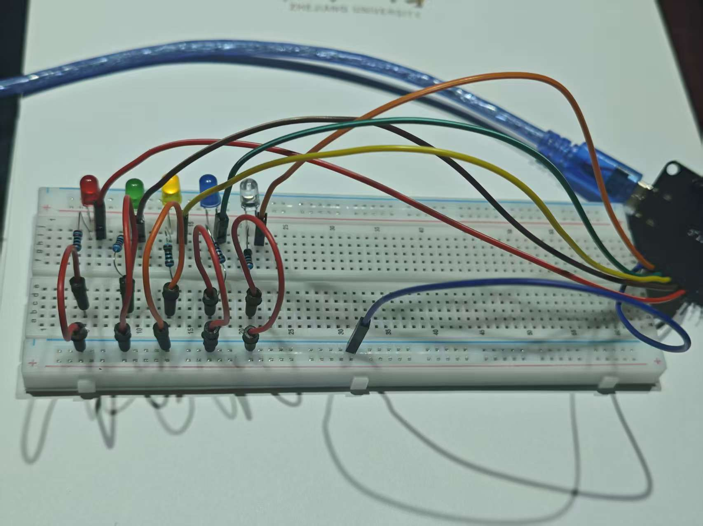

---
tags:
  - 硬件
---
启真问学的项目可能要用到esp32来控制，打算在寒假根据教程学习一下使用  

  

<a href="http://www.taichi-maker.com/" target="_blank">太极创客</a>  

<a href="https://docs.geeksman.com/esp32/" target="_blank">一个简单的ESP32教程</a>

首先在 ESP 编程环境配置就踩了坑  
在安装 ESP 32 开发环境时，不推荐直接在 Arduino 中下载，我尝试了直接下载、镜像源下载，最终都超时了。推荐采用离线安装包形式下载。

 
## LED 灯平移：


!!! info "点击查看完整代码"
    ```c++
    //定义引脚数组

    int pin_list[5] = { 13, 12, 14, 27, 26 };

    //获得数组长度

    int size = sizeof(pin_list) / sizeof(pin_list[0]);

    

    void setup() {

      // 设定GPIO引脚为输出模式

      for (int i = 0; i < size; i++) {

        pinMode(pin_list[i], OUTPUT);

      }

    }


    void loop() {

      // 所有引脚设置为高电平

      for (int i = 0; i < size; i++) {

        digitalWrite(pin_list[i], HIGH);

        if (i > 0) {

          digitalWrite(pin_list[i - 1], LOW);

        } else {

          digitalWrite(pin_list[size - 1], LOW);

        }

        delay(250);

      }

    }
    ```

## 数码管显示
