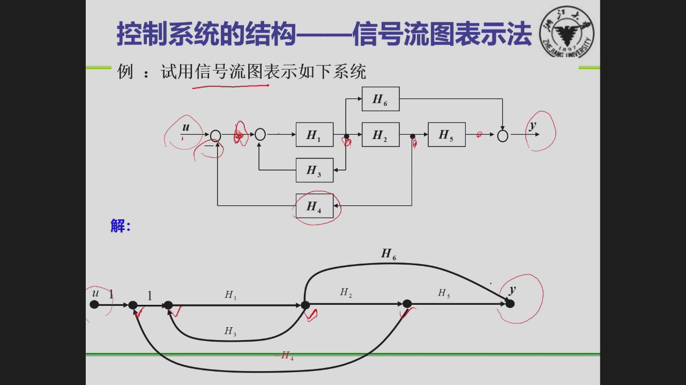
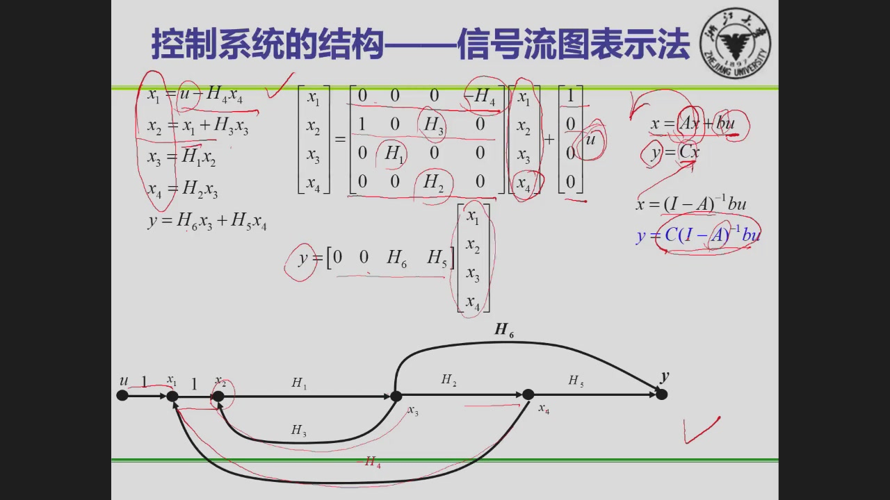
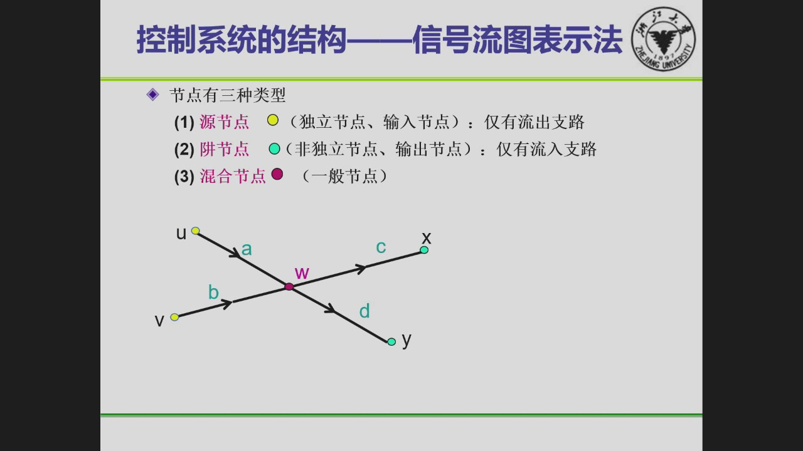
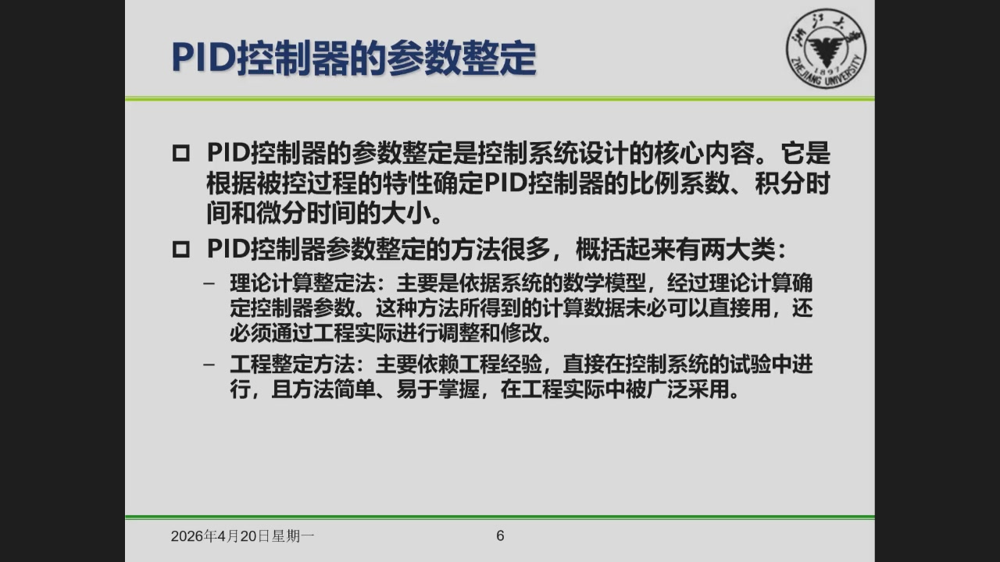
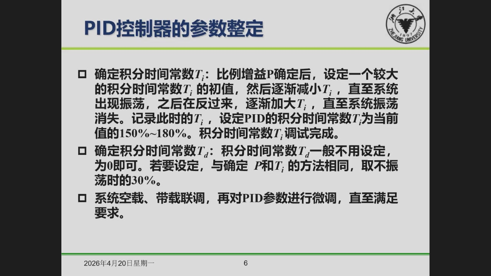
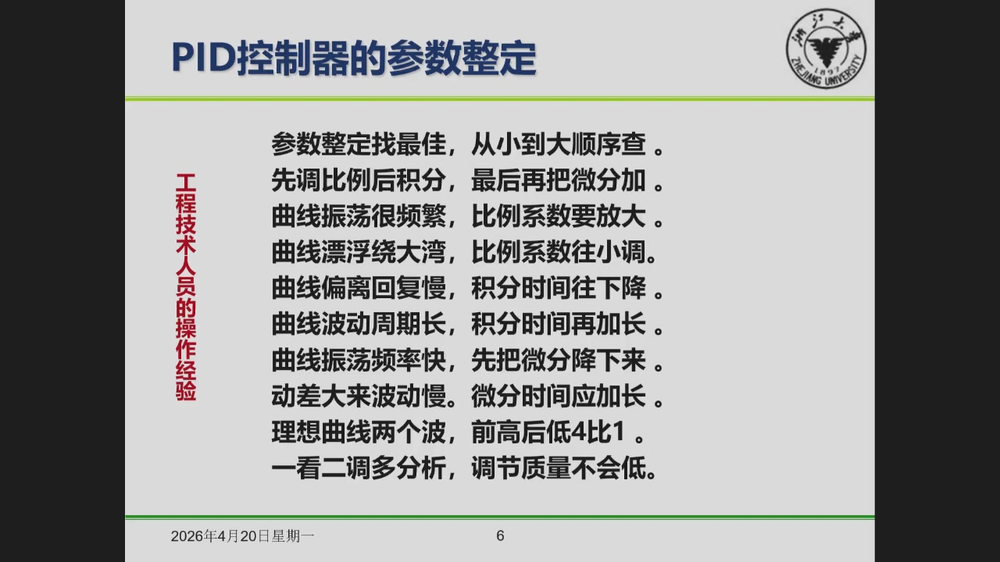

# 控制论
zju的通识核心课程  
本页用来存放课程笔记和资料
!!! info "**评分标准**"
	- 讨论课报告成绩 30%
	- 讨论课提问互动（次数和质量）10%
	- 讨论课和理论课到课情况10%
	- 期末开卷考50%
- 

ppt的内容掌握  
结合专业内容  

控制系统的结构‘

信号流图 反映一套代数方程
节点的作用

先找信号，再管方框

节点类型：  
	

前向通路：

## 稳定性

## 离散时间数字控制系统

理解信号定义和转换：模拟信号、离散信号、数字信号

理解 pid 运算、物理意义、分析能力
PID
比例
积分
微分

!!! tip "期末资料"
    看到朋友的帖子所以先记下来   
    ** 重点复习：系统流程图输出计算和稳定性计算**  
    - [2023-2024春夏控制论回忆卷及资料总结](https://www.cc98.org/topic/5919227){: target="_blank" }  
    - [25-26学年秋冬学期控制论期末考试回忆卷](https://www.cc98.org/topic/6400825){: target="_blank" }  
    - [24-25春夏控制论期末试卷](https://www.cc98.org/topic/6212341){: target="_blank" }  