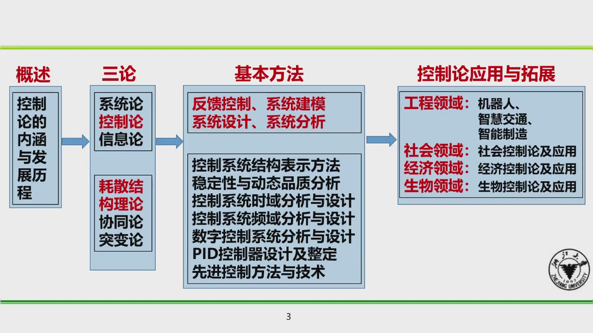

# 控制论
zju的通识核心课程  
本页用来存放课程笔记和资料
!!! info "**评分标准**"
	- 讨论课报告成绩 30%
	- 讨论课提问互动（次数和质量）10%
	- 讨论课和理论课到课情况10%
	- 期末开卷考50%
- 

ppt的内容掌握  
结合专业内容  

控制系统的结构‘

信号流图 反映一套代数方程
节点的作用

先找信号，再管方框

节点类型：  
	

前向通路：

## 稳定性

## 离散时间数字控制系统

理解信号定义和转换：模拟信号、离散信号、数字信号

理解 pid 运算、物理意义、分析能力
PID
比例
积分
微分

机器人的三个方向
loco manupulation

动手学强化学习
openai gym

## 机器人及其控制技术

机器人应用实例
基本结构类型
- 机械臂
	- 一般6 个自由度及以上，转动关节型
- 移动机器人

## 复习课

复习要点

1. 控制论的创始人及其代表著作
2. 控制论的产生背景、主要内容
3. 控制论与系统论、信息论之间的关联关系
4. 信息论的主要内容及其代表人物
5. 系统论的主要内容及其代表人物
6. 系统论中的“新三论”，及其代表人物
7. 反馈控制的概念、意义与应用举例
8. 控制系统建模的必要性、目的、方法
9. 自动控制系统的基本环节（原件）
10. 控制系统“扰动”的概念
11. 炉温、水箱液位、压力等参数自动调节的过程控制系统的功能框图画法。
12. 控制系统的结构--方块图表示法，如何化简一个复杂的方块图?
13. 系统的信号流图表示法，总传输增益计算方法。
14. 控制系统的稳定性
15. 自动控制系统的稳态和动态质量指标有哪些?
16. 何谓研究自动控制系统的时间域研究法?有何优缺点?
17. 设有一单位反馈控制系统，其闭环控制系统的特征方程式为: $s^3+6s^2+5s+K=0$  试判断能使系统稳定的参数K的范围。
18. 何谓研究自动控制系统频率域研究法?试述传递函数的概念。
19. 连续信号的离散化与数字化
20. 数字滤波的优点与常用方法
21. 采样控制系统的常用结构
22. 数字控制器的设计方法
23. PID控制概念、内容;比例、积分、微分控制的作用
24. 前馈补偿控制的原理与结构
25. 预测控制的基本原理和三要素
26. 自适应控制的概念
27. 智能控制的概念和方法:专家控制、模糊控制
28. 机器人的基本结构类型与应用举例
29. 机器人轨迹规划
30. 自主车辆中的控制系统结构
31. 城市交通中的分层递阶控制
32. 工业4.0的四大主题
33. 《中国制造2025》的核心目标和重点发展领域
34. 工业大数据的发展历程、应用场景
35. 一般生物系统的常见结构与组成单元
36. 生物控制论的主要研究方法
37. 经济控制模型的三种应用
38. 国民经济反馈控制系统的控制框图描述

!!! tip "期末资料"
    看到朋友的帖子所以先记下来   
    ** 重点复习：系统流程图输出计算和稳定性计算**  
    - [2023-2024春夏控制论回忆卷及资料总结](https://www.cc98.org/topic/5919227){: target="_blank" }  
    - [25-26学年秋冬学期控制论期末考试回忆卷](https://www.cc98.org/topic/6400825){: target="_blank" }  
    - [24-25春夏控制论期末试卷](https://www.cc98.org/topic/6212341){: target="_blank" }  