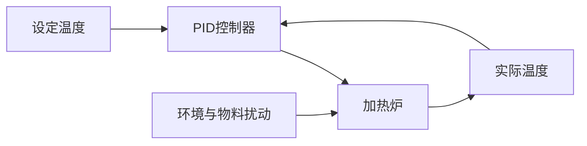
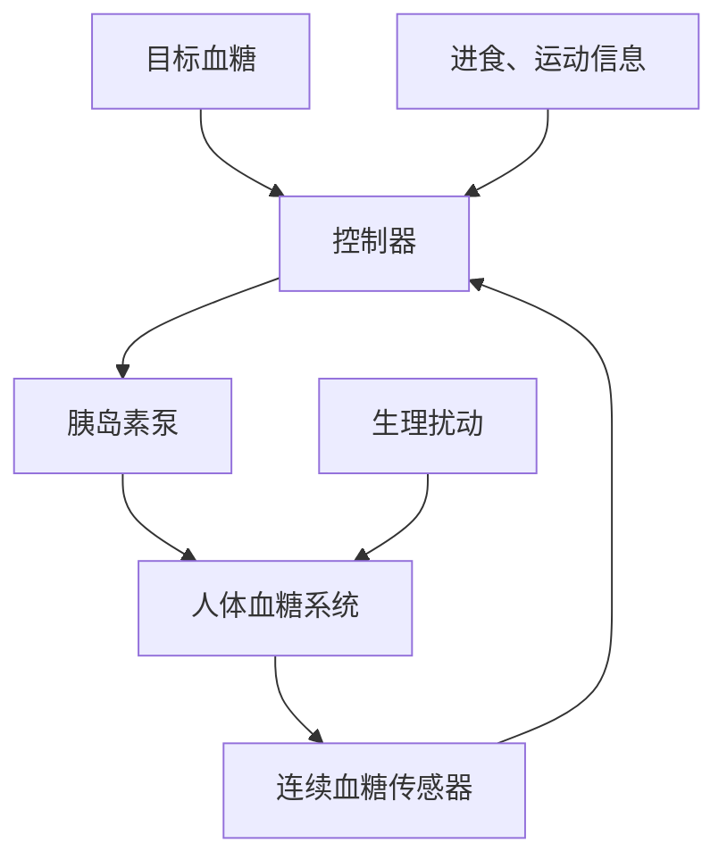

## 一、控制论与系统论

|对比项|系统论|控制论|
|---|---|---|
|研究对象|各类复杂系统的组成、结构及相互关系|动态系统的信息传递、调节和控制|
|研究方法|整体分析、层次分析、结构与功能分析|建模、反馈、稳定性分析、优化控制|
|研究目标|认识系统整体规律，解释系统行为|使系统按照预定目标稳定运行|

二者是互补关系：系统论解决“系统由什么组成、如何联系”，控制论解决“如何利用信息和反馈改变系统行为”。工程控制系统理论则把二者数学化、工程化，用于系统建模、分析和控制器设计。

## 二、信号流图

设第一个加法点输出为 (e_1)，第二个加法点输出为 (e_2)：

[  
e_1=u-H_2 y  
]

[  
e_2=G_1 G_2 e_1-H_1 y  
]

[  
y=G_3 e_2  
]

代入得：

[  
y=G_3\left[G_1 G_2(u-H_2 y)-H_1 y\right]  
]

整理：

[  
\boxed{\frac{Y(s)}{U(s)}  
=\frac{G_1 G_2 G_3}  
{1+G_3 H_1+G_1 G_2 G_3 H_2}}  
]

若输入为幅值 (2.5) 的阶跃信号，则

[  
U(s)=\frac{2.5}{s}  
]

所以

[  
\boxed{  
Y(s)=  
\frac{2.5 G_1 G_2 G_3}  
{s\left(1+G_3 H_1+G_1 G_2 G_3 H_2\right)}  
}  
]

## 三、机理建模与数据驱动建模

|方法|优点|缺点|
|---|---|---|
|机理建模|物理意义明确、可解释性强、外推能力较好、所需数据少|建模困难，复杂系统可能难以得到准确方程|
|数据驱动|不需要完全掌握机理，适合复杂非线性系统，建模速度快|依赖大量高质量数据、可解释性差、超出训练范围容易失效|

结合应用：

- 用机理模型描述已知的主体规律。
    
- 用数据模型补偿未知扰动和建模误差。
    
- 适用于数字孪生、智能预测控制、故障诊断等。
    
- 例如建立锅炉热力学模型，再用神经网络预测未建模的热损失。
    

## 四、工业控制实例

以工业加热炉温度控制为例：

温度传感器测量实际温度，与设定温度比较得到偏差。PID 控制器根据偏差调节加热功率，使温度恢复到设定值。

体现的控制论思想：

1. 利用反馈信息修正系统行为。
    
2. 通过负反馈减小偏差、抑制扰动。
    
3. 通过控制器参数设计保证稳定性和动态性能。
    
4. 以较小的控制代价实现预定目标。
    

## 五、离散 PID 控制器

将连续 PID 中的积分和微分进行数值近似：

[  
\int_0^t e(t),dt\approx T\sum_{j=0}^{k}e(j)  
]

[  
\frac{de}{dt}\approx\frac{e(k)-e(k-1)}{T}  
]

得到位置式离散 PID：

[  
\boxed{  
u(k)=K_Pe(k)+K_IT\sum_{j=0}^{k}e(j)  
+\frac{K_D}{T}[e(k)-e(k-1)]  
}  
]

增量式 PID 为：

[  
\boxed{  
\Delta u(k)=K_P[e(k)-e(k-1)]  
+K_ITe(k)  
+\frac{K_D}{T}[e(k)-2 e(k-1)+e(k-2)]  
}  
]

采样周期 (T) 的影响：

- P 项不直接含 (T)。
    
- I 项系数为 (K_IT)，(T) 越大，每次积分累加越强。
    
- D 项系数为 (K_D/T)，(T) 越小，数值微分对噪声越敏感。
    
- (T) 过大使控制滞后、精度下降，甚至失稳；过小则计算量和噪声影响增加。
    

## 六、预测控制

预测控制的三个基本要素：

1. **预测模型**：根据当前状态和未来控制量预测系统输出。
    
2. **滚动优化**：在每个采样时刻求解未来一段时间内的最优控制序列，只执行第一个控制量。
    
3. **反馈校正**：利用实际输出与预测输出的偏差修正下一次预测。
    

三者协同过程：模型预测未来，优化器选择最优控制，反馈校正模型误差，然后不断重复，实现高性能闭环控制。

与传统反馈控制相比，其优点是：

- 能提前预测系统未来变化，而不是等偏差出现后再处理。
    
- 能显式考虑输入、输出和状态约束。
    
- 适合多变量、强耦合和大滞后系统。
    
- 可以同时兼顾跟踪误差、能耗和控制平稳性。
    

## 七、粮食系统稳定性分析

设粮食库存为 (S)，生产量为 (P)，进口量为 (M)，消费量为 (C)，出口量为 (E)，则：

[  
\frac{dS}{dt}=P+M-C-E  
]

设目标库存为 (S_r)，偏差为：

[  
e=S_r-S  
]

可采用负反馈调节：

[  
u=K(S_r-S)  
]

当库存低于目标值时，增加进口和储备收购、减少出口；当库存过高时，减少进口、增加投放。国家储备粮相当于缓冲环节，可以抑制自然灾害、产量变化和需求波动造成的价格振荡。

但生产周期、政策滞后过大时，可能出现供过于求和供不应求交替发生，因此控制增益和调节速度不能过大。

## 八、血糖调节与人工胰腺

血糖调节主要机制：

- 血糖升高时，胰岛 B 细胞分泌胰岛素，促进细胞摄取和储存葡萄糖，使血糖降低。
    
- 血糖降低时，胰岛 A 细胞分泌胰高血糖素，促进肝糖原分解，使血糖升高。
    
- 低血糖时，肾上腺素等升糖激素也会促进血糖恢复。
    
- 下丘脑和神经系统参与协调调节。
    

从控制论角度看，主要扰动包括进食、运动、情绪压力、疾病、睡眠、药物以及胰岛素敏感性变化。

人工胰腺的前馈-反馈复合控制结构：

其中，连续血糖监测构成反馈控制，实时纠正血糖偏差；进食量、运动量等信息作为前馈信号，使控制器在血糖明显变化之前提前调整胰岛素剂量。这样能够同时提高快速性、准确性和抗扰动能力。