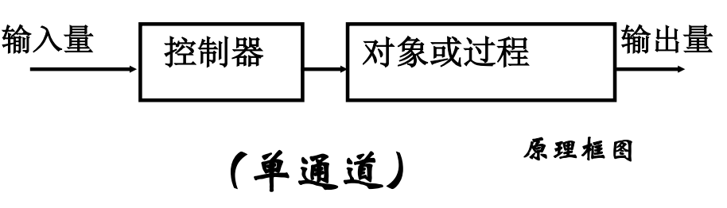

# 自动控制理论
专业课程，记录一些笔记  

!!! info "**评分标准**"
    - 课堂表现 40%
    - 闭卷考试 60%

## 1.引论
### 1.1控制系统基本形式

**开环控制系统**：输出量对系统控制作用没有影响的控制系统
	

**闭环控制系统（Closed-Loop）**：系统输出信号对控制作用有直接影响。闭环控制系统就是反馈控制系统
	

- 闭环特点：
	- 有主通道（前向通道）和反馈通道
	-  系统是采用差值进行控制的

### 1.2控制系统类型

- 线性系统与非线性系统
- 连续系统和离散系统
- 随动系统和恒值系统

## 2.控制系统的数学模型

## 3.时域分析法

## 4.根轨迹法

## 5.频域分析法

## 6.控制系统的矫正
