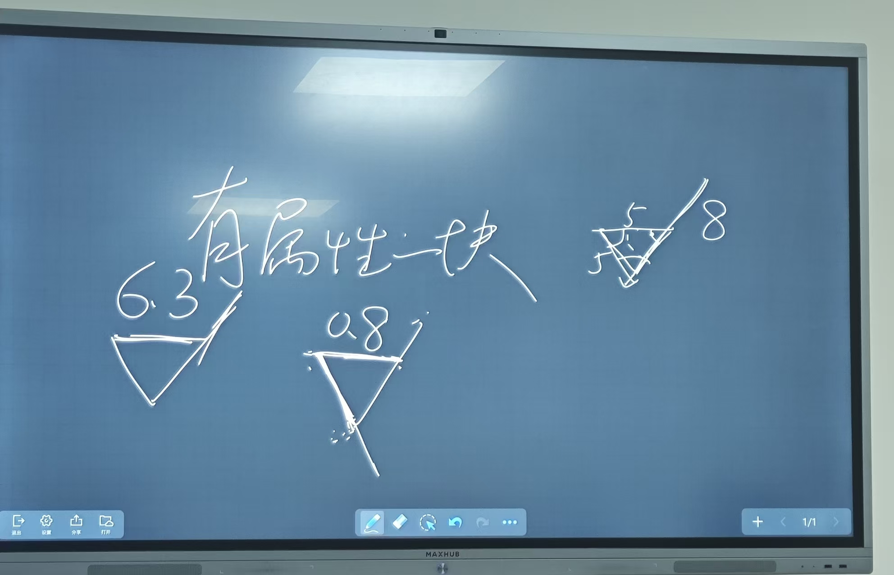

拉伸 stretch 移动对象
- 整体平移
- 一个端点，一个端点移动，另一个固定
- 两个端点都不在，则不变

拉长 lengthen

圆角 fillet

倒角 CHANFER
- 缺角延长可用倒角为 0

画圆 c 
- tdr 相切圆

打断 break

分解对象 explode
- 可以把矩形炸开

多段线 pline

样条曲线 spline

面域 region

布尔运算
union
sub

图案填充 bhatch  / hatch

标注文字
“% %D”为°
“% %C”为Φ

下偏差默认为负，输出-0.1 则下偏差为+0.1

## 标注

线性标注

基线标注

引线标注 qleader

坐标标注

形位公差
快速引线   设置 S     选择注释类型
2024 版指令 TOLERANCE   就可以直接跳出形位公差框

尺寸关联     <>

==需要建立哪些图层？==

表面粗糙度标注
把表面粗糙度做成有属性的“块”
0.4 
0.8 
1.6 
3.2 
6.3
12.8
打开极轴画 558
创建有属性的块 ATTDEF

purge 清理块

布局，打印

offset
