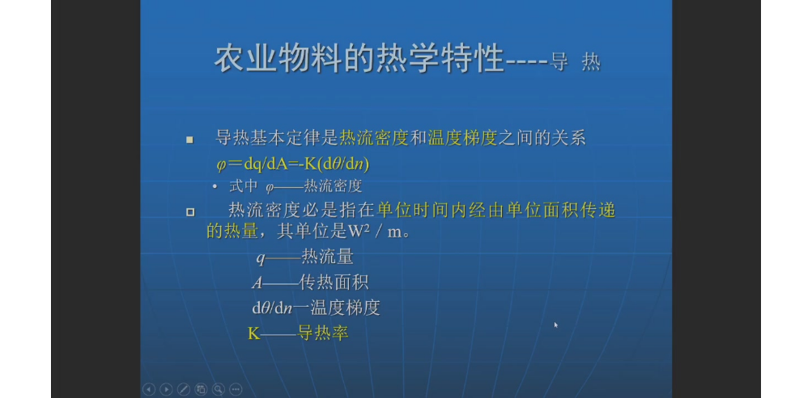
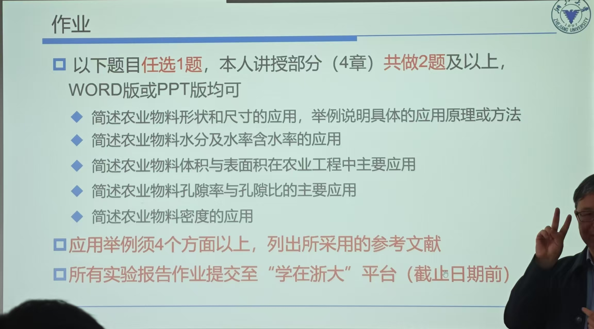

!!! info "评分标准"
	- 总成绩=考试成绩+实验成绩+平时成绩
	- 平时成绩30~40%：到课率、线上学习、作业ppt
	- 实验成绩20%左右：实验报告及质量

作业

明确主题，有关联性

光的反射特性

光的透过特性

拉曼光谱

一些水课，你根本不想去听，而且老师讲的内容比较简单，没什么专业壁垒，或者说偏向物理基础，上课内容主要就是 ppt 内容，怎么利用 ai 来直接生成学习内容或者复习资料来自学，开发产品

## 热学

农业工程学报

作业：

重点：

力与变形的关系两个图
