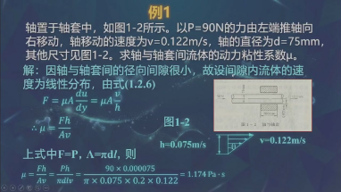
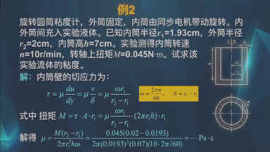

# 流体力学

## 1.流体的力学性质

混合气体密度    

牛顿内摩擦定律  

**粘性系数**

- 运动粘性系数    
- 动力粘性系数μ：  
 $$
 \tau=\frac{F}{A}=\pm\mu\frac{du}{dy}
 $$  
	- 水的动力粘度系数经验公式：
		$$
		\mu=\frac{\mu_0}{1+0.0337t+0.000221t^2}(Pa*s)
		$$
	- 气体动力粘度系数经验公式：
	- 混合气体动力粘度系数  
	- 例题
		
		

## 2流体静力学

欧拉平衡微分方程，流体平衡微分方程

流体压差方程

