!!! warning "评分标准"
	- 笔试 60%
	- 平时作业 10%
	- 验证性实验 10%
	- 探究性实验 20%
# 流体力学

## 1.流体的力学性质

混合气体密度    

牛顿内摩擦定律  

**粘性系数**

- 运动粘性系数    
- 动力粘性系数μ：  
 $$
 \tau=\frac{F}{A}=\pm\mu\frac{du}{dy}
 $$  
	- 水的动力粘度系数经验公式：
		$$
		\mu=\frac{\mu_0}{1+0.0337t+0.000221t^2}(Pa*s)
		$$
	- 气体动力粘度系数经验公式：
	- 混合气体动力粘度系数  
	- 例题
		
		

## 2流体静力学

欧拉平衡微分方程，流体平衡微分方程

流体压差方程

### 倾斜平面总压力
总压力大小

$$
F=p_c A
$$

总压力作用点：
$$
y_D=
$$
$$
x_D=
$$
### 曲面总压力

实体虚体
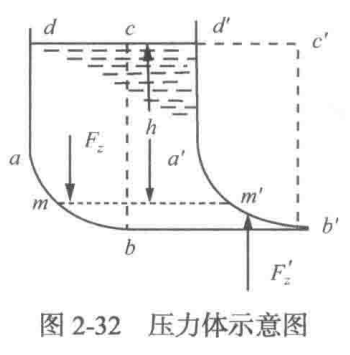

总压力水平分力  
$$
F_x=\rho gh_cA_x  
$$

总压力垂直压力
等效于压力体液重
$$
F_y=pgV_p
$$

!!！note "e.g."
	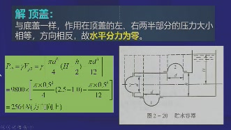
	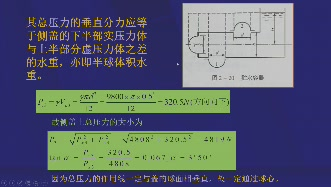

## 3.流体流动特性

### 流线与迹线

定常流动中，流线与迹线重合

### 流管

流体质点只能在流管内部或外部运动，不能穿梭
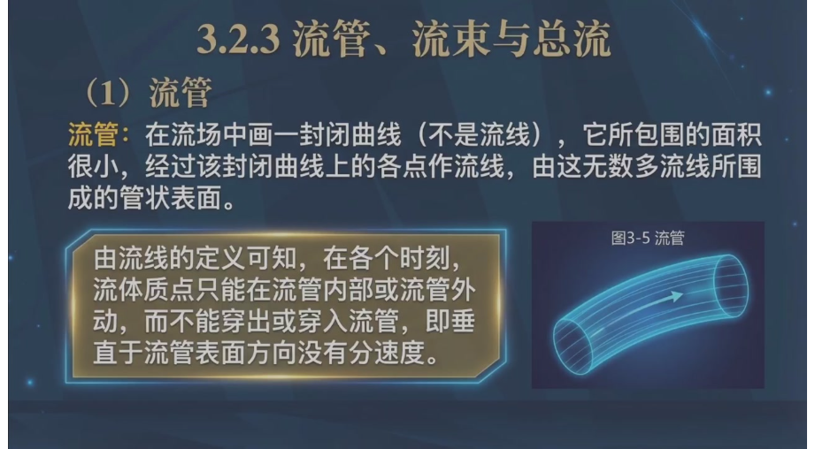

### 流量

- 体积流量
- 质量流量

### 流速

断面平均流速

### 连续性方程
流体流动连续性方程

设在某一时刻，流体流过 $C$ 点的流速为 $u$，$u$ 在 $x、y、z$ 各轴上的分量为 $u_x、u_y、u_z$，流体的密度为 $\rho$。

**可压缩流体（$\rho$ 不是常数）三维流动的连续性方程为：**

$$
\frac{\partial \rho}{\partial t} + \frac{\partial(\rho u_x)}{\partial x} + \frac{\partial(\rho u_y)}{\partial y} + \frac{\partial(\rho u_z)}{\partial z} = 0 \qquad 
$$
分类：  
1. 可压缩流体定常流动

对于可压缩流体的定常流动，由于密度 $\rho$ 不随时间变化，即 $\frac{\partial \rho}{\partial t} = 0$，则连续性方程简化为：

$$
\frac{\partial(\rho u_x)}{\partial x} + \frac{\partial(\rho u_y)}{\partial y} + \frac{\partial(\rho u_z)}{\partial z} = 0 \qquad 
$$

2. 不可压缩流体（三维定常流动）

对于不可压缩流体，由于密度 $\rho$ 为常数，其三维定常流动的连续性方程进一步简化为：

$$
\frac{\partial u_x}{\partial x} + \frac{\partial u_y}{\partial y} + \frac{\partial u_z}{\partial z} = 0 \qquad 
$$

3. 不可压缩流体二维定常流动

对于流体的二维流动（假设在 $xy$ 平面内），不可压缩流体二维定常流动的连续性方程为：

$$
\frac{\partial u_x}{\partial x} + \frac{\partial u_y}{\partial y} = 0 \qquad
$$

不可压缩流体微小流束定常流动连续性方程

### 理想流体的运动微分方程和伯努利积分

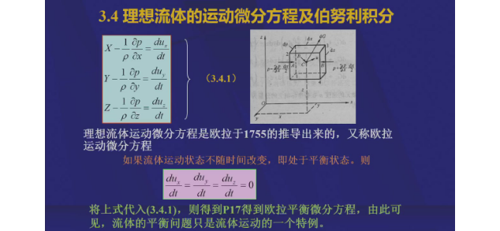
#### **欧拉运动微分方程**（理想流体）

#### **实际流体运动微分方程：纳维尔-斯托克斯方程**

对于实际流体，微元六面体流体质点除了受表面压力、质量力以外还受切应力的作用。实际流体运动的微分方程一般称为**纳维尔—斯托克斯方程**，可写为：

$$\begin{cases} X - \dfrac{1}{\rho} \dfrac{\partial p}{\partial x} + \nu \Delta^2 u_x = \dfrac{du_x}{dt} \\ Y - \dfrac{1}{\rho} \dfrac{\partial p}{\partial y} + \nu \Delta^2 u_y = \dfrac{du_y}{dt} \\ Z - \dfrac{1}{\rho} \dfrac{\partial p}{\partial z} + \nu \Delta^2 u_z = \dfrac{du_z}{dt} \end{cases}$$

**参数说明：**

- $\Delta^2$ **：称为**拉普拉斯算子** (Laplace Operator)，定义为：
    $$
    \Delta^2 = \frac{\partial^2}{\partial x^2} + \frac{\partial^2}{\partial y^2} + \frac{\partial^2}{\partial z^2}
    $$
    
- $\nu$ **：流体的**运动粘性系数 (Kinematic Viscosity)；
    
- $X, Y, Z$ **：单位质量流体所受的质量力分量；
    
-  $p$ **：流体压力；
    
- $\rho$ **：流体密度。

#### 伯努利方程

**伯努利方程与水头的三个组成部分**

对于不可压缩的理想流体，其在流动过程中的总机械能是守恒的。伯努利方程将其表示为三种“水头”的总和：

$$
H = z + \frac{p}{\rho g} + \frac{v^2}{2g} = \text{常数}
$$

在这个公式中，$H$ 代表**总水头（Total Head）**，它由以下三个部分组成：

- **位置水头（Elevation Head / Position Head），$z$：**
    
    代表单位重量流体由于所处的海拔高度（相对于某一基准面）而具有的**重力势能**。位置越高，位置水头越大。
    
- **压力水头（Pressure Head），$\frac{p}{\rho g}$：**
    
    代表单位重量流体由于内部静压力 $p$ 而具有的**压力能**。其中 $\rho$ 是流体密度，$g$ 是重力加速度。你可以把它想象成：如果在这个管道上插一根开口向上的透明管子（测压管），管里的水能被管道内的压力顶起多高。
    
- **速度水头（Velocity Head），$\frac{v^2}{2g}$：**
    
    代表单位重量流体由于流动速度 $v$ 而具有的**动能**。速度越快，流体的动能越大，转化成的速度水头就越高。

总水头线  
测压管水头线
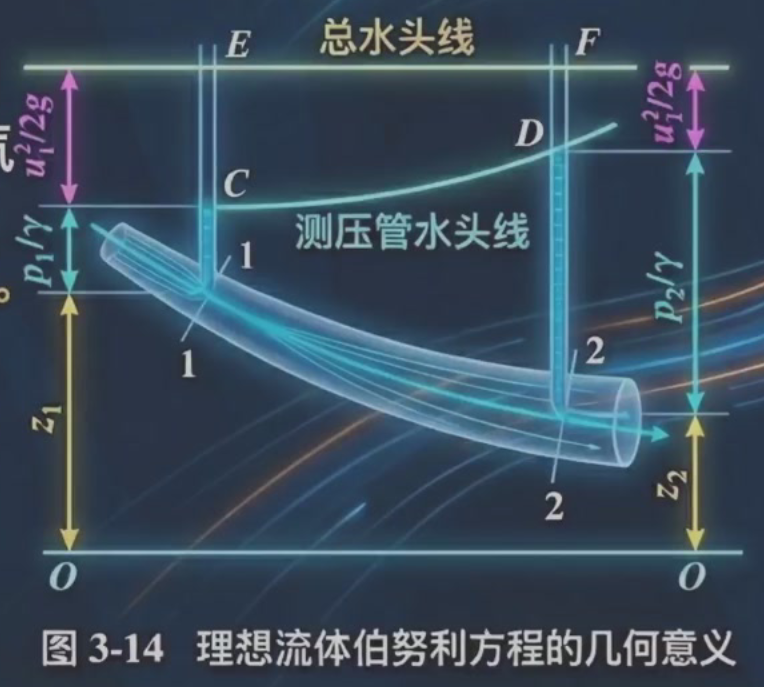

在真实的物理世界中，流体是具有粘性（摩擦力）的。因此，流体在管道中流动时，总会有一部分机械能转化为热能散失掉，这就是所谓的**水头损失（Head Loss）**。

考虑到水头损失 $h_f$，实际流体的伯努利方程变为（假设流体从截面 1 流向截面 2）：

$$
z_1 + \frac{p_1}{\rho g} + \frac{v_1^2}{2g} = z_2 + \frac{p_2}{\rho g} + \frac{v_2^2}{2g} + h_f
$$

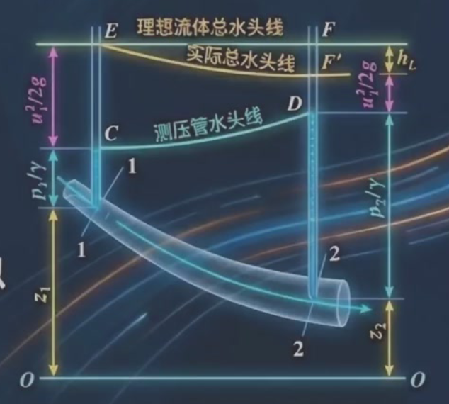

**实际流体总水头线沿流体流动方向降低**

### 伯努利方程工程应用

例题：

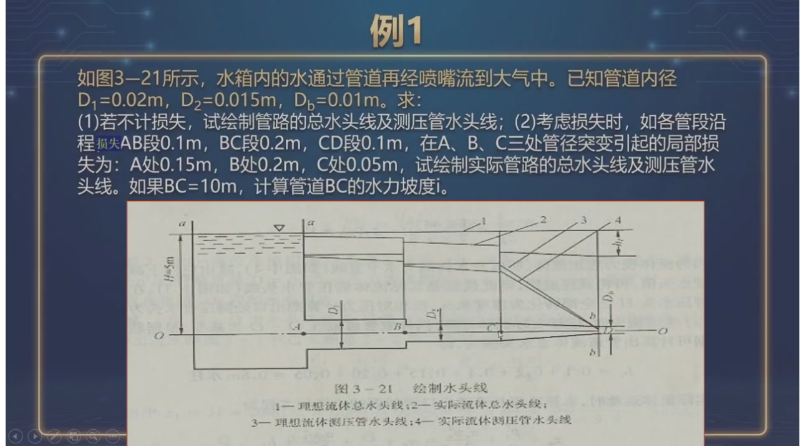

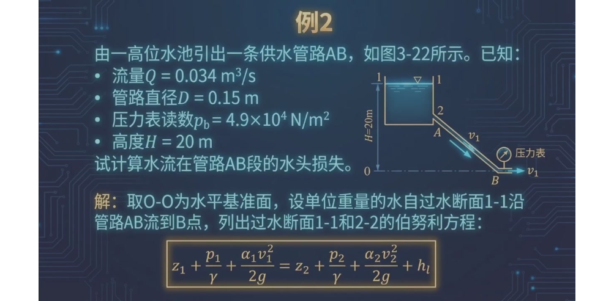

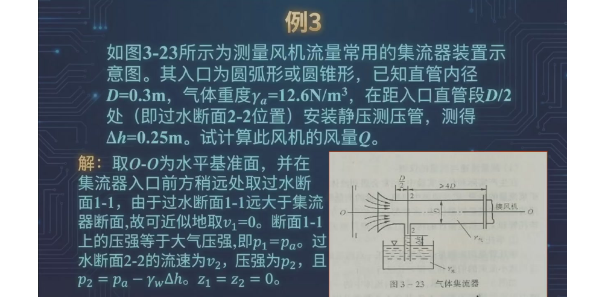

#### 测量流速仪表

毕托管

文丘里管  
	流量公式

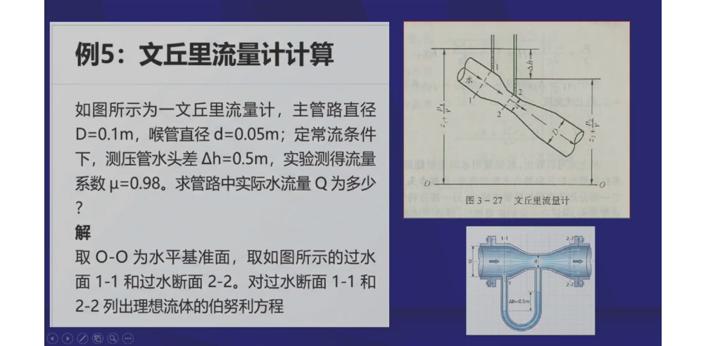
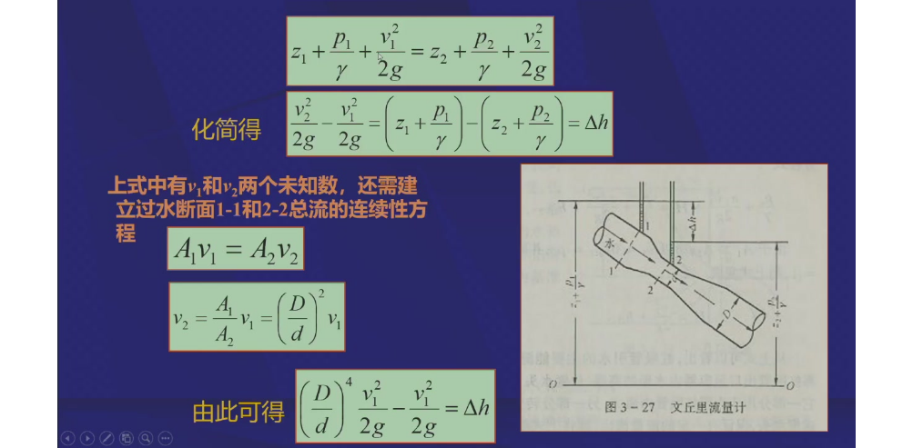
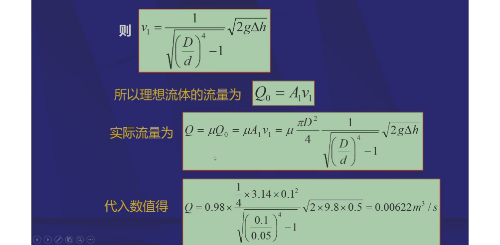

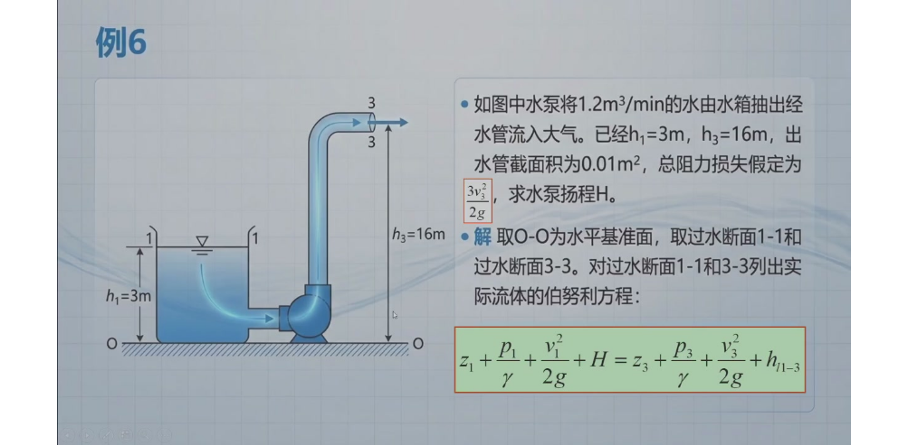
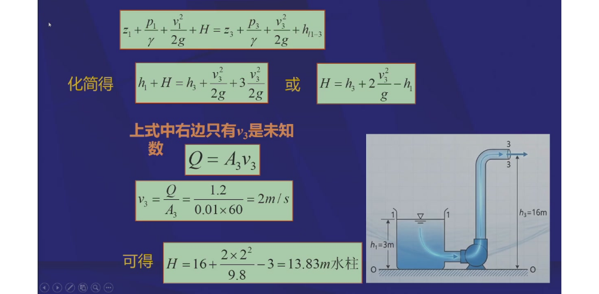

虹吸现象

## 粘性流体流动阻力计算

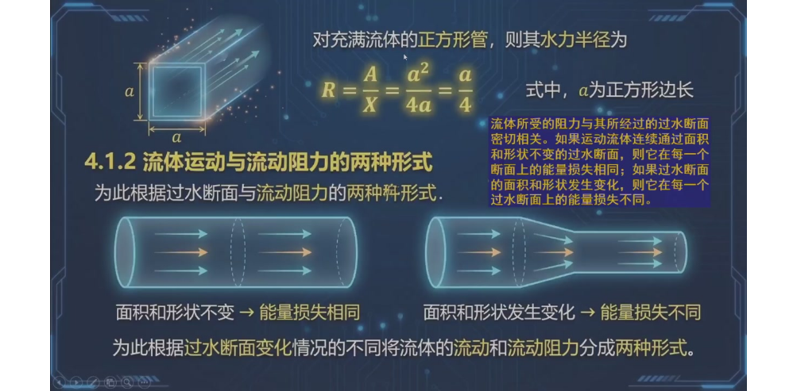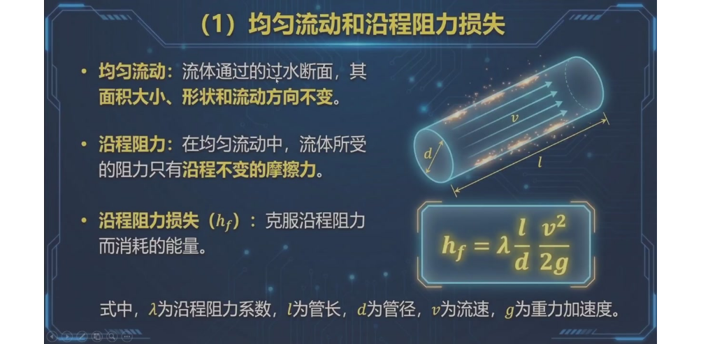

流体流动两种状态：
平流
紊流

雷诺实验
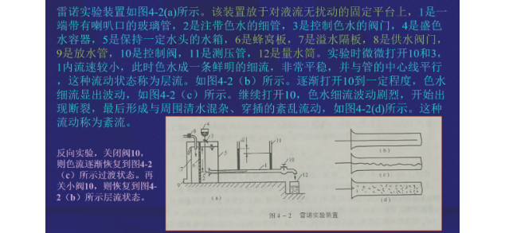

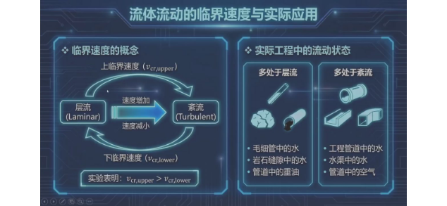

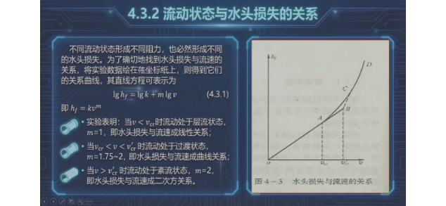

### 雷诺数

流动状态判别
雷诺数是一个无因次综合量，用以判别流体流动状态。

- **基本定义**：
    
    $$
    Re = \frac{\rho v d}{\mu} = \frac{v d}{\nu} \qquad
    $$
    
- **参数说明**：$d$ 为特征长度，圆管为直径 $d$。
    
- **临界雷诺数**：
    
    - **上临界雷诺数**：$Re'_{cr} = \frac{v'_{cr} d}{\nu}$
        
    - **下临界雷诺数**：$Re_{cr} = \frac{v_{cr} d}{\nu}$

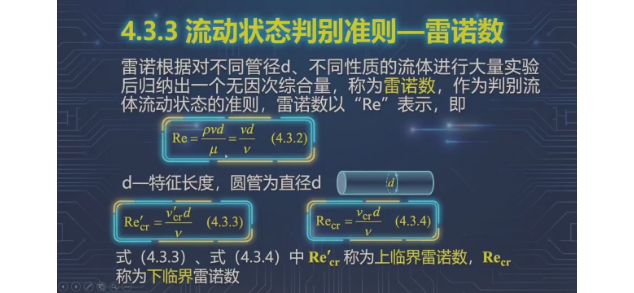
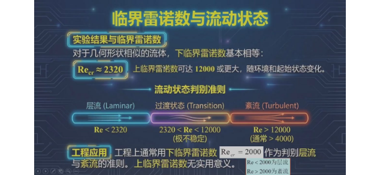

!!! note "e.g."
	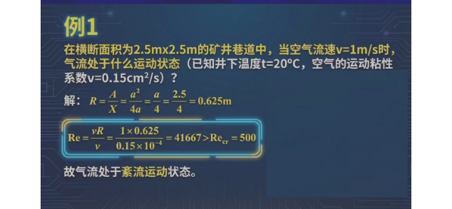
	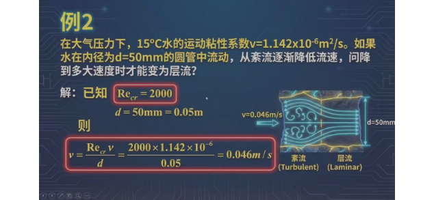

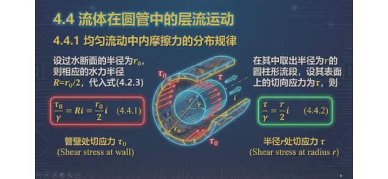

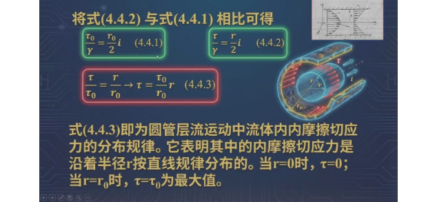

层流运动时，流体切应力分布为沿半径 r 按直线规律分布

### 圆管层流速度分布规律

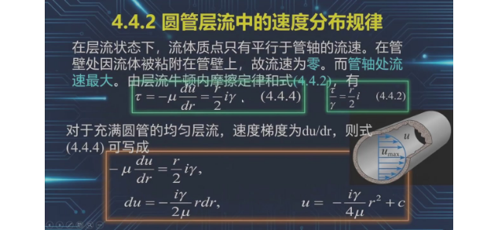
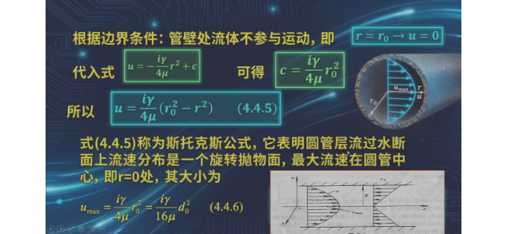
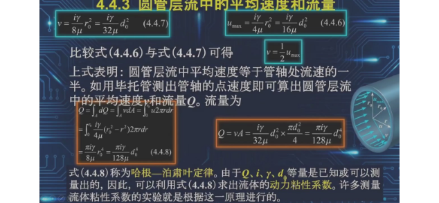
==**斯托克斯公式：**==

==**哈根-泊肃叶公式**==(计算流体的粘性系数)

### 圆管层流中的沿程损失
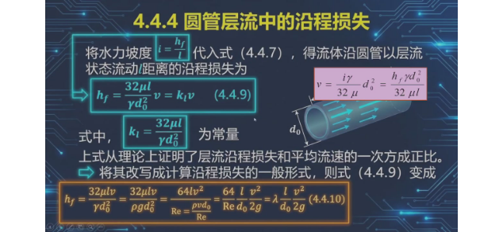

### 达西公式

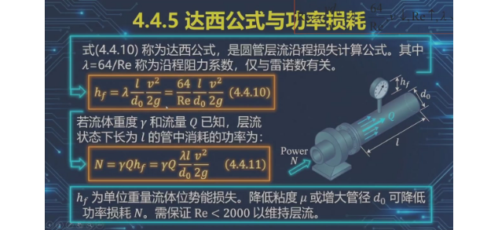

!!! note "e.g."
	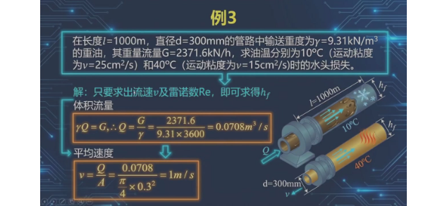
	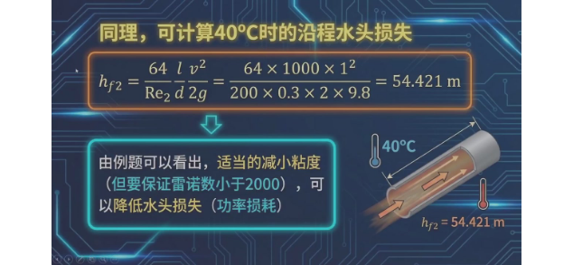

### 紊流
摩擦损耗远大于层流

#### 紊流摩擦

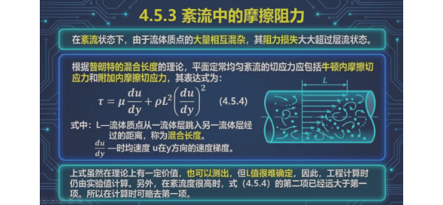

#### 速度分布

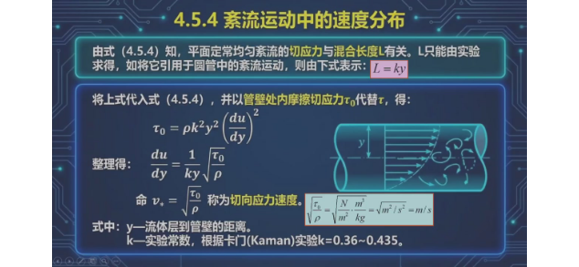
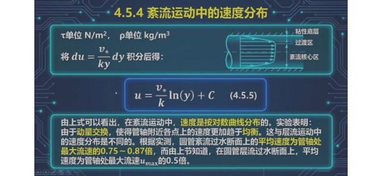

#### 紊流核心与层流边界
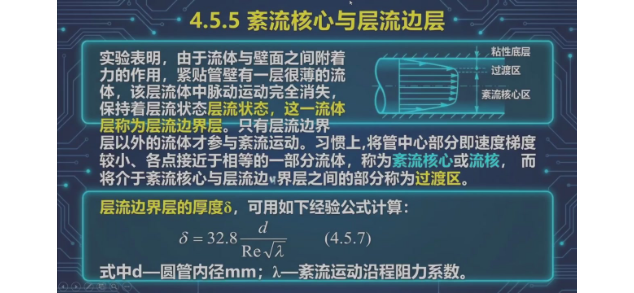

层流边界厚度公式：
$$
\sigma=32.8\frac{d}{Re\sqrt{\lambda}}
$$

沿程损失公式：
$$
\lambda=\frac{Lv^2}{D2g}
$$

雷诺数（判断层流）：

$$
Re=\frac{\rho VD}{\mu}
$$