# 传热学
## 1.绪论
### 热量传递的基本方式 ：
#### 热传导
- 必须有温差
- 物体直接接触
- 不发生宏观相对位移

##### 稳态傅里叶公式
$$
\Phi=-\lambda A \frac{dt}{dx}=\lambda A\frac{\Delta t}{\delta}
$$

$$
q=\frac{\Phi}{A}
$$

##### 热导率 ：

##### 热阻 ：
$$
热流量=\frac{温差}{热阻}
$$
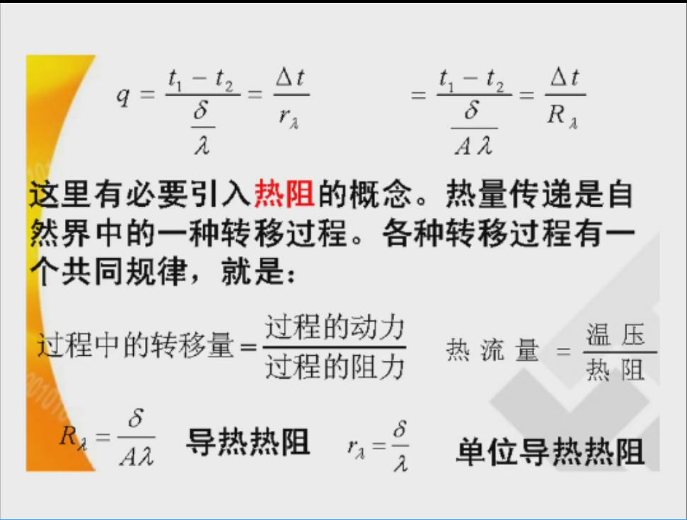

##### 一维稳态导热公式 
$$
q=\frac{t_1-t_2}{\frac{\delta}{\lambda}}
$$

#### 热对流
定义：

分类

##### 牛顿冷却公式 
$$
\Phi=hA(t_w-t_{\infty})
$$
$$
q=\Phi/A=h(t_w-t_{\infty})
$$
**参数说明：**

- $\Phi$ —— **热流量** $[\text{W}]$：单位时间传递的热量。
- $q$ —— **热流密度** $[\text{W/m}^2]$。
- $h$ —— **表面传热系数** $[\text{W}/(\text{m}^2\cdot^\circ\text{C})]$。
- $A$ —— 与流体接触的壁面面积 $[\text{m}^2]$。
- $t_w$ —— 固体壁面温度 $[^\circ\text{C}]$；$t_\infty$ —— 流体温度 $[^\circ\text{C}]$。

##### 对流热阻 
$$
R_h=\frac{1}{hA}
$$
$$
r_h=\frac{1}{h}
$$

#### 热辐射

##### 斯蒂芬-玻尔兹曼

$$
E_b=\sigma T^4
$$

!!! note "例题"
	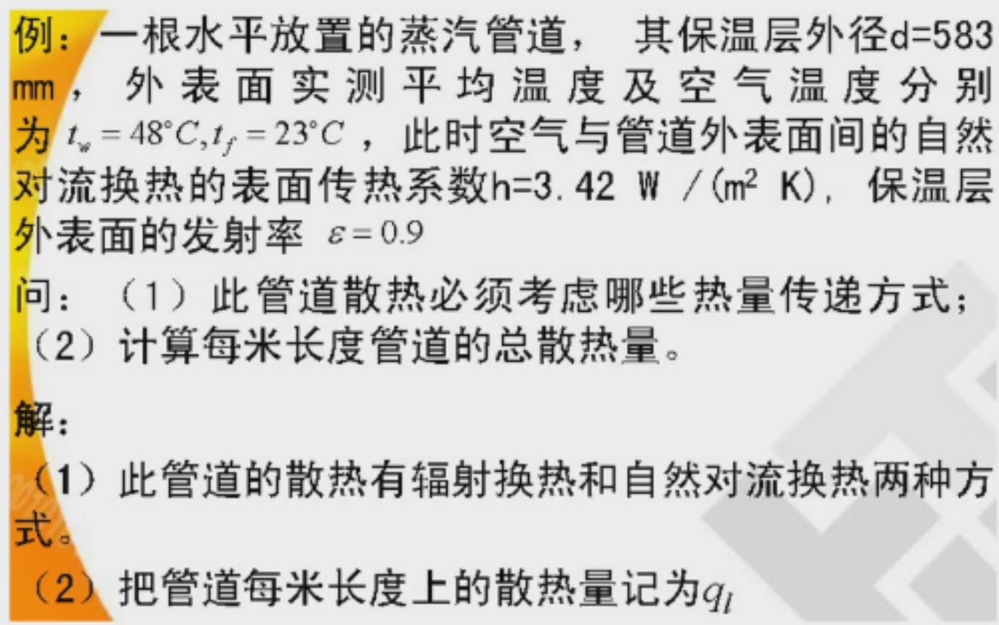

### 传热过程与传热系数
传热
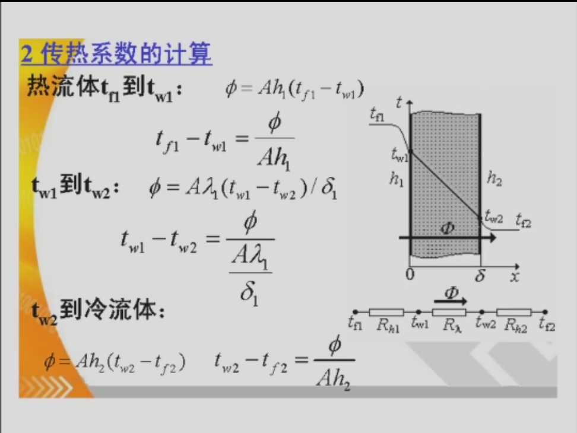

!!! note "例题"
	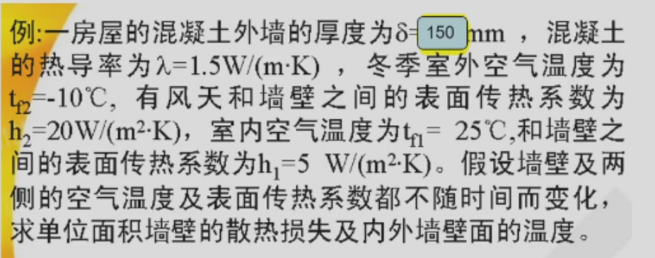

## 2. 稳态导热

### 2.1 基本概念
#### 温度场
温度场是物体内各点温度在空间和时间中的分布：
$$
t=f(x,y,z,\tau)
$$
若温度不随时间变化，则为稳态温度场：
$$
\frac{\partial t}{\partial \tau}=0
$$
一维稳态导热中，温度只沿一个方向变化，如 $t=f(x)$ 或 $t=f(r)$。

#### 等温线与等温面
同一时刻温度相同的点连成**等温线**，构成的面称为**等温面**。

- 等温线、等温面之间不会相交。
- 热量沿等温面的法线方向，从高温处传向低温处。

#### 温度梯度
温度梯度表示温度沿空间方向的最大变化率，方向指向温度升高最快的方向：
$$
\nabla t=\frac{\partial t}{\partial x}\vec i+
\frac{\partial t}{\partial y}\vec j+
\frac{\partial t}{\partial z}\vec k
$$
一维情况下：
$$
\text{grad }t=\frac{dt}{dx}
$$
实际导热方向与温度梯度方向相反。

#### 傅里叶定律
导热热流密度与温度梯度成正比，方向与温度梯度相反：
$$
\vec q=-\lambda \nabla t
$$
一维形式为：
$$
q=-\lambda \frac{dt}{dx}
$$
$$
\Phi=-\lambda A\frac{dt}{dx}
$$
其中 $\Phi$ 为热流量 $[\text{W}]$，$q$ 为热流密度 $[\text{W}/\text{m}^2]$，$A$ 为导热面积 $[\text{m}^2]$。

#### 导热系数
导热系数 $\lambda$ 表征材料导热能力，单位为：
$$
[\lambda]=\text{W}/(\text{m}\cdot \text{K})
$$
A3 中强调：不同材料的导热系数会随温度变化。计算时若温度范围不大，常把 $\lambda$ 取为平均温度下的常数。

导热机理：

- 气体：分子不规则热运动和碰撞传递能量。
- 导电固体：主要依靠自由电子运动。
- 非导电固体：主要依靠晶格振动。
- 液体：兼有气体和固体导热机理。

#### 导热微分方程
A3 中的能量守恒关系为：
$$
d\Phi_{\text{in}}+dQ_{\text{生成热}}
=d\Phi_{\text{out}}+dU_{\text{内能增量}}
$$
直角坐标系中，导热微分方程可写为：
$$
\rho c\frac{\partial t}{\partial \tau}
=
\frac{\partial}{\partial x}\left(\lambda \frac{\partial t}{\partial x}\right)
+
\frac{\partial}{\partial y}\left(\lambda \frac{\partial t}{\partial y}\right)
+
\frac{\partial}{\partial z}\left(\lambda \frac{\partial t}{\partial z}\right)
+\dot q_v
$$
其中 $\dot q_v$ 为单位体积内热源强度 $[\text{W}/\text{m}^3]$。

若 $\lambda$ 为常数：
$$
\frac{\partial t}{\partial \tau}
=a\nabla^2t+\frac{\dot q_v}{\rho c}
$$
$$
a=\frac{\lambda}{\rho c}
$$
稳态、无内热源时：
$$
\nabla^2t=0
$$
一维稳态、无内热源时：
$$
\frac{d^2t}{dx^2}=0
$$

#### 定解条件
要确定具体温度分布，除导热微分方程外，还需要给出几何条件、物性参数、内热源条件和边界条件。

常见边界条件：

1. 第一类边界条件：已知壁面温度
$$
t_w=f(\tau)
$$
2. 第二类边界条件：已知壁面热流密度
$$
-\lambda \frac{\partial t}{\partial n}=q_w
$$
绝热边界为：
$$
q_w=0
$$
3. 第三类边界条件：壁面与流体对流换热
$$
-\lambda \frac{\partial t}{\partial n}=h(t_w-t_f)
$$

### 2.2 一维稳态导热
以下公式默认 $\lambda$ 为常数，导热过程为稳态一维导热。

#### 单层平壁导热
边界条件：
$$
x=0,\quad t=t_1
$$
$$
x=\delta,\quad t=t_2
$$
无内热源时：
$$
\frac{d^2t}{dx^2}=0
$$
温度分布为线性分布：
$$
t=t_1-\frac{t_1-t_2}{\delta}x
$$
热流密度：
$$
q=\lambda \frac{t_1-t_2}{\delta}
$$
热流量：
$$
\Phi=Aq=\lambda A\frac{t_1-t_2}{\delta}
$$
单位面积热阻和总热阻分别为：
$$
r=\frac{\delta}{\lambda}
$$
$$
R=\frac{\delta}{\lambda A}
$$
因此：
$$
q=\frac{t_1-t_2}{r},\qquad
\Phi=\frac{t_1-t_2}{R}
$$

#### 多层平壁导热
对于 $n$ 层平壁串联导热：
$$
r=\sum_{i=1}^{n}\frac{\delta_i}{\lambda_i}
$$
$$
R=\sum_{i=1}^{n}\frac{\delta_i}{\lambda_i A}
$$
热流密度：
$$
q=\frac{t_1-t_{n+1}}{\sum_{i=1}^{n}\frac{\delta_i}{\lambda_i}}
$$
热流量：
$$
\Phi=\frac{t_1-t_{n+1}}{\sum_{i=1}^{n}\frac{\delta_i}{\lambda_i A}}
$$

#### 圆筒壁导热
设圆筒内半径为 $r_1$，外半径为 $r_2$，长度为 $l$，内外壁温分别为 $t_1$、$t_2$。

温度分布：
$$
t=t_1+\frac{t_2-t_1}{\ln(r_2/r_1)}\ln\frac{r}{r_1}
$$
半径 $r$ 处的热流密度：
$$
q_r=\frac{\lambda (t_1-t_2)}{r\ln(r_2/r_1)}
$$
热流量：
$$
\Phi=\frac{2\pi l\lambda (t_1-t_2)}{\ln(r_2/r_1)}
$$
导热热阻：
$$
R=\frac{\ln(r_2/r_1)}{2\pi l\lambda}
$$

#### 球壁导热
设球壁内半径为 $r_1$，外半径为 $r_2$，内外壁温分别为 $t_1$、$t_2$。

温度分布：
$$
t=t_1+(t_2-t_1)
\frac{\frac{1}{r_1}-\frac{1}{r}}
{\frac{1}{r_1}-\frac{1}{r_2}}
$$
半径 $r$ 处的热流密度：
$$
q_r=\frac{\lambda (t_1-t_2)}
{\left(\frac{1}{r_1}-\frac{1}{r_2}\right)r^2}
$$
热流量：
$$
\Phi=\frac{4\pi\lambda (t_1-t_2)}
{\frac{1}{r_1}-\frac{1}{r_2}}
$$
导热热阻：
$$
R=\frac{\frac{1}{r_1}-\frac{1}{r_2}}{4\pi\lambda}
$$

#### 有内热源的一维稳态导热
设 $\dot q_v$ 为均匀单位体积发热量，$\lambda$ 为常数，壁面温度为 $t_w$。

平壁内热源温度分布，$x=0$ 为中心面，$x=\delta$ 为壁面：
$$
t=t_w+\frac{\dot q_v}{2\lambda}(\delta^2-x^2)
$$
中心最高温度：
$$
t_{\max}=t_w+\frac{\dot q_v\delta^2}{2\lambda}
$$

圆柱体内热源温度分布，$r=0$ 为中心，$r=R$ 为壁面：
$$
t=t_w+\frac{\dot q_v}{4\lambda}(R^2-r^2)
$$
中心最高温度：
$$
t_{\max}=t_w+\frac{\dot q_vR^2}{4\lambda}
$$

!!! warning "考试重点"
	 **必须掌握**：
	1. **三类边界条件的物理意义和数学形式**
	2. **平壁一维稳态导热的温度分布和热阻公式**
	3. **多层平壁热阻串联计算**
	4. **圆筒壁导热热阻公式**
	5. **圆管内外对流 + 管壁导热的总热阻模型**
	6. **根据热阻法求热损失、界面温度、保温层厚度**
	7. **看到实际题目先画物理模型**
	**需要理解**：
	8. 导热系数随温度变化时，温度分布不再是直线；
	9. 接触热阻来自实际接触面不理想；
	10. 查表、查手册、查文献是工程计算的重要能力；
	11. 生活问题可以抽象成平壁、圆筒壁、多层热阻问题。
	**了解即可**：
	12. 非稳态导热不是本节考试重点；
	13. CFD、数值模拟、App/Web 实现属于拓展应用；
	14. 球壁导热本节更偏公式记忆和类比理解。

## 3. 对流换热原理

!!! note "重点"
	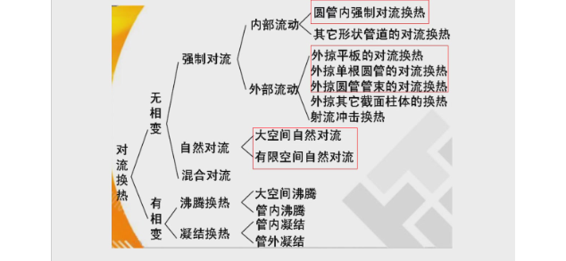
	

流动状态：  
- 层流  
- 紊流  

如何计算生物的散热量
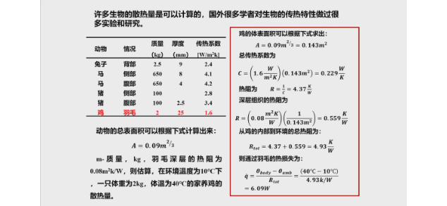

### 对流换热系数与对流换热微分方程

#### 对流换热系数

### 3.2 层流流动换热的微分方程组

不用记

#### 连续性方程

#### 动量微分方程

#### 能量微分方程

#### 对流换热单值性条件

### 对流换热过程的相似原理

#### 无量纲形式对流换热微分方程组

#### 无量纲数

##### 欧拉数

##### 雷诺数

贝克莱准则

普朗特数

##### 努塞尔准则（重要）
$$
Nu=\frac{hL}{\lambda}
$$
$L$ 为特征尺寸，$\lambda$ 为流体导热系数。
h 为对流换热系数
反应给定流场的换热能力与其导热能力的对比关系
##### 斯坦顿数

### 边界层理论

**速度边界层：**
垂直于壁面

边界层厚度：
当速度变化达到

$$
u/u_w∞=0.99
$$
该点的厚度

**热边界层厚度：**
当
$$
t_w-t/t_w-t_∞=0.99
$$
时，该点到壁厚度

**边界层厚度计算**

满足边界层假设的条件是雷诺数足够大

速度边界层：
$$
\delta=\frac{4.64x}{\sqrt{Re_x}}
$$

热边界层：
$$
\delta=\frac{1}{1.026\sqrt[3]{Re_x}}
$$

| 速度边界层厚度 | 温度边界层厚度 |
| ------- | ------- |
|         |         |

平均换热系数 h 和努塞尔数 Nu

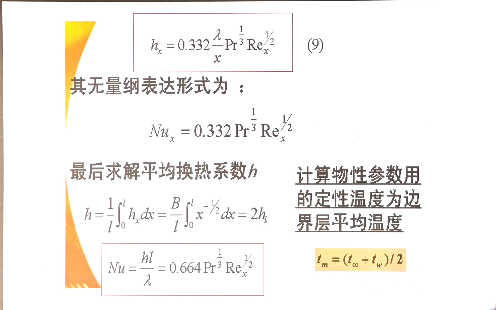

!!! example "例题"
	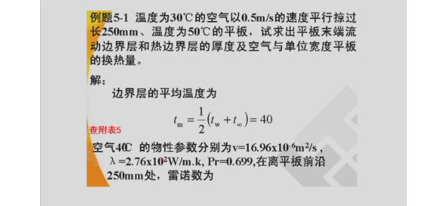
	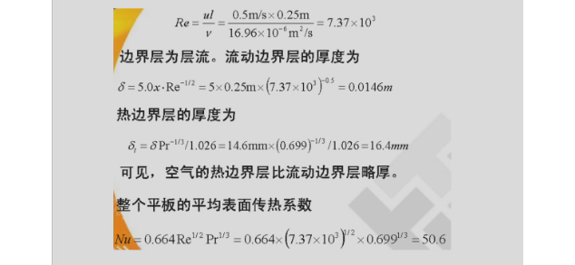
	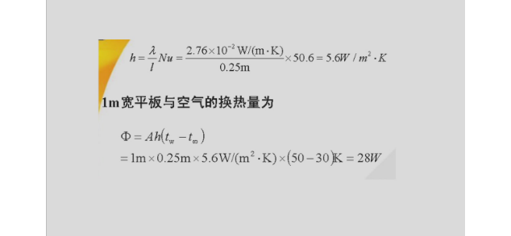

## 4. 对流换热计算

### 管槽内流体受迫对流换热计算

**流动换热平衡关系式**
$$
\frac{\pi d^2}{4} \rho c_p u_m (t_f' - t_f'') = h \pi d l \Delta t_m
$$

进口温度减出口温度

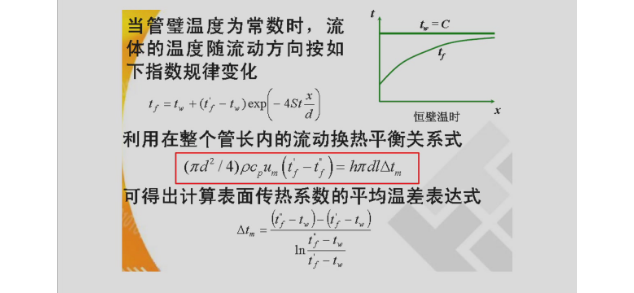

管内强制对流换热准则关系式：

当管内雷诺数 $Re>10^4$
$$
Nu=0.023Re^{0.8}Pr^n
$$

!!! example "例题"
	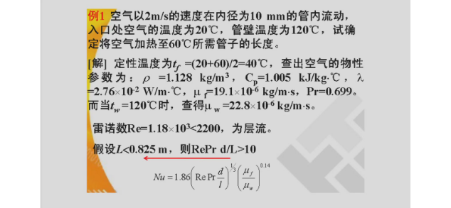
	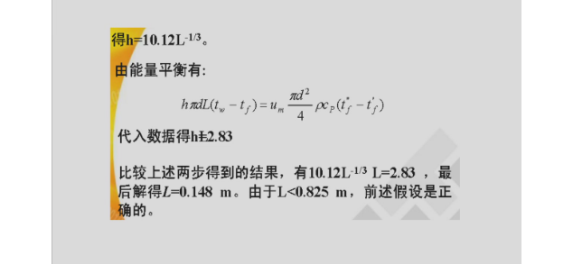
	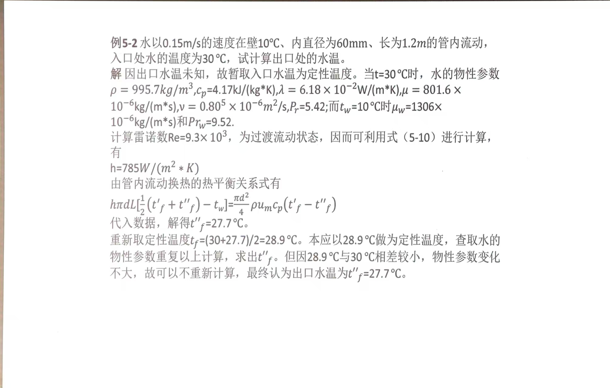
	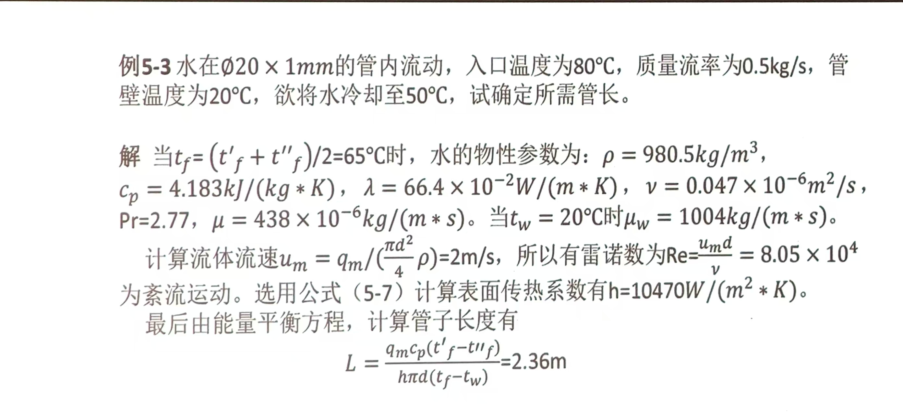

### 流体外掠物体对流换热计算

#### 平行流过平板

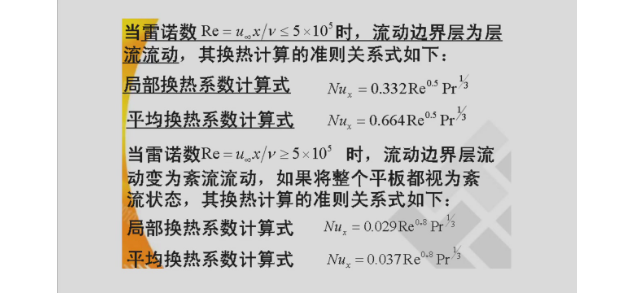

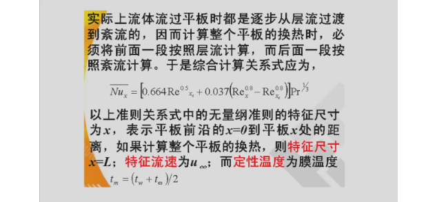

例题 5-5 考过
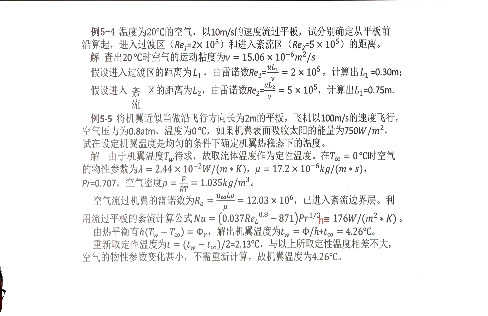

#### 横向掠过圆柱

#### 横向掠过管束

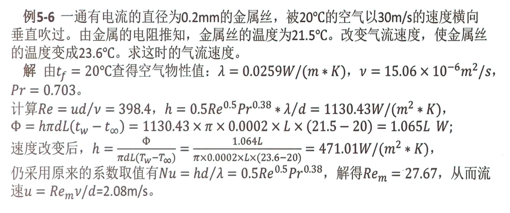

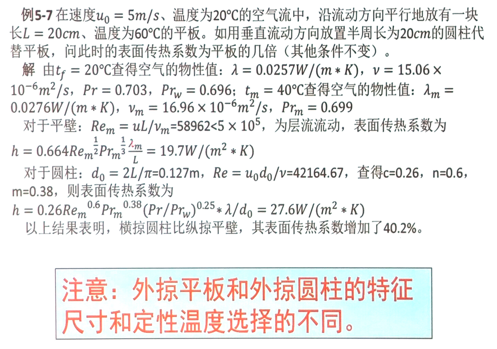

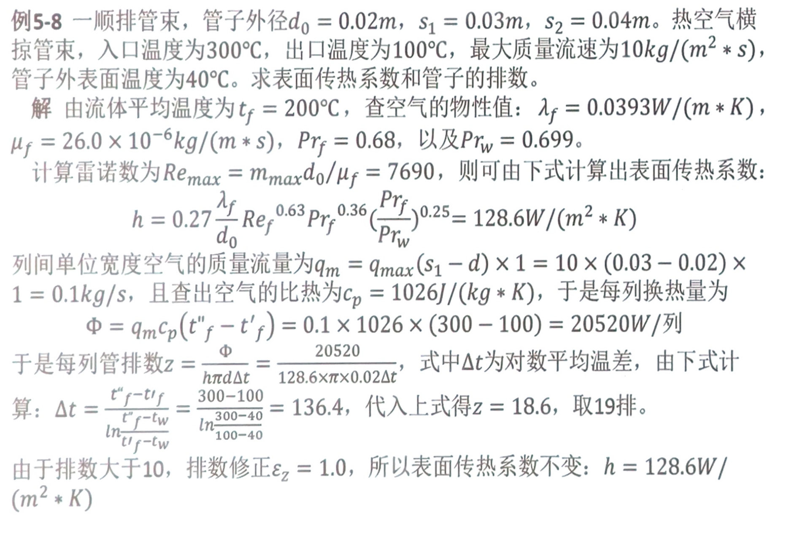