# 发展心理学

#课程笔记

!!! info "评分标准"
	- 出勤 15%
	- 读书笔记  4次5分 20% 
		- 注明3个重点和3个思考点，形式不定，字数不定，下一周上课前上交纸质报告
	- 文献报告 15%
		- 指定文献，分组报告，最后两次课报告
	- 期末闭卷 50%

**读书笔记参考书目**：*Development Across the Life Span*  *发展心理学第二版*

- **课程安排**  
	- 绪论和研究方法
	- 经典理论
	- 早期认知发展
	- 皮亚杰的认知发展理论
	- 信息加工理论
	- 智力的发展
	- 语言的发展

!!! warning "feel"
	老师的讲课不一定按课本顺序来，记一下课本没有的东西，还有上课的例子，笔记来源于发展心理学课本和老师课件

# 笔记 1（1~4周）

笔记的重点和思考置于框图内  

!!! note "几个重点？"
	- 皮亚杰认知发展理论
	- 发展心理学的研究方法和设计
	- 一些儿童观的经典理论
## 绪论和研究方法

**发展：**   

- 毕生持续
- 可塑性
	- 发展过程存在**关键期**（洛伦兹对动物印刻行为研究）
	- 发展过程中不同能力互相代偿，一种能力的损伤缺失能够被另一种能力代偿。（失明后以耳代目）
- 情景性
	- 发展在特定时空中发生
	- **生态系统理论结构**
		- 微观系统
		- 中间系统
		- 外层系统
		- 宏观系统
		- 历史系统 Chronosystem（书本为：历时系统）
		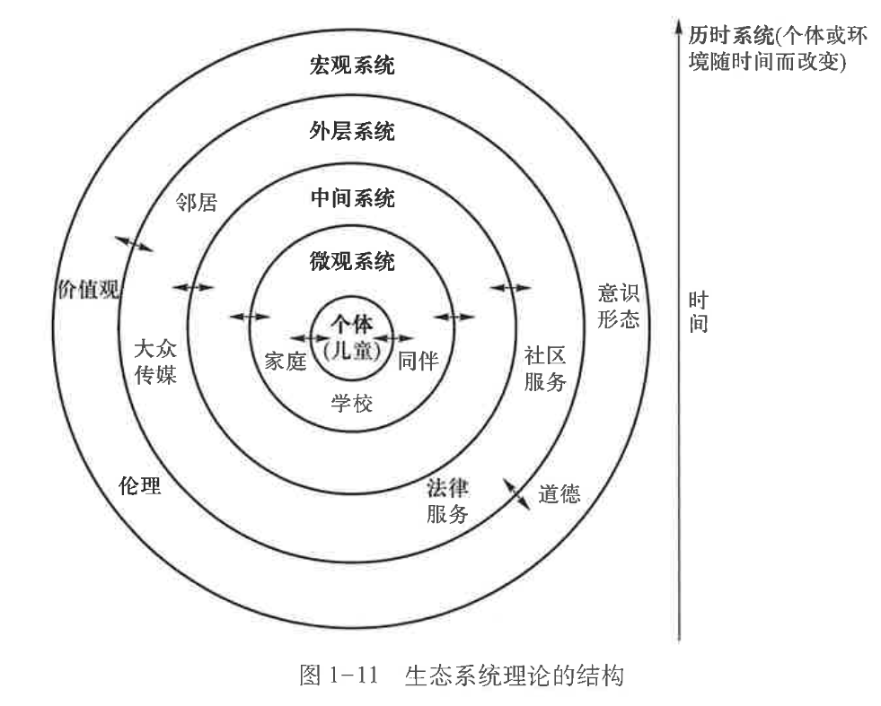

**发展心理学**（通常指狭义）：  

- 广义：研究心理发展及其规律的学科（包括比较心理学，民族心理学等）  
- 狭义：即个体发展心理学

**发展心理学研究目标、目的**  

- 揭示或描述心理发展过程共同特征与模式（最根本）
	- e.g. 共性：生活在不同文化背景下的儿童共同具有的发展过程
- 揭示心理发展的原因和机制
- 测量和解释个体差异
	- 如何评估差异？  →  样本均值
- 探究不同环境对发展的影响
- 帮助和指导儿童的发展

**发展心理学的四个基本理论问题**  

- 遗传与环境
	- 同卵双生，异卵双生控制变量
	- 遗传素质确定发展的区间（上限下限），环境只能在区间内发挥作用
	- 遗传与环境相互作用
- 主动性与被动性
	- 个体发展的不同阶段，遗传-环境-个体的关系不断变化
	- e.g. 母亲讲述事情的精细程度，影响孩子的记忆能力
- 普遍性和特殊性
	- 共性
	- 特性
- 连续性与阶段性
	- 心理年龄特征（划分阶段）
	- 本书使用能力体例划分阶段
	- 质的不同与量的不同

### 研究方法

- **测量技术/数据收集**  
	- 调查法
		- 问卷法
		- 访谈法
	- 观察法
		- 自然观察
		- 实验室观察
			- e.g. 棉花糖延迟满足实验
			- 优点：
				- 比自然观察更好地控制研究情境
				- 有助于研究观察者见到在日常生活中很少有机会见到的行为
				- 效率较高
	- 测验法
	- 实验法
	- 临床法
		- 研究者根据被试对上一个问题的反应相应地提出下一个问题的访谈法
		- 步骤：观察、谈话、实物操作
		- 注意事项
			- 访谈问题的设计(开放式问题与闭合式问题;直接问题和间接问题)
			- 提问的技术(提问的方式;暗示性实验;用语的选择;善于提出假设、通过提问验证假设等)
			- 访谈记录
		- 优点：
			- 可以灵活地把被试当作独特的个体来考察
			- 自由的追问可以保证被试真正理解所问问题的意义
		- 缺点
			- 因为没有同等地对待被试,所得结论可能不可靠
			- 灵活的追问在一定程度上依赖于研究者对被试反应的主观解释
			- 只适用于有一定口头表达能力的人

- **变量间关系的检测**  
	- 相关研究
	- 实验研究

- **研究设计**（4种）  
	- 横断设计
		 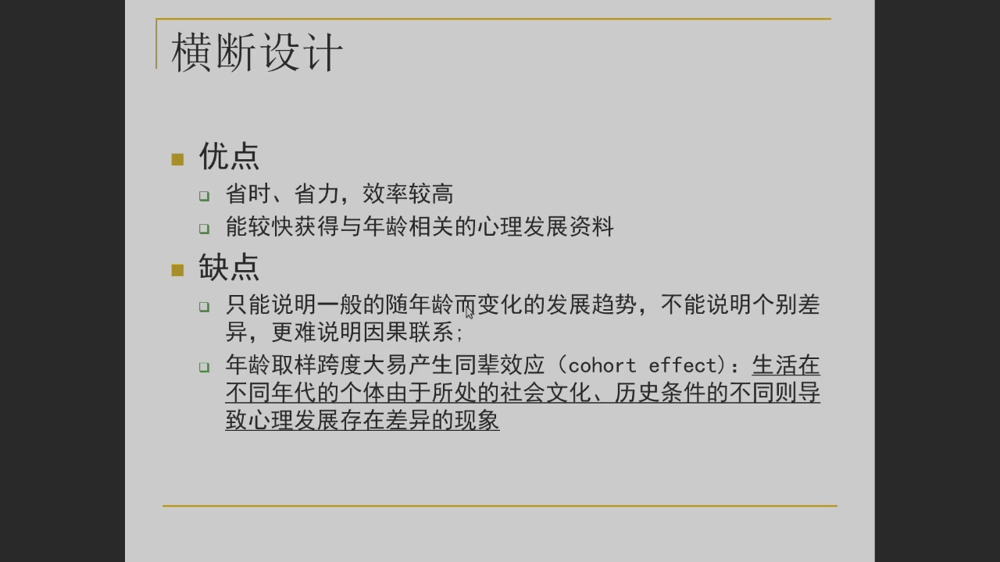
	- 纵向设计（追踪研究）
		- 缺点：
			- 重测效应：第二年比第一年测试好（练习效应）
			- 花费大（钱、时间）
			- 被试流失
		- 优点：
			- 连续
		- e.g. 南方周末少年班去向研究
	- 聚合交叉设计  
		- 没啥用的损招
		- 优点：
			- 只要在相对较短时间的追踪测量，就可以分析某一心理特征在较长时间内的拜年话发展趋势
			- 减弱练习效应
			- 减少被试流失
			- 减少研究费用
		- 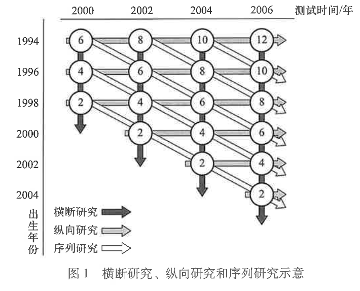
		- 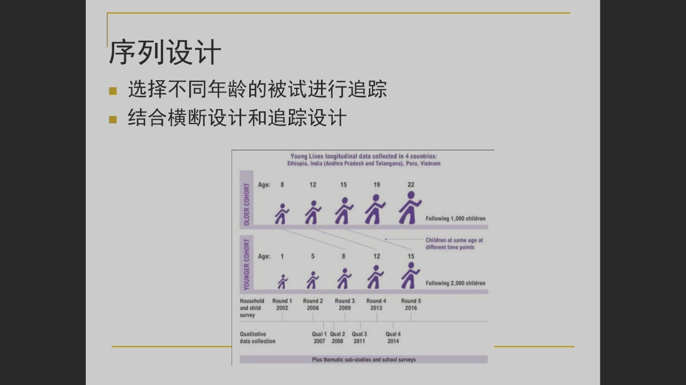
	- 微观发生设计
		- 纵向，时间短，测多次
		- 适用于某种能力在时间内变化很快

!!! note "my thinking"
	- 什么是测量，心理上的东西怎么测量，怎么量化  
	资料：  
	- 社会赞许性，倾向于没那么真实（问卷可能造成的情况，有时候我也不会如是填写问卷）  
	- 研究人的心理活动时存在变量，心理上的变量怎么控制，实验设计还是会存在许多缺陷吧
	

## 经典理论

**儿童观 timeline：**

- 17、18 世纪西方启蒙哲学   
	 - **洛克**的白板说
		 - 行为主义环境决定论
	 - **卢梭**的机能论
		 - 儿童发展冬季来自机体本身，发展过程由自然力量决定
		 - 四阶段：婴儿、童年、童年后期、青少年期
	 - **达尔文**是科学地研究儿童的先驱 
		 - 育儿日记
		 - 自然选择和生存竞争
	 - **霍尔和格塞尔**的成熟势力说：强调生理成熟准备程度
		 - e.g.双生子爬楼梯
		 - 成熟的顺序取决于时间表，年龄为树妖参照
	- 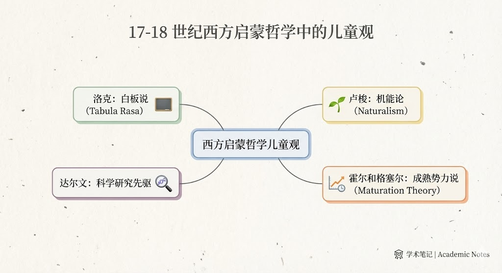
- 20 世纪中叶  
	- **弗洛伊德**的性心理发展理论  p173   
		- 用“力比多”的释放划分人格发展阶段
			- 口唇期
			- 肛门期
			- 性器期
			- 潜伏期
			- 青春期
		- note：弗洛伊德的研究基于病理样本，放在正常人身上要慎重
		- 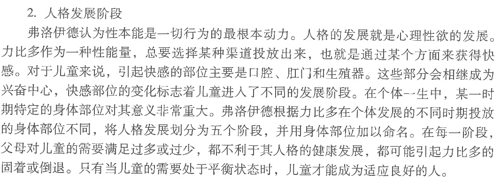
	- **埃里克森**的社会心理发展理论
		- 人的发展时期分为八个阶段，由遗传因素决定，但是阶段是否顺利度过由社会环境决定
		- 心理发展的每一阶段都存在“危机”
			- 积极解决危机→增强自我力量
			- 消极解决危机→削弱自我力量
		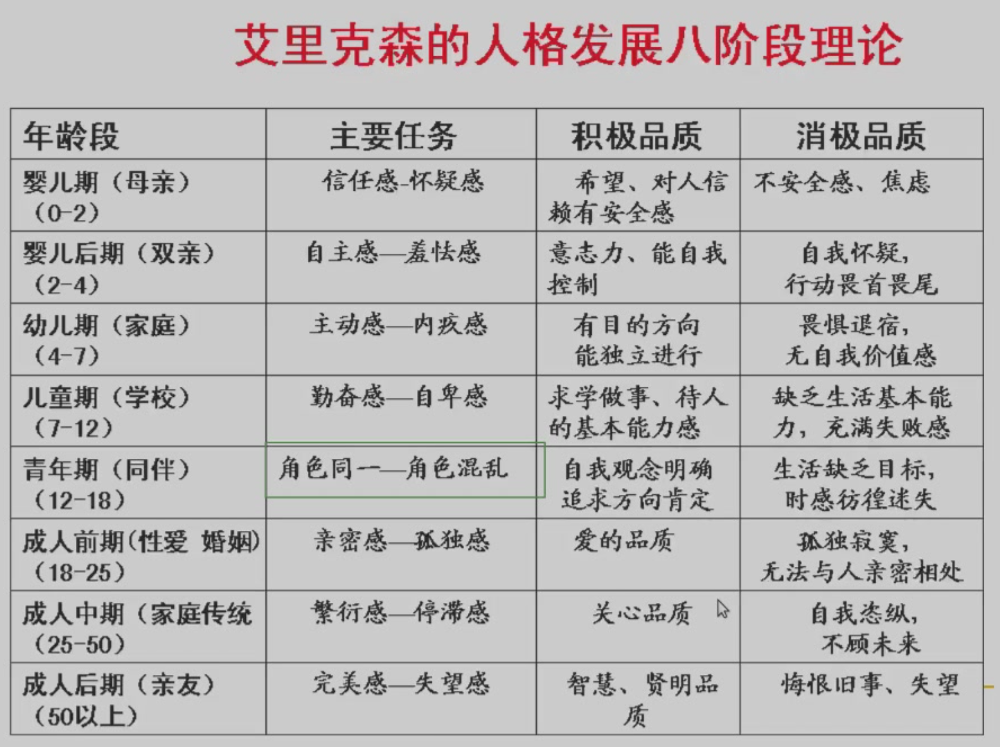
	- **行为主义观** 
		- 华生
			- 心理的本质是行为,研究对象是可观察到的行为,而不是意识
			- 研究方法应该是客观的方法;
			- 研究目标是预测人的行为,控制人的行为
				- 婴儿害怕的条件反射
			- 强调注意刺激与反应之间的可预测关系
			- e.g.哭声免疫法
		- 斯金纳
			- 条件反射
			- e.g.斯金纳箱
	- **班杜拉**的社会学习理论 
		- 观察学习
	- **皮亚杰**的认知发展理论 
- 20 世纪下半叶的发展心理学理论
	- 信息加工理论
	- 习性学
	-  Bronfenbrenner 的生态系统论
	- 维果茨基的社会文化理论
	- 朴素理论

## 早期认知发展

## 皮亚杰认知发展理论

### 概念

**图式** 

- 用来应对和解释某些经验的有组织的思维或行为模式,它是人类认识事物的基础  
- 遗传性  
- 后天获得  
- 可小可大,可一般可特殊

**适应**  

- 通过同化与顺应实现，打破不平衡，实现新的平衡  
- **同化**:用已有的认知结构或经验去解释新事物  
- **顺应**:当主体的图式不能认知或解释新的事物时,要改变和创新原有的图式  

**平衡**  

- 有机体与环境之间的平衡  
- 为了避免心理成分之间的冲突所带来的紧张感,个体通过自我调节机制使认知发展从一个状态向另一个更高的状态的过渡的过程  
- 持续一生,是儿童认知发展的动力  

### 认知发展阶段

- 感知运动阶段（0-2 岁）  
	- 反射练习期（0-1月）
		- 无条件反射练习，巩固反射结构（吮吸反射等）
	- 习惯动作期（1-4.5月）
	- 有目的动作逐步形成期（4.5-9月）
	- 手段与目的分化协调期（9-11 or 12月）
		- 客体永存开始发展
		- 客体永存不成熟，会有“A 非 B 错误”（e.g.baby放玩具）
	- 客体永久性获得期（1.5-2岁）
		- 1.5-2 岁会获得客体永恒性
- 前运算阶段（2-7 岁）  
	- 象征思维期（2-4岁）
		- 形成和使用符号的能力（e.g.小孩画画）
	- 直觉思维期（4-7岁）
		- 不能完成**守恒**
			- 不能利用补偿原则  
			- 不能利用可逆原则
			- **中心化**：不能将注意力集中到两个维度上，只能注意到一个维度（e.g. 两个杯子倒水，小孩排列饼干）  
		- **自我中心特点**："三山实验"
		- 泛灵论：觉得万物有灵，玩偶是活的
		- 不能完成排序
		- 不能完成类包含任务（e.g.花多还是黄花多）
		- 不能区分外表和真实
- 具体运算阶段（7-11、12 岁）
	- **运算**：在观念上的可逆操作
	- 成就：
		- 获得守恒，**去中心化**
		- 群集运算形成
			- 类包含
			- 序列化（e.g.长短排序）
	- 局限
		- 必须用实物
		- 水平参差
- 形式运动阶段（11、12-...成年） 
	- 对运算的运算可以在头 脑中将形式和内容分开,可以离开具体事物,根据假设来进行逻辑推演的思维
	- 不但能够练习具体事物解决问题，而且能够从可能性出发，练习现实来解决问题。
	- 不受真实情境的束缚，将心理运算用于可能性和假设性情境
		- 假设性推理:三段论推理问题
		- 现实与可能之间能实现逆转:不再局限于具体问题情境,而是更倾向于从可能性开始,仔细考虑可能的问题情境和解决方案
			- 通过假设想象表征世界
			- 自我中心意识苏醒
		- 经验归纳和假设演绎:充分利用假设和来自假设的逻辑演绎
			- e.g.钟摆实验
		- 命题内与命题间:不再个别地考虑命题,而是涉及命题与命题间的关系

### 维果茨基

- 认知发展发生于社会文化背景中,社会文
化影响着认知发展的形式
- 儿童的许多重要认识技能是在与父母、老
师以及更有能力的同伴的社会交往中逐渐发
展起来的
- 理论核心:儿童的智力发展与他们所处的
文化关系密切,智力发展的过程还是内容都
不会像皮亚杰所假设的那样具有普遍性

**四种水平**  
- 微观发生学
- 个体发生学
- 种系发生学
- 社会历史发展

### 社会文化理论

**社会相互作用**

- 促进低级心理机能转化为高级心理机能(智力适应工具)
- 可以促进外部言语转化为内部言语,获得新的思考方式,内部语言可以指导、调整自己的行为,以自己的方式获得
- 新技能 -- 心理机能内化说(与皮亚杰比较)

!!! note "典型实验"
	|实验/研究名称|相关学者/流派|所属章节与知识点|实验目的/核心意义|
	|---|---|---|---|
	|**动物印刻行为研究**|洛伦兹|绪论：发展的可塑性|证明心理和行为发展过程中存在**“关键期”**。|
	|**棉花糖延迟满足实验**|米歇尔|绪论：研究方法 - 实验室观察|作为**实验室观察**的典型例子，该方法能更好地控制情境并观察日常少见的行为。|
	|**双生子爬楼梯实验**|霍尔和格塞尔|经典理论：成熟势力说|强调**生理成熟准备程度**，证明成熟的顺序取决于内在的时间表。|
	|**婴儿害怕的条件反射**|华生|经典理论：行为主义观|证明心理本质是行为，强调刺激与反应的预测关系，目标是**预测和控制人的行为**。|
	|**杯子倒水/排列饼干实验**|皮亚杰|皮亚杰理论：前运算阶段|测验**守恒与中心化**。证明该阶段儿童不能利用补偿和可逆原则，注意力只能集中在一个维度（中心化）。|
	|**三山实验**|皮亚杰|皮亚杰理论：前运算阶段|证明该阶段儿童思维具有**“自我中心”**的特点，难以从他人的视角看问题。|
	|**花多还是黄花多任务**|皮亚杰|皮亚杰理论：前运算阶段 / 具体运算阶段|即**类包含任务**。前运算阶段儿童无法完成，到具体运算阶段（群集运算形成）才能掌握。|
	|**钟摆实验**|皮亚杰|皮亚杰理论：形式运算阶段|证明该阶段个体能够进行**经验归纳和假设演绎**，能够利用假设进行逻辑推演。|

# 笔记 2（5~7 周内容）

!!! tip "标注"
	重点使用加粗、高亮标注，思考使用框图 note 标注，最后总结
	上课&书本

## 3.认知发展

### 3.1感知觉发展

p 73
#### ==研究方法==  
1. 习惯化和去习惯化  
	习惯化(habituation)是指由于**刺激的重复出现**，有机体会逐渐**降低对他的对他的反应强度**，即刺激不再引起有机体的注意。去习惯化(dishabituation)是指一旦习惯化发生后，当**另一种刺激出现**时，有机体的反应就会**再次恢复到一个较高的水准**。
2. 注视偏好范式（视觉偏好）  
	**范茨(R. Fantz)**  
	主要用于研究婴儿的**视觉能力**发展。当在婴儿面前呈现一对刺激后，不考虑两个刺激空间位置的情况下，如果他们观看其中一个刺激的时间显著多于另一个刺激，则说明婴儿偏爱这一刺激。  
	**迫选注视偏好程序**：简化婴儿视敏度的研究过程，在改进之后，迫选的刺激只有一个，另一个刺激与背景颜色一样。  
	==**优点：对婴儿做出反应的要求简单，易于实施**==  
	==**缺点：不能解释婴儿偏好某类刺激的原因，若婴儿没有表现出偏好行为，就不易解释背后的机制**==   
3. 违背预期范式  
	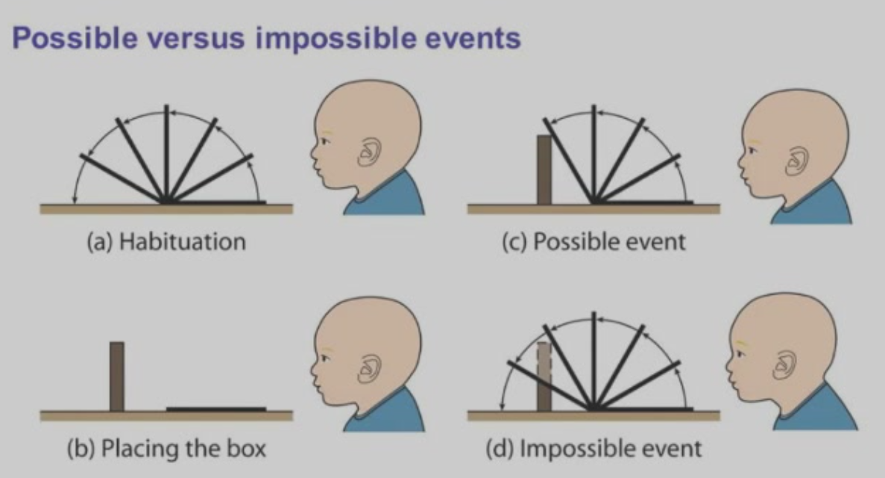
4. 视崖    
	研究婴儿**深度知觉发展**，爬 or 不爬  
	**如果婴儿没有继续向前进行并表达出对深滩的恐惧，说明已经有了深度知觉的能力。**  
	 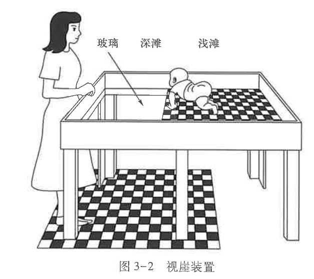
5. 高振幅吮吸技术  
	研究者让婴儿吸吮一个内部安装有电路的特殊奶嘴， 通过婴儿的**吸吮行为**，记录他们对外界的感知反应。根据婴儿的**吸吮频率变化**来研究其知觉能力发展的方法常用于**视觉和听觉**的研究当中。  
	**优点：对被试的视觉和听觉能力要求较低**  
	**不足：新生儿的感知觉和运动水平较低，所以采集到的结果很难得到行为数据的支持**  

####  感觉的发展

1. 视觉  
	==视觉是婴儿成熟最晚的感觉系统==，新生儿只能看清楚 10~75 厘米内的物体。视觉由眼睛和大脑的相应部位共同掌握，新生儿的眼睛和大脑发育都还不成熟。  
	人类早期的视觉过程主要包括**聚焦能力**和**视敏度**两个方面：  
	聚焦能力(focusing ability)指的是婴儿注视视觉目标时，眼睛根据其与物体距离对晶状体进行调节的能力。  
	视敏度(visual acuity)是指眼睛分辨细微刺激物的能力。个体分辨物体细节的能力越强，视敏度越高；反之越低。5-6 月的婴儿视敏度已经慢慢接近成人水平。  
	
	!!! note "think"
		
		老师的解释是拿不同的照片给 baby 看，看他们的反应  
		理论上新生儿看到的是模糊的，但是为什么看模糊照片不会糊上加糊  
2. 听觉  
	==新生儿早期的听力发展水平要高于视觉==  
3. 味觉  
	==新生儿在出生伊始就具有发达的味觉，并对甜味表现出偏爱==  
	不同的刺激物能使婴儿表现出不同的面部水平：  
	酸的刺激物会出现撅嘴现象，苦的刺激物会引起婴儿压低嘴角或张大嘴巴等厌恶反应。  
4. 嗅觉  
	嗅觉指的是辨别气味的感觉，婴儿能区分各种气味，还对不同气味表现出不同的面部表情。   
5. 触觉  
	**==个体发展最早的能力==**  
	==婴儿的触觉发展具有重要意义==，婴儿对母亲的触摸非常敏感，1 岁末时婴儿已经能运用触觉探索外部世界，最初使用口腔触觉，随后使用手的触觉。1 个月的婴儿已经能够凭借口腔辨别出不同软硬程度的奶嘴，并**对触摸过的物品具有一定的记忆能力**。  

#### 知觉发展

1. 大小恒常性和形状恒常性发展   
	**大小恒常性(size constancy)**:    
	是指无论与物体之间的距离如何，个体都能将物体**知觉为同样大小**的能力。    
	**形状恒常性(shape constancy):**    
	是指无论看物体的角度如何，都能将物体**知觉为同一物体**的能力    
	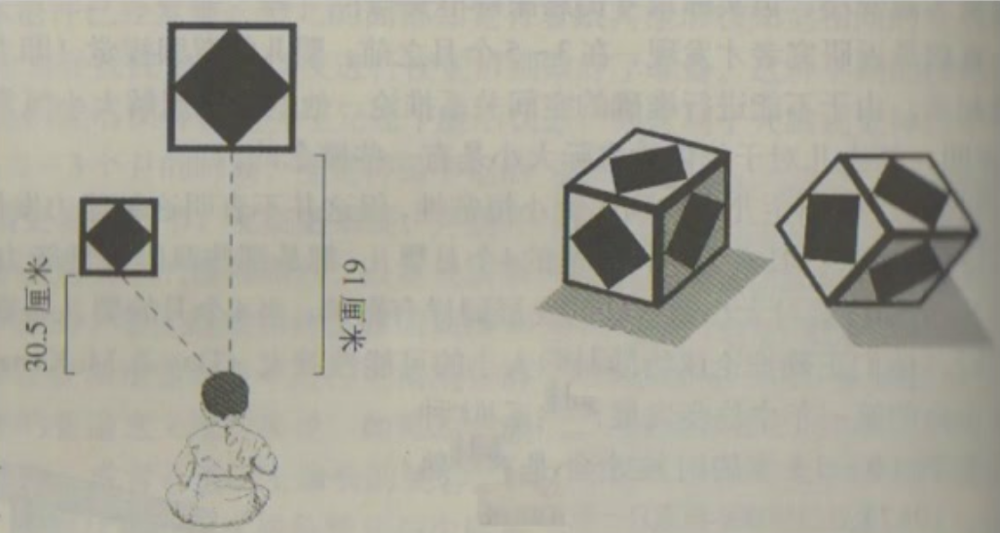
	**3 个月**的婴儿能够表现出知觉的大小恒常性，但是 3 个月大小的婴儿双眼视力能力没有完全成熟，并不能进行准确的空间关系推论。    
2. 图案和形状知觉的发展  
	**范茨**采用**视觉注视法**发现刚出生两天的新生儿就能表现出对人脸图案的偏好性，而且新生儿对面孔和具有复杂面孔特征的类面孔刺激都表现出了偏好。  
	**timeline：**  
	**4 个月**的婴儿能够运用物体的运动线索判断物体的形状  
	**3-4 个月**的儿童还能利用背景线索  
	**1 岁后**的婴儿能够根据算所察觉出越来越多的结构性图形。  
	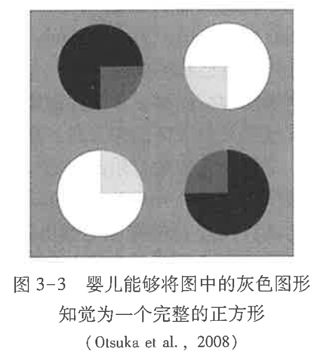
3. 深度知觉的发展  
	立体视觉是深度知觉形成的基础  
	经典装置：==**视崖**==  
	影响深度知觉的因素：  
	- **年龄增长**    
	- **个体运动能力的发展**：随着运动能力的发展，婴儿的爬行经验不断累积，从而促进其深度辨识能力的提高。  
4. 听知觉的发展    
	**新生儿在出生时的听觉能力优于视觉能力**，并且对中频声音的辨别水平已经和成人接近。  
	==新生儿对人类的声音尤其是自己母亲的声音表现出明显的偏爱。研究者采用高振幅吮吸技术==，发现新生儿听到自己母亲的声音时吮吸的速度明显更加快。  

#### 感知觉发展理论

1. 先验论和经验论    
	- **先验论：**
		**代表人物：笛卡尔**  
		基本的知觉能力都是先天具有的。人类生来就有空间知觉，能够理解空间中的复杂关系  
	- 经验论  
		**代表人物：洛克**  
		白板说：
		白板说认为婴儿在刚出生时像一块白板，必须通过后天的学习才能不断发展感知觉。  
2. 直接知觉论和间接知觉论    
	- 直接知觉论：  
		**吉布森(J. J. Gibson)**    
		知觉发展的分化理论。认为个体需要从外界环境中提取信息，从而获取稳定的、有意义的和复杂的直接知觉经验。  
	- 间接知觉论   
		刺激本身所提供的信息是模糊的、不完整的， 不能对外界事物进行全面的描述，所以个体只有在过去经验的基础上，对刺激信息做出推断、评价和解释， 才能实现对刺激的真正知觉。

### 3.2 注意的发展

注意的概念：心理活动对一定对象上的深入加工过程
注意的两个基本特征即指向性(orienting)和集中性(focusing)分别指的是在某一时刻总是有选择地朝向某一定对象和停留在一定对象上地深入加工过程。

#### 注意品质的发展
书本p 80

1. 注意广度发展  
	概念：个体在同一时间内能够清楚直觉到对象的数量  
	测量方法：速示法，通过一个个体在一定时间内知觉到的刺激对象的数量  
2. 注意稳定性发展  
	概念：个体将注意长时间地保持在某种事物上的品质。  
	2 岁可达 10 分钟以上  
	性别影响：学龄初期，女生的注意稳定性优于男生。  
3. 注意选择性发展    
	概念： 个体对同时呈现的两种或两种以上刺激信息中的目标进行选择性加工的过程。  
4. 注意分配和注意转移的发展  
	- 注意分配 
		知识个体同时进行两种以上的活动并把注意只想活动总的不同对象。
	- 注意转移
		指个体能根据新任务，主动把注意从一个对象转移到另一个对象上的能力

总结：

| 品质        | 定义            | 发展特点         |
| --------- | ------------- | ------------ |
| **注意广度**  | 同一时间清楚知觉对象的数量 | 中学阶段接近成人     |
| **注意稳定性** | 长时间保持注意       | 2岁可达10分钟以上   |
| **注意选择性** | 选择性加工目标信息     | 儿童听觉选择性延续到成人 |
| **注意分配**  | 同时进行多种活动      | 婴儿期处于较低水平    |
| **注意转移**  | 主动转移注意对象      | 随年龄发展提高      |
#### 注意发展理论

1. 鲁利亚：注意发展理论
2. 卡尼曼：中枢能量理论
3. 波斯纳等：注意网络理论

### 3.3 记忆的发展

#### 记忆概念 
记忆加工过程（信息加工理论）：编码、储存、提取
根据记忆长短分类  
- 感觉记忆  
- 短时记忆  
- 长时记忆  
	- 陈述性记忆：指能够有意识地回忆起的、对事件和事实地记忆。  
		- 语义记忆：指对事实和一般知识地记忆    
		- 情境记忆：对个体所经历的事件的记忆   
	- 程序性记忆：关于怎么去做一件事情的记忆    

#### 婴儿记忆研究范式

1. 操作性条件反射  
	Rovee-Collier 的研究用到了一张连接有活动装置的婴儿床，儿童动腿的时候可以牵动另一端的装置活动起来。看到装置活动婴儿就会非常开心于是就不停踢腿来使装置活动。结果表明，2 个月的婴儿在两天后依然记得这种连结。  
	!!! note "think"
		这个实验挺有意思的，
2. 延迟模仿  
	指成人在婴儿面前使用一个新异而物体做出一套新异的动作，婴儿则会延迟一段时间后模仿这一系列动作
3. 习惯化
	越是新异的刺激，越能吸引个体的注意。在习惯化中加入延迟，可以考察婴儿一段时间后是记住还是忘了原来的刺激，可以此来研究儿童的==视觉再认记忆==

#### 自传体记忆发展
  1. 婴儿期遗忘
	儿童和成人很难记得自己在婴儿期或早期经历的事情
	理论原因分析：
  2. 自传体记忆
	随着自我意识的获得、语言水平的发展、叙述水平的提高、**元表征能力**的提高，儿童能够记住关于自己的事件变得越来越复杂。
	如果有成人语言的提示和引导，儿童的自传体记忆会表现得更为出色。儿童在与父母进行有关回忆过去得对话的同时，也是积极地参与自己记忆的发展。
	!!! note "think"
		这一点如何指导儿童的成长

#### 记忆容量
测量短时记忆存储容量通常使用**记忆广度任务**  

#### 记忆策略  
- **机械复述**  
- **精细加工**：记忆材料时，创造出与这些材料有联系的表征，时它们更具有意义  
- **组织**：把相似的信息放在一组中进行记忆  

### 3.4 思维和问题解决

#### 婴儿思维

思维较为简单  
理解客体永存性  

#### 学前儿童和学龄儿童的思维

1. **中心化**  
	幼年儿童往往只注意刺激物的某一方面，特别是表面特征，而忽略其他方面   
	e.g.
	 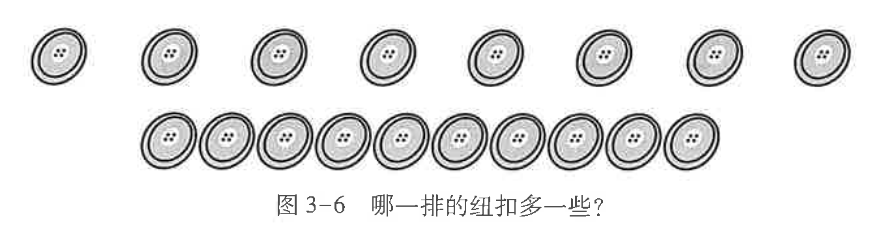
2. **对守恒的理解**  
	不能理解守恒问题（e.g. 杯子倒水一样高吗？）  
3. **对转化理解**   
	转化：一种状态变化成另一种状态的过程  
	无法想象转换的过程，年幼儿童倾向于把注意集中于某一状态，而不是状态发生的整个过程  
	e.g.铅笔下落的状态？  
	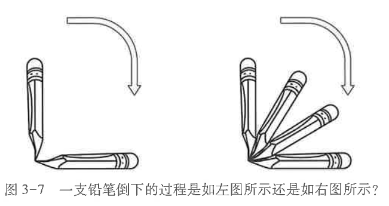
4. **自我中心**  
	不考虑他人观点的思维  
	年幼儿童不考虑他人观点，不能理解他人具有与自己不一样的心理活动，学龄儿童自言自语也与他们的自我中心有关。  
5. **学龄儿童进步**   
	- 摆脱自我中心
	- 获得可逆性概念

#### 青少年的思维
和前面皮亚杰理论差不多

### 3.5 元认知
#### 基本概念

**元认知(metacognition)**：是个人对自身认知活动的认知，负责管理、组织、调节、监控各个认知活动。  

元认知与认知有区别

**元认知的测量**：自我报告发，出生思考发和自然语言分析法，量表和眼动记录也能用于分析儿童的元认知。  
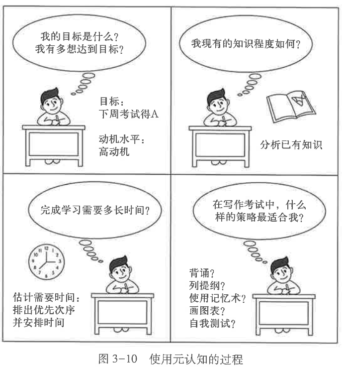

#### 元认知要素
元认知知识最早出现  
元认知监控在 8-10 岁后发展，但这不代表元认知监控就发展完善了，有些个体可能知道成年都未发展出成熟有效的元认知监控  
最后发展的是有关元认知成分、结构的整体概念。这种概念化会在日后越来越成熟和完整。  

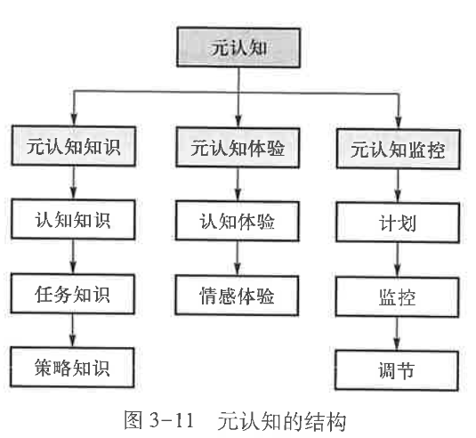

#### 元认知发展

| 类型    | 定义              | 特点               |
| ----- | --------------- | ---------------- |
| 元记忆   | 对自身记忆能力和过程的认识   | 学前儿童水平低，会高估自己能力  |
| 元模仿   | 对自己模仿能力的认知      | 随年龄、认知能力和经验增加而发展 |
| 元注意   | 对自身注意力的认知、调节和监控 | 越来越注重自身努力的重要性    |
| 元学习能力 | 对学习的自我监控        | 小学后发展明显          |

## 4.语言的发展
### 4.1语言发展过程
#### 前语言阶段

几个特点  

- 3 个月：交流中表现出轮流特点
- 7-9 个月：具有联合注意能力
- 婴儿能区分极其相似的语音
- 对母语表现出偏好

#### 言语阶段

##### 单词句阶段（12-24 月）

把单词匹配到意义方面时会出现以下几种错误    
一些不足：  

**拓展不足**：指只将单词的指代范围限制在有其内涵，例如，把“狗”这个词等同于自家的那只狗。  
**过度拓展**：扩大了单词的指代范围。例如，“爸爸”不仅指代自己的爸爸，还用来代表所有的男人。
**重叠**：指儿童有时过度拓展某个词语，有时又对该词拓展不足。  

##### 双词句阶段（18-30 月）
一个单词进入两个单词  

**3 个里程碑：**  
- 出生第一年的下半年的时候获得交流姿势  
- 在大约一岁的时候第一个单词出现
- 约 18 个月时词汇的显著增长

##### 句法爆发期（24-36 个月）

能够将单词组合成有意义的，类似于句子一样的单元。他们能够使用形容词和副词、疑 问句以及简单的否定词和肯定词，开始学习语调、词形变化的规则。
==**过度规则化**==：发现语言的词法和句法规则，但是不能很好掌握词形变化的例外情况。（e.g.倩读成青）

### 4.2 语言知觉

#### 言语范畴知觉特性
baby is citizen of the world  
人类并非以连续方式感知语言，而是在某个点上突然感知到语音变化。  

概念：  
言语范畴知觉：不能区分属于同一音位范畴的不同语音而容易区分落在音位界限两侧的与语音现象  
发声起始事件（VOT）：声音从嘴唇释放和声带开始震动之间的时间。对于/ba/和/pa/，VOT 在25 ms 时为临界点。  

实验：  
采用习惯化的范式和高振幅吮吸技术研究婴儿的言语范畴知觉，先让婴儿习惯化其中一种语音的刺激， 然后再呈现另一种语音的刺激，当婴儿区分出这两种刺激时婴儿的吮吸速度会加快。
研究结果表明，婴儿在会发出/ba/和/pa/两个语音前就能区分这两者。   

言语知觉能力来源：  
言语知觉是先天的，婴儿能够区分非母语者语音对比  
条件化转头技术(conditioned head turn)是条件反射的一种形式   

#### 言语范畴知觉的发展
几个特点：  

- 婴儿对非母语言语知觉的敏感性在 6-12 个月下降  
- 元音的母语特异性感知比辅音发生得早  
- 元音感知呈现**感知磁体效应**  
	- 感知磁体：心理物理距离比声学物理距离更敏感的变化。在声学距离近的地方，心理距离更近；声学距离远的地方，心理距离更远。

#### 言语范畴知觉母语特异性的发展机制

1. 统计学习理论
2. 功能性重组
3. 社会交互行为促进语言学习（找外教...)

### 4.3 词汇学习
#### 词汇学习里程碑
| 年龄      | 发展特点        |
| ------- | ----------- |
| 6个月     | 识别少数熟悉词汇    |
| 9-12个月  | 首次出现系统的词汇学习 |
| 12-18个月 | 学习各种类型词汇    |
| 18-24个月 | 词汇爆发期，出现双词句 |

#### 词汇学习过程

1. **社会互动线索**：婴儿利用视线、表情推断说话者意图
2. **认知限制原则**：整体性原则、互斥原则、分类组织原则
3. **句法线索**：从句法结构推测词汇意义
4. **一般加工过程**：知觉、注意、记忆等加工过程

可以推断婴儿词汇学习的发展并不会单纯依赖一种机制。  
联合生成模型（ECM）整合了婴儿词汇发展较早阶段使用的注意线索、认知限制原则与稍晚阶段使用的社会线索、语言线索，用多方面的因素解释词汇获得和爆发现象。

#### 语用发展

1. 词汇
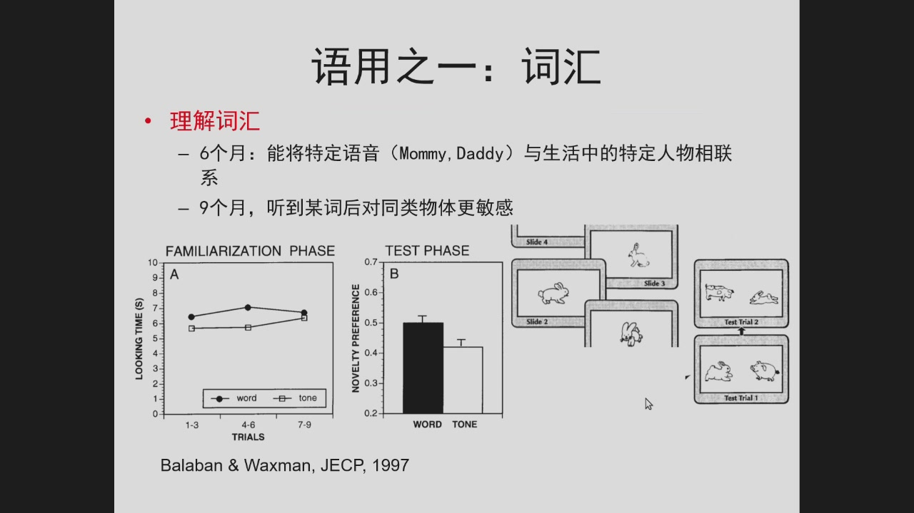

婴儿理解词汇的可能机制

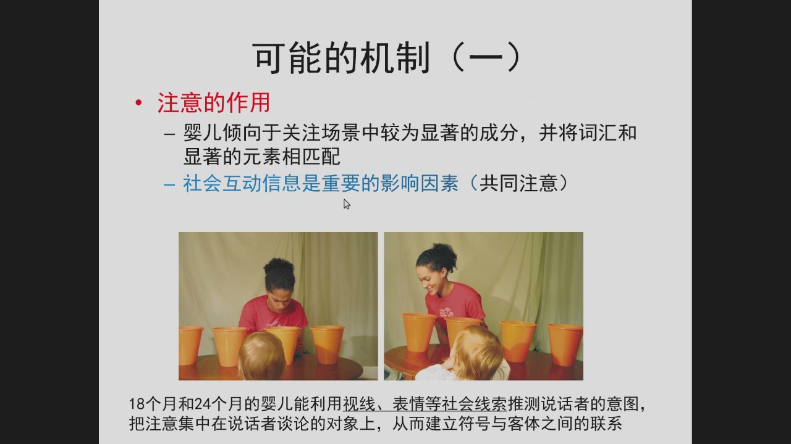

### 4.4 语言规则学习

**重点！：**  
==**普遍语法理论：乔姆斯基**==
尽管不同文化儿童必须学习各异的语言规则， 但他们生来具有一套抽象的、普遍的关于语言特性的知识，这些知识是用来描述所有语言特征的语法规则。
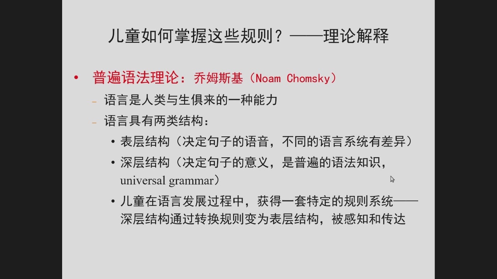

证据：  
1. **Wug 测验**：学生能正确复数化新词，说明语言学习受先天敏感性引导  
2. **过度规则化**：儿童在不规则单词上使用规则语素  
3. **黑猩猩实验**：黑猩猩能用词汇交流但没有句法能力  
4. **关键期假设**：18个月到青春期是语法学习的关键时期  

对语言发展的理解  

==语言获得装置==  
	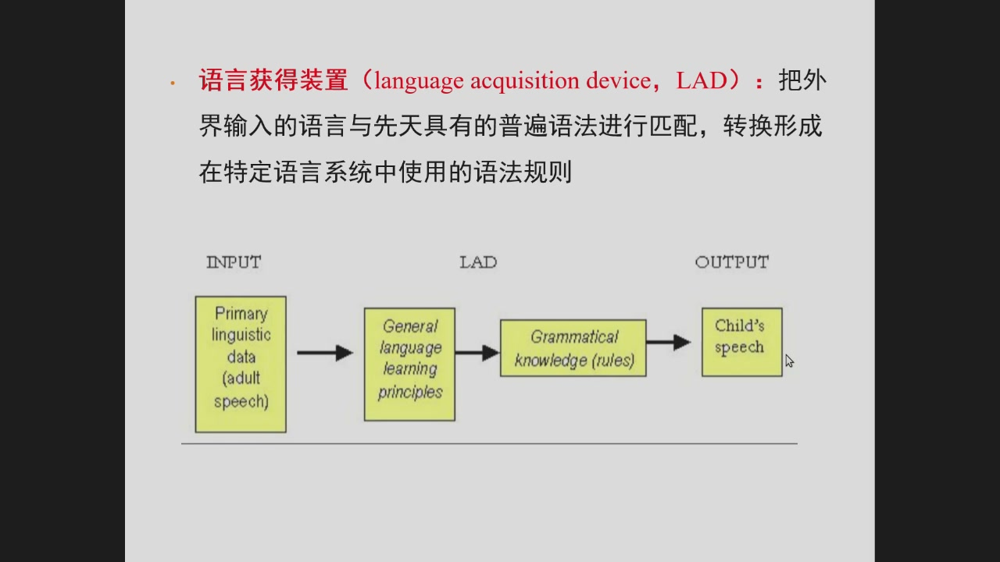
大脑的专门化  
语言学习的关键期假设

## 5. 智力发展
### 5.1智力理论

#### 心理测量学取向
总结：  

| 理论      | 提出者    | 内容                   |
| ------- | ------ | -------------------- |
| 因素论     | 斯皮尔曼   | G因素（一般能力）+ S因素（特殊能力） |
| 群因素论    | 瑟斯顿    | 7种基本心理能力             |
| 流体/晶体智力 | 霍恩&卡特尔 | 流体智力（先天）+ 晶体智力（后天获得） |
| 层次结构理论  | 弗农     | 四个层次的智力结构            |
| 三位结构理论  | 吉尔福德   | 内容、操作、产品三个维度         |

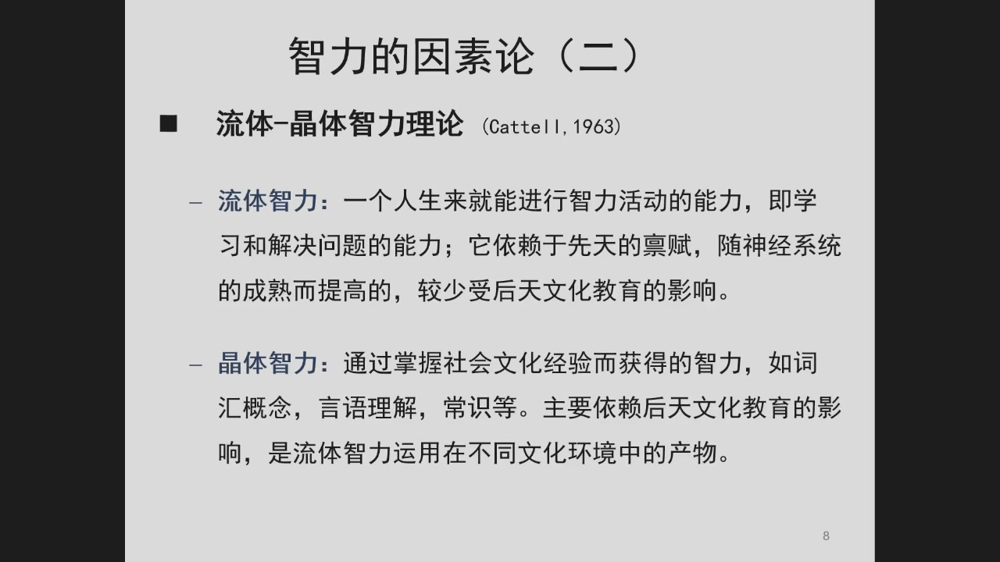
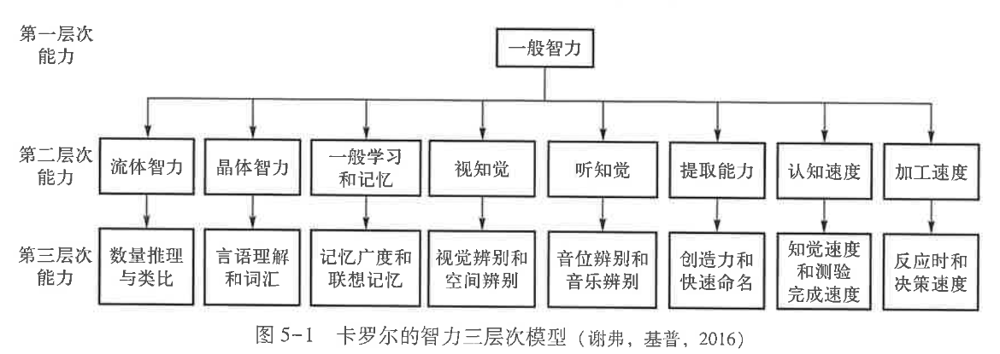

#### 认知心理学取向

1. 多元智力理论  
	加德纳(H. Gardner)  
	智力并非一元结构，而是由多元成分构成的，具有 9 种成分，且 9 种成分各自独立。  
	==**言语智力、数理逻辑能力智力、音乐智力、空间智力、身体运动智力、人际智力、自知智力、自然感知智力、对精神和存在的思索智力。**==  
	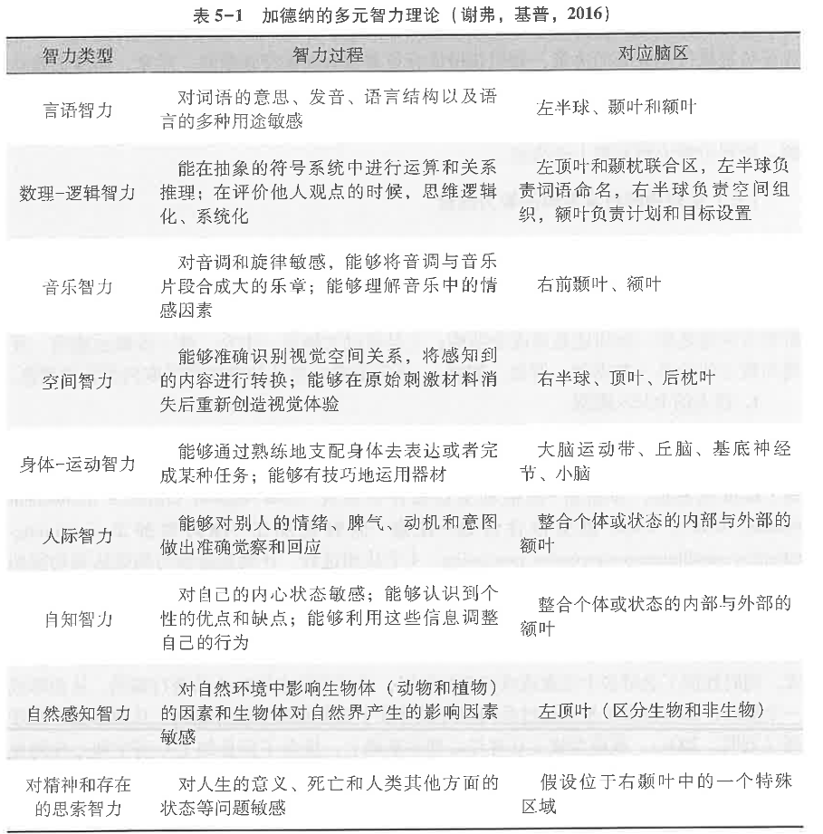
2. 三元智力理论  斯滕伯格 Sternberg  
	在传统智力理论的基础上，采用信息加工方法，对人的复杂而多层面的智力结构中进行相对完整的描述。  
	试图以**主题内部世界、显示外部世界、联系内外世界**的经验世界三个维度来描述智，形成了以**情景亚理论、经验亚理论和成分亚理论**为维度的三元智力理论。  
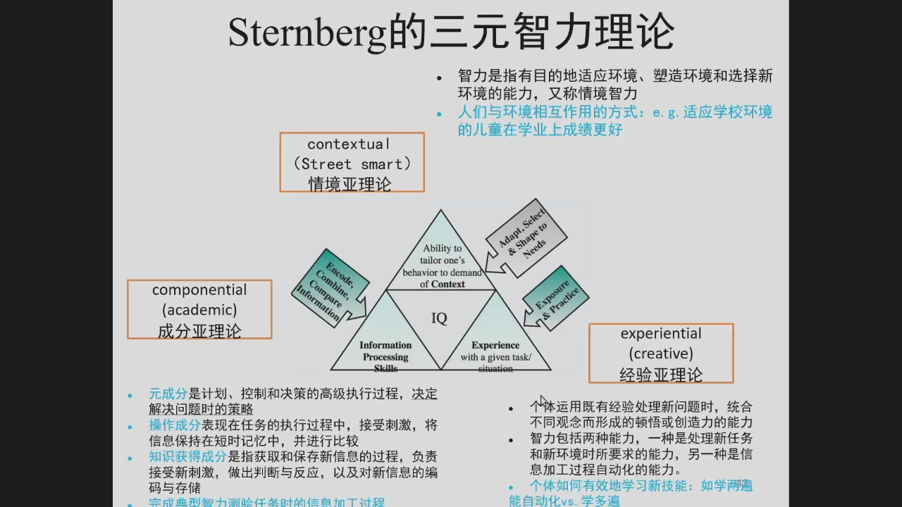

#### 认知神经科学取向

1. 智力的 PASS 模型  
	达斯(J. P. Das)、纳格利里(J. A. Naglieri)和科尔比(J. R. Kirby)    
	PASS 包含**计划-注意-同时性加工-继时性加工**4 个认知过程  
2. 生物-生态学智力理论  
	塞西(S. J. Ceci)   
	主张智力是天生潜能、情境因素和内部动机的函数  
3. 智力的神经可塑性模型  
	加里克  
	通过对人工神经系统的研究提出  
	神经可塑性：神经系统为不断适应外界环境的变化二改变自身结构的能力

#### 情绪智力理论
萨洛维(P. Salovey)和梅耶(J. D. Mayer)  
分为 4 维度、16 个变量的情绪智力理论结构  
四个维度分别为：**情绪知觉、情绪整合、情绪理解、情绪管理**  
### 5.2 智力测验

#### 测验的演变

1. **方法学基础**：从经典测验理论（CTT）到项目反应理论（IRT）  
	- 经典测验理论（CTT）:真分数理论，主要是将测量部分分为真实部分和误差部分等  
	- 项目反应理论（IRT）：测量指标与被试的潜在特质之间的联系（比上面这个进步）  
2. **测验依据** ：从强调测量指标到强调理论基础
	鉴于传统智力测验理论上的不足，研究者在现有的智力测验时都在一定程度上增加了基本理论的内容。  
	e.g.   
	PASS 模型就是整合了信息加工心理学和心理测量学理论而编制的认知评估系统。  
3. **测验内容**  ：从关注学业能力到评估更多方面能力
	传统智力测验的内容大多是与学业有关的智力，测验编制倾向于与学校教育的内容相一致，追求的是预测成功，忽略了与现实相联系的部分。因此，后续的研究者提倡从更宽广的视角来研究智力，拓宽智力测验的内容。
4. **测验形式**  ：从静态测验到动态测验
	从静态测验到动态测验  

!!! note "think"
	智力测量的变化，反应了这个社会的价值评价体系有什么变化？以前大多是学业相关，现在更多看多元能力发展

#### 经典智力测验
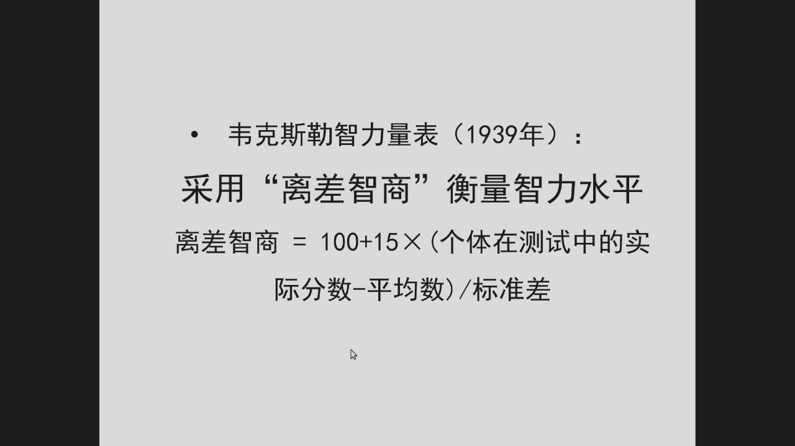

| 测验              | 人物     | 特点                      |
| --------------- | ------ | ----------------------- |
| **比内-西蒙智力量表**   | 比内&西蒙  | 1905年编制，提出"智力年龄"概念      |
| **斯坦福-比内智力量表**  | 特曼     | 引入IQ概念：IQ=心理年龄/实际年龄×100 |
| **韦克斯勒儿童智力量表**  | 韦克斯勒   | 综合测量语言、操作及工作记忆          |
| **考夫曼儿童成套评估测验** | 考夫曼    | 关注认知过程而非仅知识积累           |
| **动态测验**        | 布朗&布多夫 | 评估潜在智力发展水平              |

### 5.3 智力发展与影响因素

#### 智力发展特点
一般特点：  
- 从简单到复杂  
- 从一般到特殊  
- 存在不同认知能力发展的最佳时期  

年龄特点：  
智力发展随着年龄的变化而变化  

不同学者的观点整理：

| 学者   | 观点                                                                |
| ---- | ----------------------------------------------------------------- |
| 推孟   | 10岁前呈直线式快速发展，10 岁后速度减慢。                                           |
| 贝利   | 13 岁前呈直线式上升，13 岁后上升逐渐减慢，26—36 岁处于高峰期但略有下降。                        |
| 韦克斯勒 | 3—13 岁呈匀速发展趋势，13 岁后速度随年龄增加而递减。                                    |
| 布卢姆  | 强调早期发展的重要性：出生到 4 岁：获得 50%的智力； 4—8 岁：获得 30%的智力；8—12 岁：获得最后 20%的智力。 |

#### 智力发展的差异性

##### 个体差异
**发展水平差异**
在智力发展水平方面，人群的智力水平呈现两头小、中间大的正态分布形式  
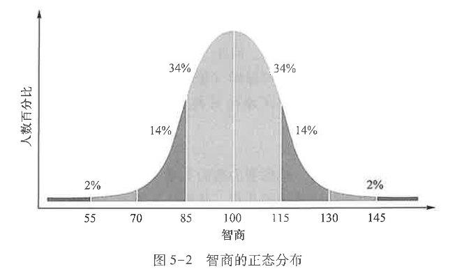

**智力类型差异**

同龄群体按智力发展水平分为：**智力超常、智力中等、智力落后**

!!! note "think"
	怎么根据智力特点来教育儿童

##### 群体差异

**性别差异**：  
男性更聪明，女性更聪明？bushi 研究这个  
**男性的正态分布的标准差更小，极端值更多，女性的智商的中等水平的人数百分比更大。以及在均值上两者相同。**  

**文化差异**：  
这个研究有些争议   

!!! note "think"
	在文化差异上，大多数研究者是白人，他们编制的智力测验多符合白人中产阶级的经验和文化背景。这种智力测验的结果是有失偏颇的  
	有没有基于中国人特点的智力研究方案？  

#### 智力发展的影响因素

1. 遗传因素
	- 家庭谱系研究
		scholar：高尔顿  
		结论：
		- 智力在人群中呈**正态分布**。
		- 智力有亲缘相关性：名人的父亲、儿子、兄弟成为名人的比例远高于普通人；且随着亲属关系疏远，杰出比例下降。
	- 双生子研究
2. 家庭环境
	家庭环境是一个复杂的刺激组合，其动态变化直接影响智商差异  
	收养研究  
	贫困研究  
3. 学校教育
	教育教学在智力发展中起着主导作用，是提升智力方法和获取经验的必要途径。
4. 社会文化
	跨文化差异  
	弗林效应  

## 重点总结

1. 感知觉研究方法（习惯化、注意偏好范式、视崖）
2. 语言发展的三个阶段
3. 言语规则 乔姆斯基
4. 智力的主要理论（因素论、多元智力、三元智力）
5. 经典智力测验

## 思考点

1. **联合注意缺失对自闭症儿童发展的影响是什么？** 如何通过干预改善？

2. **儿童期遗忘现象的成因是什么？** 为什么我们很难记得婴儿期的经历？这与大脑发育、语言能力和自我意识有何关系？

3. **元认知能力对学习有什么影响？** 如何培养儿童的元认知能力？在教学中应该如何应用？

4. **语言学习的关键期假设是否成立？** 如果错过了关键期，语言能力还能恢复到什么程度？

5. **不同智力理论的优缺点是什么？** 在实际教育中，应该采用哪种智力观来评价和培养学生？

6. **智力测验的文化公平性问题如何解决？** 传统智力测验可能存在什么偏见？