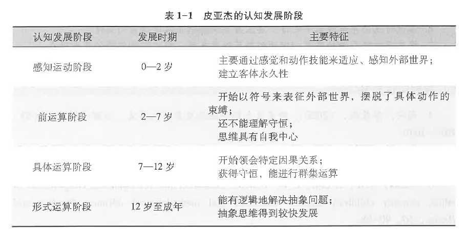
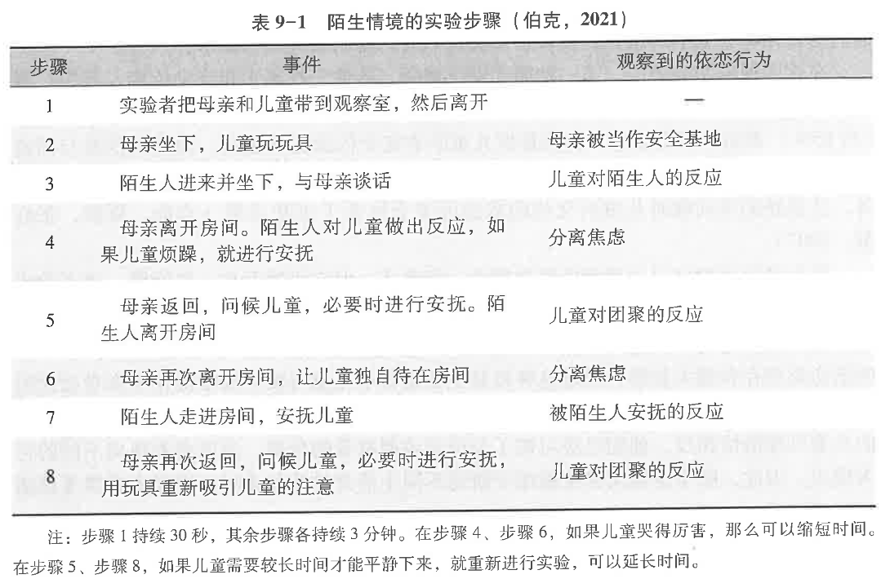

发展心理学研究方法
- 调查法
- 观察法
- 实验法
- 临床法

认知发展；

**皮亚杰认知发展理论**

图式：认知结构、格局，用来应对或解释某些经验得到的有组织的思维或行为模式

适应  
	- 同化 ：用已有的图式来解释新事物
	- 顺应 ：不能用图式解释时，对已有的图式进行改变

平衡：

认知发展阶段
- 感知运动阶段
	- 客体永存性形成
- 前运算阶段
	- 使用符号
	- 中心化（单一维度看问题）
	- 自我中心（三山实验）
	- 不能守恒、排序
- 具体运算阶段
	- 守恒、去中心化
	- 群集运算，能类包含和序列化
- 形式运动阶段
	- 抽象思维

**维果茨基社会文化理论**

语言和自我语言的作用

语言三阶段：外部言语、自我中心言语、内部言语

最近发展区（ZPD）：介于儿童独立解决问题的实际发展水平和借助他人帮助解决问题的潜在发展水平之间的区域

**信息加工理论**

生态系统理论
- 个体
- 微观：家庭、学校、同伴
- 中间
- 外层
- 宏观
- 历时

## 第三章 身体与动作发展

动作发展：

粗大运动技能
精细运动技能

## 认知发展

感知觉、注意、记忆、元认知

**感知觉研究方法**
- 习惯化去习惯化
- 注意偏好范式：偏爱哪个视觉刺激
- 视崖（在社会参照里面也有）：深度知觉能力
- 高振幅吸吮技术

**感觉发展**
选填

视觉最晚发展
研究聚焦能力、视敏度（辨认物体细节）

听觉
味觉
嗅觉
触觉

**知觉发展**

大小恒常性：无论距离，知觉相同大小
形状恒常性：无论角度，知觉相同形状

深度知觉：视崖实验

直接知觉论、间接知觉论

**注意发展**

注意：心理活动对一定对象的选择和集中
- 集中性：心理活动停留在一定对象上的深入加工
- 指向性：心理活动有选择地朝向一定对象

**注意品质**

- 注意广度：个体在同一时间内清楚知觉到的对象数量
- 注意稳定性
- 注意选择性
- 注意分配、注意转移

**联合注意**：个体追随另一个个体的注意，从而两个个体注意到同一个事物的过程

**记忆发展**

**记忆**：对先前时间或经历的记录或表征

**陈述性记忆**：对事件和事实的记忆
- 语义记忆
- 情境记忆
**程序性记忆**：怎么去做一件事（骑自行车）

**研究婴儿记忆实验范式**：

操作性条件反射
**延迟模仿**
习惯化：研究视觉再认记忆

**自传体记忆**

**婴儿的思维、学龄儿童**：客体永存、守恒问题、中心化、自我中心...

青少年：假设思维、归纳推理、演绎推理、想象听众、个人神话

**元认知**：个体对自身认知活动的认知
（简单理解？认知是解决问题的能力，元认知是评估认知的能力）

## 语言发展

**乔姆斯基**  普遍语法理论：不同文化下的儿童生来具有一套抽象的、普遍关于语言特性的知识

证据：
- wug 测验
- 过度规则化
- 黑猩猩学语言
- 关键期假设

**语言获得装置（乔姆斯基）**：人类具有天生的语言处理器

言语知觉范畴：

## 智力发展

智力： 个体顺利从事多种活动所必须的各种认知能力的有机结合

流体智力
晶体智力

智力理论
心理测量学取向
- 因素论:  斯皮尔曼：智力二因素论（一般因素+特殊因素）/霍恩、卡特尔：流体智力、晶体智力
- 层次结构理论：

认知心理学取向：
- 多元智力理论：加德纳
- 三元智力理论：斯滕伯格

认知神经科学取向：
- 智力 PASS 模型：计划——注意——同时性加工——继时性加工

**智力测验**

第一个：比内—西蒙量表

斯坦福-比内量表：比率智商 $IQ=\frac{心理年龄}{实际年龄}$

韦克斯勒儿童智力量表（WISC、WAIS）

考夫曼儿童成套评估测验

**智力差异**
- 超常儿童：iq>140
- 低常儿童 iq<70

遗传对智力影响：双生子研究

## 情绪、气质、人格

**情绪**：对客观事物与人的需要之间关系的反映，是个体对内部或外部事物的主观感觉和体验

布利斯齐  **情绪分化理论**：
兴奋→快乐、痛苦→快乐：高兴、喜悦、喜爱/  痛苦：愤怒、厌恶、恐惧、嫉妒

**陌生人焦虑**（认生）：害怕跟陌生人在一起或说话，表现出警惕反应

**社会参照**：婴儿利用他人的表情作为参照决定自己的反应行为

**自我意识情绪**：以自我参照为前提，通过自我察觉、自我评价、自我反思而产生的情绪（内疚、羞愧、尴尬、自豪 etc）

移情：儿童察觉到他人反应的同时，也能体验到与他人相似的情绪反应

**气质**：个体在反应性和自我调节等方面的稳定特征

类型：
托马斯、切斯分类：
- 容易型
- 困难型
- 迟缓型：活动水平低

**人格**：源自个体自身的稳定行为方式和内部心理过程

理论：
弗洛伊德心理性欲发展理论

**埃里克森**  **心理社会发展理论**：
八个阶段，每个阶段有主要矛盾

## 自我与社会认知

自我；知情意

点红实验

自尊：通过对构成自我概念的特征进行评价，而做出的对自己存在价值的认定
- 内隐自尊
- 外显自尊

**社会认知的发展**

**观点采择**：从他人的角度看待问题的能力
- 社会观点采择
- 空间观点采择

**心理理论**：儿童对他人的愿望、信念、动机等心理状态以及心理状态和行为之间关系的认识
- 理论论
- 模仿论
- 模块论

心理理论的发展：
- 愿望心理学
- 愿望-信念心理学
- 信念-愿望心理学

实验范式：
**错误信念任务**
- 意外地点任务（盒子、篮子找小球）
- 意外内容任务（糖果盒装铅笔）
- 外表-事实区分任务（石头与海绵）

## 性别差异与性别角色社会化

**儿童性别化发展**

**性别化**：儿童获得性别角色行为和性别角色信念的过程

**性别恒常性发展**
- 性别认同（正确把自己标志为男性或女性）
- 性别稳定性（性别不随年龄变化而改变，boy 以后是 dad 不是 mummy 没有男妈妈这一说）
- 性别一致性（女装的开心元元也是男生）

## 社会交往的发展

**依恋**：婴儿与熟悉的人所建立的亲密情感联结

鲍尔比，依恋发展阶段
- 前依恋阶段
- 依恋关系形成阶段
- 依恋关系明确阶段
- 交互关系形成阶段

**依恋理论**：
- 习性学：
	- 鲍尔比
	- 洛伦兹：**印刻**描绘小动物依恋（雏鸭跟人）
- 精神分析理论
	- 弗洛伊德
	- 埃里克森
- 社会学习理论
- 认知理论

**依恋测量和类型**

**陌生情境**实验

**依恋类型**：
- **安全型依恋**
- **回避型依恋**
- **抗拒型依恋**
- 混乱型依恋：回避+抗拒

**游戏**

**游戏分类**：
按照游戏的社会化程度分类
- 非社会游戏
	- 沉默行为：旁观、谈话但是不参与游戏
	- 独自—被动行为：独自一人探索构建，一个人玩玩具
	- 独自—活跃行为：重复进行机械身体运动或者独自一人的戏剧式活动
- 平行游戏：
- 联合游戏：聚在一起玩同样游戏，但是没分工和目标
- 合作游戏：为了共同目标聚在一起

**同伴关系**

同伴研究的方法：
**社会测量技术**
- 同伴提名：谁最有趣？回答赤奈，赤奈提名+1
- 同伴评定：用量表逐一评定每位成员

**同伴关系的类型**
- 受欢迎型儿童
- 被拒绝型儿童
- 被忽视型儿童
- 矛盾型儿童
- 一般型儿童

## 道德认知发展

**道德认知**：个体对道德知识和道德评价标准的理解与掌握

- 皮亚杰
	- 对偶故事
- 科尔伯格
	- 道德两难故事
- 艾森伯格：亲社会道德发展理论
	- 亲社会道德两难故事

**道德情感的发展**

**共情**（移情）：个体察觉他人情绪反应时所体验到的与他人共有的情绪反应

**亲社会行为**
> 对他人有利或者对社会有积极影响的行为

**攻击行为**
> 一种经常有意地伤害和挑衅他人的行为

- 精神分析理论
- 习性学理论
- 挫折-攻击假说
- 社会学习理论
- 认知理论