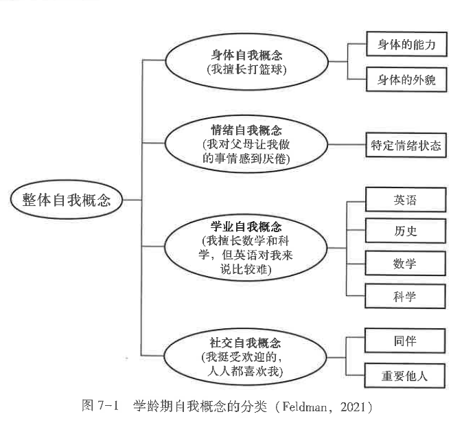
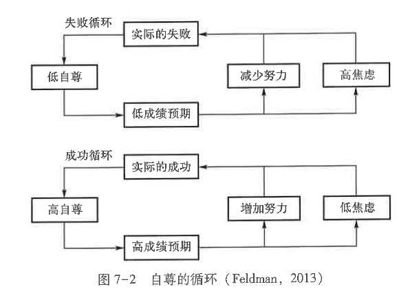
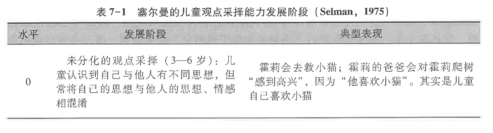
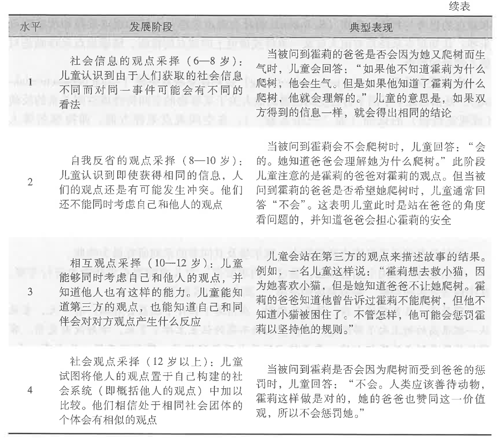
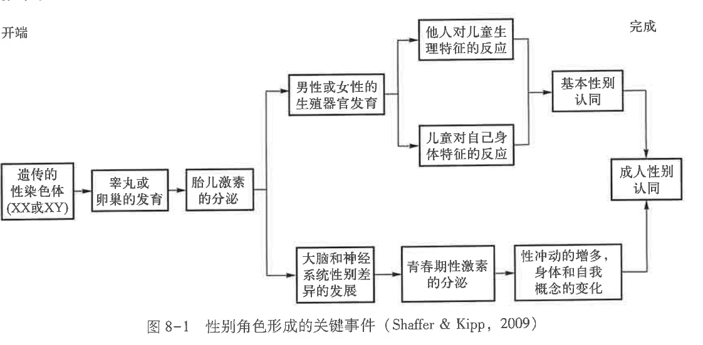
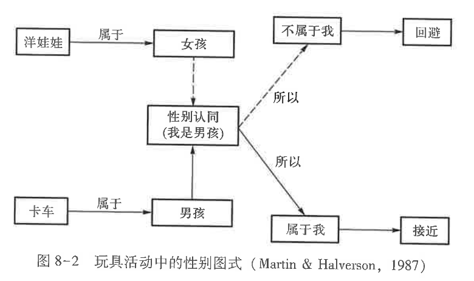

# 笔记 3 

何洁老师  主讲

!!! tip "标注"
	重点使用加粗或高亮标注，思考使用框图 note 标注，在最后总结重点和思考  
	笔记：上课&书本

## 6. 情绪、气质与人格发展

### 6.1 情绪的发展

#### 情绪的含义与功能

定义：情绪(emotion)是对客观事物与人的需要之间关系的反映，是个体内部或外部事物的主观感觉和体验。  
情绪功能：  
1. 情绪可以组织和调节功能  
2. 情绪影响认知过程  
3. 情绪影响人际交往  

#### 情绪的产生和发展

##### 婴儿的情绪发展
1. 情绪的早期表现    
	**情绪分化理论**：新生儿的情绪只是一种弥散的兴奋或激动，是一种杂乱的、未分化的反应。之后，痛苦和快乐逐渐分化为特殊的反应，痛苦分化为愤怒、厌恶、恐惧和嫉妒，快乐分化为高兴、喜悦和喜爱。    
2. 婴儿基本情绪发展    
	- 高兴：主要通过**微笑和大笑**等方式来表达自己的积极情绪。  
	- 愤怒与悲伤：当婴儿愤怒与悲伤时会以**哭泣**的形式反映出来    
		- 一般性哭泣：常常是饥饿诱发的， 以一种有节奏的方式表现出来。  
		- 愤怒的哭泣：是指婴儿发怒时用力吸气，迫使大量空气从声带通过，引起声带振动，从而产生哭泣。  
		- 痛苦的哭泣：由于高度紧张的刺激引发的，经常表现为突然响亮的哭声，接着屏住呼吸，随后出现更高的哭声。  
	- 害怕、恐惧：害怕/恐惧是婴儿最早表现出来的情绪之一。**陌生人焦虑**即认生，指婴儿害怕跟陌生人说话或在一起，表现出警惕的反映。这种对陌生人的警惕在 8-10 个月时表现强烈。婴儿也会出现对父母或照料者的依恋，表现出**分离焦虑**，即不愿和父母分开。
3. 婴儿情绪是被与情绪理解的发展  
	**社会参照**：是婴儿情绪发展一个重要事件。婴儿在 6 个月以后出现情绪的社会参照，**即婴儿能够利用他人的表情作为参照来决定自己的行为反应**。社会参照是人与人之间发生的主动的情绪交流活动。（e.g.视崖）
	==社会性参照例子==  
	饼干花椰菜实验    
	理解他人情绪  
4. 婴儿情绪调节能力的发展
	随着语言能力的发展，到 2 岁左右，婴儿就能使用语言来定义自己的情绪。同时婴儿也逐渐学会采用一定的方式来控制自己的情绪。

!!! note "thinking"
	语言为什么能促进情绪调节？

##### 学前儿童和学龄儿童的情绪发展

一些新特点：    
1. 自我意识情绪    
	**自我意识情绪**：是一种以自我参照行为的出现为前提，通过自我察觉、自我评价和自我反思而产生的情绪，包括内疚、羞愧、尴尬、嫉妒和自豪等。    
	- 对自我的肯定    
	- 对自我的否定    
	自我意识情绪表明儿童能使用社会标准和规则来评价自己的行为。父母对儿童行为的反应影响儿童自我意识情绪的表达。    
2. 情绪理解和情绪表达能力     
	**情绪理解**：指的是儿童理解情绪的原因和结果的能力，以及运用这些信息对自我和他人产生恰当情绪反应的能力    
	**移情(empathy)**：是指儿童在察觉到他人情绪反应时同时也能体验到与他人相似的情绪反应。  
		包括两个成分：认知成分和情绪成分。  
		**认知成分**：指儿童能认识以及区分他人的情绪以及推测他人的想法。  
		**情绪成分**：也称情绪共情，是指由他人情绪情感所引发的与之相一致的情绪情感反应，如看到别人悲伤自己也会难过。  
3. 情绪调节能力  
	儿童能够用语言表达的方式采取各种策略调节自己的情绪。  
	注意力转移    
	自我安慰    
	自我满意的方式解释    

##### 青少年的情绪发展
1. 自我意识情绪  
	青少年自我意识的增强使他们的情绪更加丰富，内心体验更加深刻。他们的身体和心理正在发生巨大变化，对自我的认识和评价也在改变，产生了“成人感”，要求独立和自主。  
	具有强烈的自我意识和自我中心特点  
	关于自我的探索和思考影响青少年的情绪和行为表现，使其自我意识情绪得到飞速发展。     
2. 情绪理解与情绪表达能力   
	情绪理解：青少年对他人的情绪有很强的理解力，认识到人具有复杂的情绪体验。    
	情绪表达：能更熟练掌握情绪表达的社会规则。可以在内心隐藏自己真实的情感。能够很好的掩饰自己内心的情感。   
3. 情绪调节能力   
	在深刻理解情绪和自我意识发展的基础上，青少年能更好地认识各种积极情绪和消极情绪产生的原因，从而运用各种策略来调节自己的情绪。  

上课：
情绪调节策略

- 转移注意力
- 自我安慰
- 情绪命名
- 认知重评
- 正念

!!! note "thinking"
	怎么测量情绪？

儿童情绪的测量：  
生理测量

!!! abstract "重点"
	情绪发展重点掌握基本情绪、自我意识情绪、情绪理解与情绪调节。核心概念包括**情绪分化理论**、**陌生人焦虑**、**分离焦虑**、**社会参照**、移情，以及转移注意力、情绪命名、认知重评等调节策略。

### 6.2 气质的发展

#### 含义与稳定性

##### 气质含义 
定义：**个体在反应性和自我调节等方面的稳定特征**
**反应性**：情绪唤醒、注意以及活动的速度与强度
**自我调节**：用于改变反应性的方法

##### 气质的稳定性
气质在个体发展中具有中等程度的稳定性。婴儿期较低，幼儿期开始有中等程度稳定性    
气质并非一成不变。因为气质的生物基础处于发展中的系统，这些系统的成熟过程可能改变气质的特征和结构。  
后天经验或社会环境也会作用与生物基础影响气质  

#### 类型与测量

##### 气质的类型

几种分类：

1. 托马斯&切斯分类
	三种基本气质类型：容易型、困难型、迟缓型  
	- **容易型儿童**：一般处于愉快、积极的心境或情绪状态中，其饮食、大小便、睡眠都很有规律，他们乐于探究新事物，容易适应新环境。约占 40%    
	- **困难型儿童**：反应消极，容易紧张、哭泣，日常没什么规律，不容易预测和把握。他们对新环境很难适应，退缩，反应强烈而敏感。约占总数的 10%    
	- **迟缓型儿童**：居于上述两种类型之间，活动水平低，安静，不爱活动，心境有些消极，容易对环境做出温和低调的反应，对新环境的适应速度比较慢，约占总数的 15%。  
2. 凯根的行为抑制-非抑制分类    
	凯跟关注两类儿童：一类是羞怯、抑制、胆怯的儿童。另一类是合群、外向、大胆的儿童。  
	分为两类：抑制型、非抑制型    
	- 抑制型：对不熟悉事物做出逃避害怕和抑制情感的反应  
	- 非抑制型：无拘无束，自由自在，具有冲动性  
3. 罗斯巴特的气质分类  
	3 个表征维度：
	外向性：包括积极参与、冲动、主动性和感觉追求，凯跟理论中的非抑制型儿童属于此维度。
	消极情绪性：包括过敏性和害怕。这类儿童容易忧伤，经常哭泣或感到烦恼。凯跟所说的抑制性儿童属于此维度。
	努力控制：包括注意力集中和转移、抑制控制、知觉敏感和低强度的愉悦。努力控制是自我调节的一个基本成分。  

##### 气质的测量

1. 问卷法：通过询问儿童和能够概括其行为特点的成人来获得相关信息   
2. 观察法：**对于气质的测量，研究者倾向于使用陌生情景观察法**。例如，先要观察儿童的行为抑制性，研究者会让儿童置身于有不熟悉的玩具或有陌生人场景，观察儿童对这些物体、人和情境的反应。
3. 生理测量法：研究者发现敏感、害羞儿童的右半球大脑皮质比左半球表现出更多的脑电活动。

#### 气质发展的影响因素

##### 遗传因素

遗传的生物基础使个体的气质表现出较强的稳定性  
不同的气质特征与独特的生理特征相联系  

##### 环境因素

气质特征只有中度遗传性，环境同样影响儿童  
儿童不是被动地接受环境的影响，而是以个人的独特方式去影响环境   
不同文化环境对婴儿气质的反应存在差异  

!!! abstract "重点"
	气质是个体在**反应性**和**自我调节**上的稳定特征。重点掌握托马斯和切斯分类、凯根的抑制/非抑制分类、罗斯巴特三维度，以及问卷法、观察法、生理测量法。

### 6.3 人格的发展

人格：是指源自个人自身的稳定行为方式和内部心理过程。  
每名儿童都有其独特的人格特征，这些人格特征具有稳定性，让儿童的行为表现出跨时间和跨情景的一致性。

#### 人格发展理论

（1）**弗洛伊德 心理性欲发展理论**  

心理结构：意识、前意识和潜意识  
人格：本我、自我和超越  

| **结构**            | **核心特点**   | **遵循原则** | **详细描述**                                                     |
| ----------------- | ---------- | -------- | ------------------------------------------------------------ |
| **本我 (id)**       | 生理成分、潜意识   | **快乐原则** | 与生俱来，最原始的部分。是心理活动的主要能量（力比多）来源。只追求本能的即时满足，不能忍耐，无视社会道德。        |
| **自我 (ego)**      | 心理，理性成分、意识 | **现实原则** | 从本我中分化出来。作为理性的调节者，既要满足本我的需求，又要控制其冲动以避免被现实惩罚。寻找现实手段解决问题。      |
| **超我 (superego)** | 社会成分、意识    | **道德原则** | 代表社会的习俗、道德和法律。主要作用是抑制本我中被认为是“恶”的欲望。通过3-6岁儿童内化父母的观念形成，包含“良心”。 |

弗洛伊德人格发展阶段：认为人格是在儿童早期逐步形成的，主要通过一系列心理发展的阶段完成。每个阶段都围绕“力比多”集中在身体的不同部位展开；结果在某一阶段冲突未能顺利解决；如果在某一阶段冲突未能顺利解决，就可能造成“固着”，并影响成年后的人格特征。

（2）**埃里克森的心理社会发展理论**

人的发展时按阶段依次进行的，如果人的生命是一个周期，可划分为八个阶段。八个阶段以不变的顺序依次出现，且具有文化一致性。他们是由遗传因素决定的，但每一个阶段是否能顺利过度则是社会环境决定的。社会环境不同，阶段出现的时间可能不一样。在心理发展的每一阶段都存在“危机”——发展中的一个重要转折点。

#### 人格的测量
1. **儿童十四种人格因素问卷(CPQ)**，由波特(R. Porter)和卡特尔(R. B. Cattell)共同编制，测验内容包括非常多的人格因素。适用于 8-14 岁的青少年，是各国广泛使用的儿童人格测验。  
2. **艾森克人格问卷(EPQ)** 是英国心理学家艾森克夫妇提出的人格三维度理论编制成的。问卷包括少年版和成人版两个版本。   
3. **大五人格问卷(NEO-PI)** 是由五因素理论的代表人物编制的，适用于 16 岁以上的个体使用。  

#### 人格的影响因素
遗传&环境

遗传生物因素对儿童人格发展的影响主要体现在气质上。  

而环境上在儿童的人格发展中，家庭、同伴和社会文化等多方面的环境塑造了其相对稳定的行为习惯和人格特点。   
- 家庭环境
- 同伴关系
- 社会文化环境

!!! abstract "重点"
	人格发展重点掌握弗洛伊德的本我、自我、超我和埃里克森心理社会发展八阶段；人格受遗传、家庭、同伴和社会文化共同影响。

## 7. 自我与社会认知

### 7.1 自我的发展

#### 自我概念

**自我**：个体关于自己与周围人、事物之间关系的认识，包括**知、情、意**三个方面，主要表现为：

- **自我认识**：“知”，主要指自我概念。个体对“我是谁”的认知。
- **自我体验**：“情”，主要包括自尊
- **自我控制 / 自我调节**：“意”

##### 自我的形成

经典研究：**点红实验**

- 方法：在婴儿鼻子上悄悄点红点，再让婴儿照镜子。
- 结果解释：如果婴儿摸自己的鼻子，说明其知道镜中形象是“自己”，已经形成基本的客体自我。

##### 自我概念的发展

自我概念的发展既受到环境塑造，也依赖儿童的积极反应。

米德：  

- **1 岁以内**：模仿阶段。以模仿为主。  
- **2-4 岁**：游戏阶段，儿童通过游戏，尤其是角色游戏，发展出更有组织的整体自我。  
- **4 岁以后**：博弈阶段，儿童开始与家庭以外的团体建立关系，自我概念随社会关系扩展而变化。  
- **青少年期**：个体自我概念形成和发展的关键时期。

#### 自尊

**自尊**：个体通过评价构成自我概念的特征，对自身存在价值作出的认定。

- 基础与来源：能力和价值。
- 表现形式：认知评价和情感过程。
- 类型：
	- **内隐自尊**：对与自我相关或与自我分离的客体所持有的自动化态度，个体通常不能通过内省直接意识到。
	- **外显自尊**：个体对自己的有意识、推理性的评价。

##### 自尊的结构

重要感、自我胜任感、外表感、归属感是自尊获得的重要途径；社会认可是青少年自尊发展的较高表现形式。

##### 自尊的发展与影响因素
- 自尊的结构：重要感、自我胜任感、外表感、归宿感

- 自尊具有较高稳定性，但不是一成不变的。
- 青春期个体开始寻求稳定的成人认同感，社会比较对象的变化会影响自尊。
- 影响因素：
	- 个体层面：外貌、年龄、性别
	- 家庭层面：父母教养方式
	- 人际层面：同伴关系、社会认可等

#### 自我控制与自我调节

**自我调节**：个体为实现适应，主动调节情绪、动机、行为与认知唤醒，使其达到最优水平的过程。  
**自我控制**：一种有意识且需要努力的自我调节过程，核心是抑制冲动和自动化行为反应。

##### 机制

成功的自我控制  
**两阶段模型**解释：

- 阶段一：识别与自我控制有关的冲突或需求。
- 阶段二：调用有效的自我控制策略。

神经机制上，额叶和伏隔核对自我调节具有重要作用；背外侧前额叶皮质与计划、新异性加工、选择、工作记忆和语言功能相关。

##### 发展

- 儿童的自我控制和自我调节能力在 2-3 岁开始正式发展。
- 婴幼儿自我控制研究常集中在：
	- **服从任务**：如要求儿童暂时不要碰玩具电话。
	- **延迟满足任务**：如“葡萄干-杯子”任务、礼物任务，用儿童坚持等待的时间计分。（e.g.棉花糖实验）

##### 自我控制能力构成

儿童自我控制能力可分为：

- 自制力
- 自觉性
- 坚持性
- 自我延迟满足

!!! abstract "重点"
	自我发展包括自我概念、自尊和自我控制。重点掌握点红实验、米德自我概念发展阶段、自尊结构、两阶段模型、服从任务和延迟满足任务。

#### 自我同一性

**自我同一性**：个体在青少年期把过去经验、当前角色和未来目标整合为连续一致的自我理解。它对应埃里克森心理社会发展理论中“自我同一性 vs 角色混乱”的发展危机。

马西亚用“探索”和“承诺”两个维度区分同一性状态：

| 状态 | 探索 | 承诺 | 特点 |
| --- | --- | --- | --- |
| 同一性达成 | 高 | 高 | 经历探索后形成稳定选择 |
| 同一性延缓 | 高 | 低 | 正在探索，但尚未作出稳定承诺 |
| 同一性早闭 | 低 | 高 | 未充分探索就接受既定选择 |
| 同一性扩散 | 低 | 低 | 缺乏探索，也缺乏明确承诺 |

!!! note "thinking"
	同一性的延缓 = 高探索、低承诺，常见于仍在主动尝试和思考人生方向的青少年。

!!! abstract "重点"
	自我同一性是青少年期的重要任务。马西亚用**探索**和**承诺**区分同一性达成、延缓、早闭和扩散。

### 7.2 社会认知的发展

#### 社会认知的定义

**社会认知**：个体对自我、他人、社会关系、社会规则等社会性客体和社会现象及其关系的感知与理解。

几种理论侧重点：

- 信息加工心理学：强调对社会信息的综合加工，包括对自我、他人行为和关系的理解与推测。
- 社会心理学：强调社会认知对理解复杂社会行为的意义。
- 发展心理学：强调儿童对人及人类事件的知识和认知如何发展。

#### 儿童观点采择能力的发展

**观点采择**：从他人的角度看待问题的能力，是儿童社会认知发展的核心能力。

##### 特点

- 本质是认知发展上的**去自我中心化**。
- 要求儿童能区分自己与他人的观点。
- 要求个体在社会认知上能够对自我进行控制
- 具有递推性质：能超越直接给出的信息，对他人的想法或反应作出判断。

!!! note "e.g."
	皮亚杰“三山实验”体现了观点采择能力：儿童要判断别人从另一个位置看到什么，必须抑制自己的视觉表象。

##### 分类

- **社会观点采择**：对社会客体以及他人情感、态度、观念的思考与判断。
- **空间观点采择 / 视觉观点采择**：理解处于不同空间位置的他人对事物空间特征或空间关系的反映。
	- 一级空间观点采择：判断他人能否看到某个物体。
	- 二级空间观点采择：理解同一物体从不同视角看，外观可能不同。

##### 发展阶段

**塞尔曼**等人采用个别访谈法，通过“**两难故事**”考察儿童观点采择能力，并将其划分为水平 0 到水平 4 的五个阶段。

#### 儿童对心理现象的认知

##### 婴幼儿对心理现象的认知

- 2 岁左右：儿童开始表现出共情，会安慰或关心他人，说明其心理活动感增强。
- 3-4 岁：儿童能区分自己的想法和客观事实，也能在假装游戏中把“假装发生”的事情作为行动依据。

##### 心理理论

**心理理论**：儿童对他人的愿望、信念、动机等心理状态，以及心理状态与行为之间关系的认识。

心理理论的发展模式：

- **理论论**：儿童对心理状态的理解类似科学理论建构过程。
- **模仿论**：儿童通过想象和心理模拟他人处境来推测心理状态。
- **模块论**：心理理论是一种内在能力，以模块形式存在于神经系统中。

##### 心理理论的发展阶段

| 阶段       | 年龄     | 特点                                             |
| -------- | ------ | ---------------------------------------------- |
| 愿望心理学    | 约 2 岁  | 首先形成对愿望的认知，愿望理解是进一步理解复杂心理状态的基础                 |
| 愿望-信念心理学 | 约 3 岁  | 开始涉及想法和信念，但解释事实、行为和情感时仍主要依赖愿望                  |
| 信念-愿望心理学 | 约 4 岁起 | 认识到行为建立在信念基础上，而不一定建立在事实基础上；能通过错误信念任务和外表-事实区分任务 |

##### 实验范式

心理理论任务

**错误信念任务**：考察儿童是否理解他人的行为取决于他人的信念，即使该信念与现实不一致。

常见范式：

1. **意外地点任务**：小球先放在篮子里，角色离开后被转移到盒子里，问儿童角色回来会去哪里找。3 岁儿童常依据自己知道的事实回答“盒子”，不能理解角色的错误信念。
2. **意外内容任务**：糖果盒里实际装铅笔，问儿童其他小朋友打开前会认为里面是什么。年幼儿童常回答“铅笔”，难以区分自己已知事实与他人未知状态。
3. **外表-事实区分任务**：外表像石头的海绵，儿童触摸后知道是海绵，再问“看起来像什么、实际上是什么”。3 岁儿童常坚持说看起来也是海绵。

##### 心理理论的影响因素

- 家庭背景和语言交流方式。
- 语言能力与心理理论相互关联：
	- 语言可能是心理理论发展的基础。
	- 心理理论也可能是语言发展的前提。
	- 执行控制和成长环境可能共同影响二者。
- 阅读促进心理理论发展，因为儿童读物包含丰富的心理状态信息。

!!! note "thinking"
	为什么孤独症患者会喜欢旋转的东西：可以从感觉加工偏好、重复刻板行为、对可预测刺激的偏好等角度理解；同时，孤独症个体在心理理论和社会线索理解上可能存在困难，因此社会刺激的吸引力和可预测性可能弱于重复性物体刺激。

#### 儿童对权威的认知

**权威认知**：个体对权威关系的认知。对儿童而言，主要指对儿童与成人之间关系的认知。  
**父母权威认知**：儿童对父母权威合理性的认可程度。

儿童权威认知具有阶段性和年龄差异  
影响因素：

- **权威特征**：成人身份、知识、社会地位等。
- **问题领域**：儿童在道德、社会规范、个人和安全领域中，对父母权威的认可程度不同。
- **文化背景**：不同文化对社会地位和权威的强调不同。
- **儿童人格特征**：也会影响儿童对权威的接受和判断。

!!! abstract "重点"
	社会认知重点掌握观点采择、心理理论和权威认知。心理理论的发展经历愿望心理学、愿望-信念心理学、信念-愿望心理学，常用范式包括错误信念任务、意外内容任务和外表-事实区分任务。

## 8.性别差异与性别角色的社会化

### 8.1 儿童的性别差异

#### 数学能力差异

童年中期以前，男孩和女孩的数学能力尚未表现出明显差异；从青少年期开始，男孩的数学能力平均水平高于女孩。

可能原因：

- 女孩语言能力较强，因此在精算任务中可能更有优势。
- 男孩空间能力较强，因此在估算、空间数量加工等任务中可能更有优势。

!!! note "e.g."
	实验：  
	- 精算任务  
	- 数量加工任务  
	- 空间任务  

#### 空间能力差异

**空间能力**：根据图片进行推理，或在心理上操作图像信息的能力，如心理旋转任务。

- 男孩的大脑右半球发达程度可能高于女孩，这与空间能力优势有关。
- 环境因素也会影响空间能力差异，例如户外运动频率、空间类玩具和活动经验等。

#### 语言能力差异

女孩在语言能力上通常占优势，尤其体现在词汇、阅读理解和语言流畅性方面。整个童年期和青少年期，女孩在阅读理解和语言流畅性方面一般优于男孩。

差异原因可以归因于：

- 生理因素
- 社会性因素
- 经验因素

#### 攻击性差异

男性的攻击性通常大于女性，但攻击行为的一般发展趋势并不存在显著的性别差异。

#### 其他方面差异

- 玩具偏好
- 情绪情感特点
- 发展问题表现

!!! abstract "重点"
	性别差异涉及数学、空间、语言、攻击性、玩具偏好和发展问题等方面，不能简单归因于生物或社会单一因素。

### 8.2 性别角色发展理论

**性别角色**(gender role)：个体基于性别差异而形成的、与社会或群体规定相适应的心理特点和行为模式。

性别角色发展理论主要包括生物取向、社会取向和认知取向三类。

#### 生物取向理论

##### 精神分析观点

乔德鲁提出重构理论，认为性别认同始于婴儿期，而不是弗洛伊德所说的生殖器期。

- 最初男婴和女婴都认同母亲。
- 女孩与母亲性别相同，因此女孩与母亲的认同可能更强，并在发展中继续认同母亲。
- 男孩需要与母亲分离，通过强调与女性的差异来确定自己的身份，进而建构独立性和个体性。

##### 进化心理学观点

进化心理学认为，史前狩猎采集社会中男女承担不同角色和任务，这可能导致心理上的性别差异。繁殖压力不同，也是两性产生不同适应问题的重要原因。

##### 其他生物取向解释

- **跨物种比较研究**：一些性别差异可能源于共同的身体或行为特征。
- **行为遗传学研究**：关注遗传因素对性别差异的影响。
- **青春期激素影响**：青春期激素变化会影响性别相关行为和心理特点。
- **生物社会理论**：强调生物因素与社会环境共同塑造性别角色。

#### 社会取向理论

##### 社会学习理论

社会学习理论认为，儿童主要通过两种途径获得性别认同和性别角色行为：

- **直接教导**：父母、教师等成人对适合性别的行为进行强化。
- **观察学习**：儿童选择性观察并模仿同性别榜样，学习“适合自己性别”的行为。

只有当儿童认识到性别是人格中相对稳定、不可随意改变的特征时，他们才会更多注意同性别榜样。

##### 社会结构理论

社会结构理论强调社会结构模式对性别角色发展的作用，认为男女的性别差异在很大程度上由社会结构模式和社会限制导致。

##### 群体社会化理论

群体社会化理论认为，同伴群体在儿童性别角色发展中具有重要作用，家庭影响相对较小。该理论预测：当某一性别不在场时，性别分化行为会明显减少。

#### 认知取向理论

##### 认知发展理论

科尔伯格认为，儿童理解性别范畴不会发生变化，是获得性别角色的关键因素，其中最重要的是**性别一致性**。

- 儿童只有获得性别一致性后，才能表现出一贯的性别角色行为。
- 儿童一旦认识到自己的性别稳定不变，就会更希望像同一性别群体的其他成员那样行动。
- 儿童会主动寻找同性别榜样和相关信息，学习如何表现得更像“男孩”或“女孩”。

##### 性别图式理论

**性别图式**：人们关于男性特点和女性特点的朴素理论观念。

性别图式理论认为，儿童和成人都会形成关于性别的图式，这种图式直接影响个体的思维和行为。

性别图式有两种主要取向：

- 强调性别图式的发展变化：儿童如何获得性别知识，如何形成稳定而合适的性别脚本。
- 强调个体性别图式差异：不同个体加工性别信息的方式不同。

性别图式的发展可分为两个水平：

1. 儿童评价信息是否符合自己的性别，需要先建立男性和女性两种图式。
2. 儿童进一步评价某个环境刺激是否适合自己。

性别图式的功能：

- 行为引导
- 组织信息
- 推理功能

!!! abstract "重点"
	性别角色发展理论包括生物取向、社会取向和认知取向。重点掌握社会学习理论、社会结构理论、群体社会化理论、认知发展理论和性别图式理论。

### 8.3 儿童性别化的发展

**性别化**：儿童获得性别认同，获得所属社会文化认为该性别成员应持有的动机、价值观和行为方式的过程，也就是获得性别角色行为和性别角色信念的过程。

#### 性别恒常性的发展

**性别恒常性**：个体认识到性别是基于生物特征的永久特征，不依赖外表特征，也不会随着发型、服饰、活动等变化而变化。

科尔伯格认为，只有儿童达到具体运算阶段、获得守恒概念后，才具有性别恒常性概念。

儿童性别恒常性的发展经历三个阶段：

| 阶段    | 含义               | 特点                                              |
| ----- | ---------------- | ----------------------------------------------- |
| 性别认同  | 正确把自己和他人标记为男性或女性 | 也称性别标志，约 1.5-2 岁能使用性别标签，2.5-3 岁大多能准确说出自己是男孩还是女孩 |
| 性别稳定性 | 认识到人的性别不随年龄变化而改变 | 知道一生中性别稳定，但仍可能认为发型、服饰或行为变化会改变性别                 |
| 性别一致性 | 认识到外表变化不改变人的性别   | 理解无论外表如何变化，性别仍保持不变                              |

!!! note "补充"
	3-4 个月的婴儿已经能够区分男性和女性。性别认同不仅包括性别分类知识，也包括对自身性别的满意度、压力以及对性别群体的态度。

#### 性别刻板印象的发展

**性别刻板印象**：人们对男性或女性在活动、行为、人格特征等方面的固定看法或信念。这种印象不一定有事实依据，也常常忽视个体差异。

儿童性别刻板印象发展包括两个方面：

- 性别刻板印象知识的发展
- 性别刻板灵活性的发展

总体发展阶段：

| 阶段 | 年龄 | 特点 |
| --- | --- | --- |
| 建构期 | 约 3 岁 | 开始习得性别刻板印象 |
| 固着期 | 5-7 岁 | 性别刻板印象的僵化程度达到顶峰 |
| 整合期 | 约 8 岁起 | 性别刻板印象变得相对灵活 |

马丁等人认为，儿童性别刻板印象的领域与成人类似，主要包括：

- 外貌
- 角色行为
- 职业
- 特质

##### 性别刻板知识的发展

儿童首先获得有关外貌和角色行为的性别刻板知识，随后随着认知发展，逐渐获得有关职业和特质的性别刻板知识。

##### 性别刻板灵活性的发展

**性别刻板灵活性**：意识到男性和女性可以拥有相似特质，或可以参与相似活动的程度。

- 学前儿童的性别刻板印象比较僵化，学前晚期僵化程度最高。
- 7 岁左右，儿童性别刻板灵活性显著增强，小学高年级达到较高水平。
- 青春期个体会产生较强的性别相关期望，性别刻板印象可能重新恢复到早期的僵化状态。
- 不同领域中，性别刻板灵活性开始变化的年龄不同。

#### 性别特征行为模式的发展

评估儿童行为的性别适宜性，常用方法是观察儿童“玩什么”以及游戏性质上的差异；另一种方法是观察儿童“和谁玩”。

**性别分离**：儿童喜欢和同性别伙伴交往，并将异性伙伴看作圈外人的倾向。

- 性别分离在许多文化中普遍存在，具有跨文化一致性。
- 同伴数量、教师对性别的要求等因素会影响性别分离水平。

!!! abstract "重点"
	儿童性别化包括性别认同、性别恒常性、性别刻板印象和性别特征行为模式。性别恒常性分为性别认同、性别稳定性、性别一致性；性别刻板印象经历建构期、固着期和整合期。

### 8.4 心理的双性化

#### 心理双性化的提出

传统观点把性别角色看成单一维度：高度男性化意味着缺乏女性化特质，高度女性化也意味着缺乏男性化特质。

1964 年，罗西提出**双性化**概念：个体同时具有传统的男性化和女性化特质。双性化被认为是一种更适合的性别角色模式，因为个体可以在不同情境中表现出更高的灵活性和适应性。

#### 心理双性化的测量

- **贝姆性别角色量表**：根据被试自陈是否具有社会赞许的男性化或女性化特质，评价其男性化和女性化程度。
- **个人特征问卷**：斯宾塞等人开发的常用性别角色测量工具。

!!! abstract "重点"
	心理双性化强调个体可同时具有传统男性化和女性化特质，常用测量工具包括贝姆性别角色量表和个人特征问卷。

## 重点总结

1. 情绪发展重点掌握基本情绪、自我意识情绪、情绪理解与情绪调节。核心概念包括**情绪分化理论**、**陌生人焦虑**、**分离焦虑**、**社会参照**、移情，以及转移注意力、情绪命名、认知重评等调节策略。
2. 气质是个体在**反应性**和**自我调节**上的稳定特征。重点掌握托马斯和切斯分类、凯根的抑制/非抑制分类、罗斯巴特三维度，以及问卷法、观察法、生理测量法。
3. 人格发展重点掌握弗洛伊德的本我、自我、超我和埃里克森心理社会发展八阶段；人格受遗传、家庭、同伴和社会文化共同影响。
4. 自我发展包括自我概念、自尊和自我控制。重点掌握点红实验、米德自我概念发展阶段、自尊结构、两阶段模型、服从任务和延迟满足任务。
5. 自我同一性是青少年期的重要任务。马西亚用**探索**和**承诺**区分同一性达成、延缓、早闭和扩散。
6. 社会认知重点掌握观点采择、心理理论和权威认知。心理理论的发展经历愿望心理学、愿望-信念心理学、信念-愿望心理学，常用范式包括错误信念任务、意外内容任务和外表-事实区分任务。
7. 性别差异涉及数学、空间、语言、攻击性、玩具偏好和发展问题等方面，不能简单归因于生物或社会单一因素。
8. 性别角色发展理论包括生物取向、社会取向和认知取向。重点掌握社会学习理论、社会结构理论、群体社会化理论、认知发展理论和性别图式理论。
9. 儿童性别化包括性别认同、性别恒常性、性别刻板印象和性别特征行为模式。性别恒常性分为性别认同、性别稳定性、性别一致性；性别刻板印象经历建构期、固着期和整合期。
10. 心理双性化强调个体可同时具有传统男性化和女性化特质，常用测量工具包括贝姆性别角色量表和个人特征问卷。

## 思考点总结

1. 语言为什么能促进情绪调节？
2. 气质稳定但不决定命运。可以思考：同样的气质为何会在不同教养环境中产生不同结果？
3. 青春期个体为什么更容易受同伴评价和社会比较影响？
4. 延迟满足实验比如棉花糖实验，对于延迟满足表现和个人日后成就的相关性是准确的吗
5. 自我同一性
6. 错误信念任务为什么能检验儿童是否理解他人信念？
7. 为什么儿童在安全问题和个人选择问题上对父母权威的接受程度不同？
8. 为什么儿童认知能力提高后反而可能先强化性别分类，为什么小时候会出现特别的男女对立现象？
