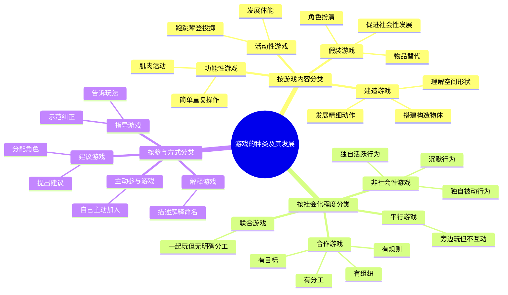
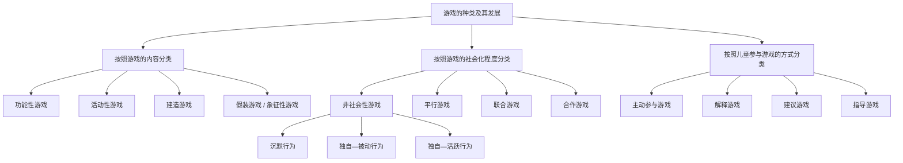

# 笔记 4

何洁老师  主讲

!!! tip "标注"
	重点使用加粗或高亮标注，思考使用框图 note 标注，在最后总结重点和思考  
	笔记：上课&书本

## 9. 社会交往的发展

爱由何处来？

### 依恋

**依恋**：婴儿与熟悉的人所建立的亲密情感联结

**依恋的发展过程：**

- 第一阶段，前依恋阶段——无差别的社会反应阶段：对他人反应不加区分、无差别  
- 第二阶段，依恋关系形成阶段——有差别的社会反应阶段(6-8 个月)  
- 第三阶段，依恋关系明确阶段——特殊的情感联结阶段(8-18 个月)   
- 第四阶段，交互关系形成阶段——相互的情感联结阶段(18 个月以后)  

#### 依恋理论

- **习性学理论**
	
	鲍尔比
	观点：人类的许多行为都来自种系生存和繁衍行为的进化
	
	洛伦兹：用印刻描绘小动物的依恋过程
	
	强调婴儿早期的社会信号——哭、笑、依附等在依恋中形成的作用
	
- **精神分析理论**
	
	弗洛伊德：依恋是由内部的、直接的成熟过程所激起的自然现象，并以需要的满足为中介。
	
	埃里克森：母亲喂养会影响婴儿依赖的强度和安全性
- **社会学习理论**
	
	观点：认为母亲或其他照料者获得了二级强化物的地位，成为能够满足婴儿需要的客体
	
- **认知理论**
	
	凯根 ：婴儿逐渐发展与其接触人、事物或事件相关的图式，倾向接受和这些图式相似的刺激源。    
	认为依恋的形成在某种程度上依赖婴儿的认知发展水平。在产生依恋之前，婴儿需要能将熟悉的人和陌生的人加以区分的能力，此外婴儿还必须能意识到熟悉的照料者具有客体永久性。  

#### 依恋的测量

**陌生情境实验**

分类：

| 依恋类型  | 实验表现                                                                                                  |
| ----- | ----------------------------------------------------------------------------------------------------- |
| 安全型依恋 | 这类儿童与母亲在一起时能够安心地玩玩具，并不总是依靠在父母身旁，当母亲离开时，他们会立刻寻求与母亲地接触，但很快又平静下来，继续做游戏。                                  |
| 回避型依恋 | 这类儿童对母亲在场或者不在场时都无所谓。和母亲在一起时， 他们似乎没有对母亲做出什么反应；当母亲离开时，他们也不反抗，很少有紧张、不安地表现。                               |
| 抗拒型依恋 | 这类儿童每当母亲要离开前都显得很警惕，紧靠母亲，不愿离开母亲一步；当母亲离开时会显得非常苦恼，任何一次短暂地分离都会引起此类儿童的大喊大叫。当母亲回来时对母亲的态度又是矛盾的，表现出非常生气地抗拒行为。 |
| 混乱型依恋 | 混合了回避型和抗拒型的依恋模式                                                                                       |

#### 依恋影响因素

- 抚育质量
- 婴儿自身特点
- 家庭环境和文化因素

依恋的代际传递（原生家庭）

教养的方式
- 权威型
- 专制型
- 溺爱型
- 忽视型

### 游戏

!!! note "重点"
	重点：游戏的社会化测量

#### 游戏理论

早期游戏理论

当代游戏理论

#### 游戏的种类和发展

#### 游戏对儿童心理发展的意义

| 方面           | 核心作用             | 具体内容                                                   |
| ------------ | ---------------- | ------------------------------------------------------ |
| **游戏与认知的发展** | 促进探索、观察和问题解决     | 满足好奇心，通过操作和模仿认识环境；发展智力和自控力；自由玩工具促进问题解决                 |
| **游戏与社会能力**  | 帮助理解他人、交往合作和处理冲突 | 假装游戏学习理解他人角色和想法；同伴冲突促进倾听、协商、合作；语言和社交能力提升（e.g. “警察抓小偷”） |
| **游戏与情绪**    | 释放压力、表达情绪和调节冲突   | 虚幻性允许表达现实禁忌情感，宣泄消极体验；情绪失调儿童游戏表现刻板、混乱                   |
| **游戏与人格**    | 培养自我控制、自主性、耐心等品质 | 主动克服困难、完成角色任务；培养冲动控制和延迟满足；装扮游戏促进想象力和创造力                |

### 同伴关系

**同伴关系定义**：指年龄相同或相近的儿童之间的一种共同活动并相互协作的关系，可以分为四个水平：个体特征水平、人际交互水平、双向关系水平和群体水平。

#### 同伴关系作用

- 给予稳定感和归属感
- 起到强化物作用
- 提供行为榜样和社交模式
- 帮助儿童去自我中心，实现同伴间双向尊重
- 是社会化的动因

## 10. 道德发展

### 道德认知的发展

> 道德认知(moral cognition)：主要是指个体对道德知识和道德评价标准的理解和掌握。

#### 皮亚杰道德发展理论

皮亚杰创立**临床法**，设计包含道德价值内容的**对偶故事**研究

哪个男孩更淘气？

| 阶段   |        | 年龄          | 特点                                                             |
| ---- | ------ | ----------- | -------------------------------------------------------------- |
| 第一阶段 | 前道德阶段  | 4-5 岁       | 思维具有自我中心特点，很少关注规则；行为直接受行为结果支配；尚不能对行为作出一定判断                     |
| 第二阶段 | 他律道德阶段 | 4-5 岁~8-9 岁 | 规则意识很强，认为规则由权威人物制定且神圣不可侵犯；认为道德问题只有对错之分，正确即遵守规则；只重视行为后果，不考虑行为意向 |
| 第三阶段 | 自律道德阶段 | 9 or 10 岁   | 不再盲目服从权威；认识到道德规范的相对性；在判断对错时，除行为结果外还考虑行为者动机                     |

!!! note "存在问题"
	皮亚杰研究的一些缺陷：  
	- 从他律向自律道德的转化，收到内在认知和环境因素影响  
	- 意图的陈述总是在他所造成的损失之前  
	- 低估了年幼儿童的道德推理能力  

#### 科尔伯格道德发展理论

用“开放式”手段揭示儿童道德发展水平  
编制**道德两难故事**

提出 3 种水平 6 个阶段道德发展理论

- 前习俗水平   
	- 惩罚与服从倾向  
	- 相对功利取向  
- 习俗水平  
	- 好孩子取向
	- 维护法律与秩序取向
- 后习俗水平
	- 社会契约取向
	- 普遍的道德原则取向

!!! note "模型评价"
	这种方法操作繁琐，问题为开放式，儿童回答没有限制难以计分；以及有些故事的主观性太强，现实生活中不可能发生这类问题，以及科尔伯格也没有很好地区分习俗规则和适用于公平、真理与是否原则的道德规则。

#### 艾森伯格 亲社会道德发展理论

设计另一种道德两难情境：亲社会道德两难情境

儿童亲社会道德发展 5 个阶段

- 1. 享乐主义
- 2. 需要取向的推理
- 3. 赞许和人际取向、定型取向的推理
- 4.（a）自我投射的共情推理
- 4.（b）过渡阶段
- 5. 深度内化推理

### 道德情感的发展

> 道德情感：人的道德需要是否得到满足所引起的一种内心体验，它反映并伴随着人的道德认知和道德行为。

#### 儿童共情的发展

霍夫曼：婴儿生来就有共情能力  
共情发展 4 阶段

| 阶段   |             | 特点                      |
| ---- | ----------- | ----------------------- |
| 阶段 1 | 非认知的共情阶段    | 他人情绪变化会在儿童身上引起相似的情绪反应   |
| 阶段 2 | 我自我中心的共情阶段  | 开始能够对他人的情绪做出反应，但是不能理解他人 |
| 阶段 3 | 推断的共情阶段     | 形成最初的观点采择能力             |
| 阶段 4 | 超越直接情境的共情阶段 | 能够注意到他人的生活经验和背景         |

#### 儿童内疚感的发展

| 阶段   | 时间      | 特点                                          |
| ---- | ------- | ------------------------------------------- |
| 第一阶段 | 8-9 个月  | 从对伤害一个人的身体感到内疚，发展到对说出伤人的话内疚→对没有积极回应某种要求感到内疚 |
| 第二阶段 | 4-5 岁   | 对没有进行互惠行为内疚                                 |
| 第三阶段 | 6-8 岁   | 对没有尽到某项义务，没有兑现承诺内疚                          |
| 第四阶段 | 10-12 岁 | 对违背一个怎样对待他人的普遍抽象道德感到内疚                      |

### 亲社会行为及其发展

> 亲社会行为：对他人有益或者对社会有积极影响的行为，包括分享、合作、助人、安慰、捐赠等。

#### 亲社会行为的理论

1. **社会生物学理论**  
	霍夫曼  
	强调遗传因素  
	利他行为一般在同一物种内发生，是长期进化过程中的“预设程序”

2.  **精神分析理论**
	弗洛伊德  
	亲社会行为是朝我的一种表现，个体出现亲社会行为是因为超我按照至善原则行事，指导自我，限制本我

3. **社会学习理论**
	班杜拉  
	个体的亲社会行为是社会学习和强化的结果

4. **认知发展理论**
	个体认知的发展是亲社会行为发展的直接动力，不同年龄段的儿童认知能力由性质不同的思维模式构成

#### 亲社会行为的发展

