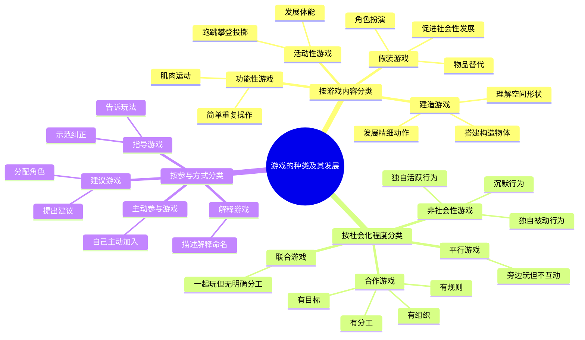
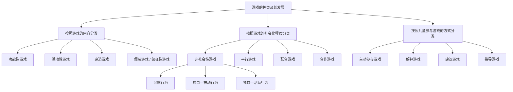
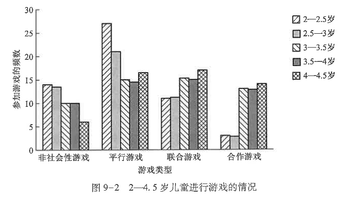
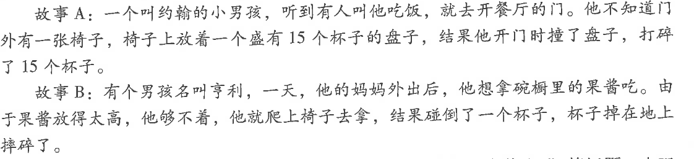
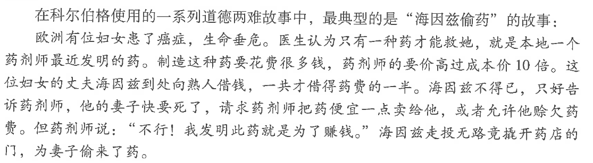
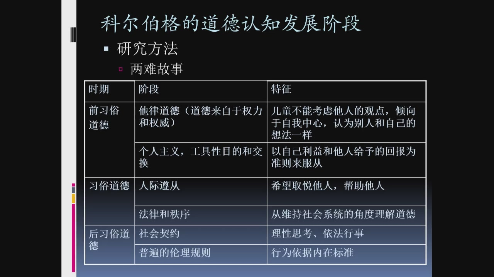
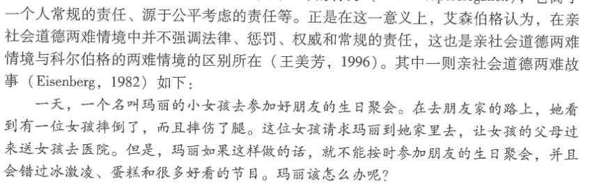
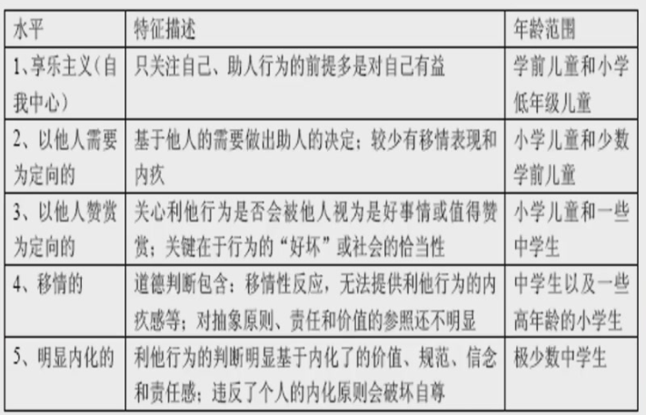

# 笔记 4

何洁老师  主讲

!!! tip "标注"
	重点使用加粗或高亮标注，思考使用框图 note 标注，在最后总结重点和思考  
	笔记：上课&书本

## 9. 社会交往的发展

爱由何处来？

### 依恋

**依恋**：婴儿与熟悉的人所建立的亲密情感联结

**依恋的发展过程：**

- 第一阶段，前依恋阶段——无差别的社会反应阶段：对他人反应不加区分、无差别  
- 第二阶段，依恋关系形成阶段——有差别的社会反应阶段(6-8 个月)  
- 第三阶段，依恋关系明确阶段——特殊的情感联结阶段(8-18 个月)   
- 第四阶段，交互关系形成阶段——相互的情感联结阶段(18 个月以后)  

**依恋的主要特点：**

- 主动寻求与依恋对象在身体上的亲近
- 能从依恋对象处获得慰藉和安全感
- 依恋关系遭到破坏时，会产生明显的情感痛苦

**各阶段的典型表现：**

- 前依恋阶段：尚未形成对特定照料者的偏爱，与陌生人相处通常不会产生明显的分离焦虑。
- 依恋关系形成阶段：开始区分熟悉者和陌生人，对主要照料者表现出偏爱，并逐渐形成信任感。
- 依恋关系明确阶段：对照料者的依恋明显增强，出现分离焦虑和怯生反应。
- 交互关系形成阶段：随着语言和表征能力发展，儿童能理解照料者暂时离开的原因，并尝试用请求、说服等方式调节双方关系。

#### 依恋理论

- **习性学理论**
	
	鲍尔比
	观点：人类的许多行为都来自种系生存和繁衍行为的进化
	
	洛伦兹：用印刻描绘小动物的依恋过程
	
	强调婴儿早期的社会信号——哭、笑、依附等在依恋中形成的作用
	
- **精神分析理论**
	
	弗洛伊德：依恋是由内部的、直接的成熟过程所激起的自然现象，并以需要的满足为中介。
	
	埃里克森：母亲喂养会影响婴儿依赖的强度和安全性
- **社会学习理论**
	
	观点：认为母亲或其他照料者获得了二级强化物的地位，成为能够满足婴儿需要的客体
	
- **认知理论**
	
	凯根 ：婴儿逐渐发展与其接触人、事物或事件相关的图式，倾向接受和这些图式相似的刺激源。    
	认为依恋的形成在某种程度上依赖婴儿的认知发展水平。在产生依恋之前，婴儿需要能将熟悉的人和陌生的人加以区分的能力，此外婴儿还必须能意识到熟悉的照料者具有客体永久性。  

#### 依恋的测量

**陌生情境实验**

分类：

| 依恋类型  | 实验表现                                                                                                  |
| ----- | ----------------------------------------------------------------------------------------------------- |
| 安全型依恋 | 这类儿童与母亲在一起时能够安心地玩玩具，并不总是依靠在父母身旁，当母亲离开时，他们会立刻寻求与母亲地接触，但很快又平静下来，继续做游戏。                                  |
| 回避型依恋 | 这类儿童对母亲在场或者不在场时都无所谓。和母亲在一起时， 他们似乎没有对母亲做出什么反应；当母亲离开时，他们也不反抗，很少有紧张、不安地表现。                               |
| 抗拒型依恋 | 这类儿童每当母亲要离开前都显得很警惕，紧靠母亲，不愿离开母亲一步；当母亲离开时会显得非常苦恼，任何一次短暂地分离都会引起此类儿童的大喊大叫。当母亲回来时对母亲的态度又是矛盾的，表现出非常生气地抗拒行为。 |
| 混乱型依恋 | 混合了回避型和抗拒型的依恋模式                                                                                       |

#### 依恋影响因素

- 抚育质量
- 婴儿自身特点
- 家庭环境和文化因素

依恋的代际传递（原生家庭）

#### 依恋与儿童心理发展的关系

- 安全型依恋有利于儿童好奇心、探索行为和问题解决能力的发展。
- 安全型依恋有利于儿童形成自信，并促进自我概念、自尊和自主性的发展。
- 依恋并非完全固定，会随着家庭环境和照料方式的变化而变化。
- 婴儿不是被动接受照料的个体，其气质和人格特点也会反过来影响亲子互动与依恋关系。

!!! note "thinking"
	为什么依恋关系具有一定稳定性，却仍可能随着家庭环境和照料方式改变？

教养的方式
- 权威型
- 专制型
- 溺爱型
- 忽视型

### 游戏

!!! note "重点"
	重点：游戏的社会化测量

#### 游戏理论

早期游戏理论

- **霍尔的复演说**：游戏是远古时代人类祖先生活与活动特征在儿童身上的重演。
- **斯宾塞的剩余精力说**：游戏是人和动物在满足生存需要后消耗剩余能量的方式。

当代游戏理论

- **精神分析理论**：游戏能够补偿儿童在现实生活中未被满足的愿望，并帮助儿童处理和修复创伤性经验。
- **认知动力理论**：皮亚杰认为游戏是儿童认识新客体和新事件、巩固与扩展已有概念和技能的方式；儿童通过把新经验同化到已有图式中获得控制感。
- **学习理论**：桑代克认为游戏是一种习得行为，遵循效果律和练习律，会受到成人强化、社会文化和教育要求的影响。

!!! abstract "游戏的基本性质"
	游戏是适应儿童发展特点的独特活动，具有社会性，也是对成人社会活动的模拟。

#### 游戏的种类和发展

!!! note "thinking"
	非社会性游戏是否一定意味着儿童社会能力较差？应如何区分独立游戏偏好与社交退缩？

#### 游戏对儿童心理发展的意义

| 方面           | 核心作用             | 具体内容                                                   |
| ------------ | ---------------- | ------------------------------------------------------ |
| **游戏与认知的发展** | 促进探索、观察和问题解决     | 满足好奇心，通过操作和模仿认识环境；发展智力和自控力；自由玩工具促进问题解决                 |
| **游戏与社会能力**  | 帮助理解他人、交往合作和处理冲突 | 假装游戏学习理解他人角色和想法；同伴冲突促进倾听、协商、合作；语言和社交能力提升（e.g. “警察抓小偷”） |
| **游戏与情绪**    | 释放压力、表达情绪和调节冲突   | 虚幻性允许表达现实禁忌情感，宣泄消极体验；情绪失调儿童游戏表现刻板、混乱                   |
| **游戏与人格**    | 培养自我控制、自主性、耐心等品质 | 主动克服困难、完成角色任务；培养冲动控制和延迟满足；装扮游戏促进想象力和创造力                |

### 同伴关系

**同伴关系定义**：指年龄相同或相近的儿童之间的一种共同活动并相互协作的关系，可以分为四个水平：个体特征水平、人际交互水平、双向关系水平和群体水平。

#### 同伴关系作用

- 给予稳定感和归属感
- 起到强化物作用
- 提供行为榜样和社交模式
- 帮助儿童去自我中心，实现同伴间双向尊重
- 是社会化的动因

#### 同伴关系的测量

**社会测量技术**：莫雷诺提出的一种自我报告式同伴关系评价技术，以群体成员提供的信息为基础，量化儿童在群体中的地位，主要包括同伴提名和同伴评定。

1. **同伴提名**
	- 根据某种心理品质或行为特征，让儿童从同伴群体中选出最符合描述的人。
	- 例如：“你最喜欢和谁玩？”“班里最受欢迎的人是谁？”
	- 积极提名越多，说明同伴接纳程度越高；消极提名越多，说明被排斥程度越高。
2. **同伴评定**
	- 要求儿童依据具体量表，对群体中的每位成员逐一评价。
	- 例如，让儿童评价自己是否喜欢和某位同伴一起玩。

!!! note "thinking"
	同伴提名能反映儿童在群体中的地位，但是否会强化对被拒绝或被忽视儿童的标签？

#### 同伴关系的类型

| 类型 | 同伴提名特点 | 主要表现 |
| --- | --- | --- |
| 受欢迎型儿童 | 正向提名多、负向提名少 | 与同伴交往融洽，善于理解和识别他人情绪，社会创造性较好 |
| 被拒绝型儿童 | 负向提名多、正向提名少 | 可分为攻击型受拒儿童和退缩型受拒儿童 |
| 被忽视型儿童 | 正向、负向提名都很少 | 在群体中不突出，容易被其他儿童忽视 |
| 矛盾型儿童 | 正向、负向提名都较多 | 同时被许多人喜欢，也被许多人不喜欢 |
| 一般型儿童 | 提名情况不符合上述类型 | 同伴地位处于一般水平 |

- **攻击型受拒儿童**：在群体中调皮、不合作，具有明显攻击行为。
- **退缩型受拒儿童**：不愿主动加入人际活动，喜欢独处，也称社交退缩儿童。

## 10. 道德发展

### 道德认知的发展

> 道德认知(moral cognition)：主要是指个体对道德知识和道德评价标准的理解和掌握。

#### 皮亚杰道德发展理论

皮亚杰创立**临床法**，设计包含道德价值内容的**对偶故事**研究

哪个男孩更淘气？

| 阶段   |        | 年龄          | 特点                                                             |
| ---- | ------ | ----------- | -------------------------------------------------------------- |
| 第一阶段 | 前道德阶段  | 4-5 岁       | 思维具有自我中心特点，很少关注规则；行为直接受行为结果支配；尚不能对行为作出一定判断                     |
| 第二阶段 | 他律道德阶段 | 4-5 岁~8-9 岁 | 规则意识很强，认为规则由权威人物制定且神圣不可侵犯；认为道德问题只有对错之分，正确即遵守规则；只重视行为后果，不考虑行为意向 |
| 第三阶段 | 自律道德阶段 | 9 or 10 岁   | 不再盲目服从权威；认识到道德规范的相对性；在判断对错时，除行为结果外还考虑行为者动机                     |

!!! note "存在问题"
	皮亚杰研究的一些缺陷：  
	- 从他律向自律道德的转化，收到内在认知和环境因素影响  
	- 意图的陈述总是在他所造成的损失之前  
	- 低估了年幼儿童的道德推理能力  

#### 科尔伯格道德发展理论

用“开放式”手段揭示儿童道德发展水平  
编制**道德两难故事**

提出 3 种水平 6 个阶段道德发展理论

- 前习俗水平   
	- 惩罚与服从倾向  
	- 相对功利取向  
- 习俗水平  
	- 好孩子取向
	- 维护法律与秩序取向
- 后习俗水平
	- 社会契约取向
	- 普遍的道德原则取向

| 水平 | 阶段 | 判断道德的主要依据 |
| --- | --- | --- |
| 前习俗水平 | 惩罚与服从取向 | 以是否受到惩罚判断行为好坏，服从权威以避免惩罚 |
| 前习俗水平 | 相对功利取向 | 以满足自身需要为标准，互惠具有功利性 |
| 习俗水平 | 好孩子取向 | 重视他人赞许、人际和谐以及“好孩子”形象 |
| 习俗水平 | 维护法律与秩序取向 | 认为遵守法律和规则本身就是正确的 |
| 后习俗水平 | 社会契约取向 | 认为法律是维护多数人幸福的工具，不公正的法律可以改变 |
| 后习俗水平 | 普遍的道德原则取向 | 依据平等、尊严等自选的普遍道德原则判断是非，道德原则高于具体法律 |

!!! note "模型评价"
	这种方法操作繁琐，问题为开放式，儿童回答没有限制难以计分；以及有些故事的主观性太强，现实生活中不可能发生这类问题，以及科尔伯格也没有很好地区分习俗规则和适用于公平、真理与是否原则的道德规则。

#### 艾森伯格 亲社会道德发展理论

设计另一种道德两难情境：亲社会道德两难情境

儿童亲社会道德发展 5 个阶段

- 1. 享乐主义
- 2. 需要取向的推理
- 3. 赞许和人际取向、定型取向的推理
- 4.（a）自我投射的共情推理
- 4.（b）过渡阶段
- 5. 深度内化推理

| 阶段 | 推理重点 | 主要特征 |
| --- | --- | --- |
| 1. 享乐主义、自我关注的推理 | 自我利益 | 是否帮助他人取决于个人直接获益、未来互惠或对他人的喜爱 |
| 2. 需要取向的推理 | 他人需要 | 开始关注他人的身体、物质和心理需要，但角色采择和共情仍较少 |
| 3. 赞许和人际取向、定型取向的推理 | 他人评价 | 根据“好人/坏人”等定型形象和他人的赞许判断是否助人 |
| 4a. 自我投射的共情推理 | 共情和角色采择 | 关注他人的权利、行为后果及由此产生的内疚等情绪 |
| 4b. 过渡阶段 | 规范和责任 | 开始涉及内化的价值观、规范、责任和义务，但表达尚不成熟 |
| 5. 深度内化推理 | 内化价值和责任 | 依据内化的规范、责任和社会契约作出判断，并伴随相应道德情感 |

### 道德情感的发展

> 道德情感：人的道德需要是否得到满足所引起的一种内心体验，它反映并伴随着人的道德认知和道德行为。

#### 儿童共情的发展

霍夫曼：婴儿生来就有共情能力  
共情发展 4 阶段

| 阶段   |             | 特点                      |
| ---- | ----------- | ----------------------- |
| 阶段 1 | 非认知的共情阶段    | 他人情绪变化会在儿童身上引起相似的情绪反应   |
| 阶段 2 | 我自我中心的共情阶段  | 开始能够对他人的情绪做出反应，但是不能理解他人 |
| 阶段 3 | 推断的共情阶段     | 形成最初的观点采择能力             |
| 阶段 4 | 超越直接情境的共情阶段 | 能够注意到他人的生活经验和背景         |

#### 儿童内疚感的发展

| 阶段   | 时间      | 特点                                          |
| ---- | ------- | ------------------------------------------- |
| 第一阶段 | 8-9 个月  | 从对伤害一个人的身体感到内疚，发展到对说出伤人的话内疚→对没有积极回应某种要求感到内疚 |
| 第二阶段 | 4-5 岁   | 对没有进行互惠行为内疚                                 |
| 第三阶段 | 6-8 岁   | 对没有尽到某项义务，没有兑现承诺内疚                          |
| 第四阶段 | 10-12 岁 | 对违背一个怎样对待他人的普遍抽象道德感到内疚                      |

### 亲社会行为及其发展

> 亲社会行为：对他人有益或者对社会有积极影响的行为，包括分享、合作、助人、安慰、捐赠等。

#### 亲社会行为的理论

1. **社会生物学理论**  
	霍夫曼  
	强调遗传因素  
	利他行为一般在同一物种内发生，是长期进化过程中的“预设程序”

2.  **精神分析理论**
	弗洛伊德  
	亲社会行为是朝我的一种表现，个体出现亲社会行为是因为超我按照至善原则行事，指导自我，限制本我

3. **社会学习理论**
	班杜拉  
	个体的亲社会行为是社会学习和强化的结果

4. **认知发展理论**
	个体认知的发展是亲社会行为发展的直接动力，不同年龄段的儿童认知能力由性质不同的思维模式构成

#### 亲社会行为的发展

- **婴儿期**：亲社会行为已经开始出现，儿童逐渐表现出分享、移情和简单助人行为。
- **儿童期的年龄差异**：亲社会行为总体随年龄发展，但会受到具体情境和行为前提的影响。
- **儿童期的性别差异**：差异会随年龄、文化背景和测量方式而变化，不能简单认为某一性别始终更亲社会。
- **一致性和稳定性**：儿童的亲社会行为具有较高的跨情境一致性和一定的长期稳定性。

| 年龄 | 主要特点 |
| --- | --- |
| 1-2 岁 | 开始出现分享和移情能力 |
| 3-6 岁 | 相对以自我为中心，亲社会行为常带有自我服务目的 |
| 7-11 岁 | 能更多考虑他人需要，移情和同情行为得到发展 |
| 11 岁以后 | 能理解和尊重社会规则的意义，亲社会行为更多受到内化规范影响 |

#### 亲社会行为的影响因素

1. **社会环境**
	- 社会传统与文化
	- 大众传媒
	- 家庭环境
	- 榜样作用
	- 物质言语游戏强化
2. **儿童的社会认知**
	- 观点采择
	- 亲社会道德推理
	- 自我相关概念
3. **共情**

!!! note "thinking"
	为什么儿童可能知道某种行为“不道德”，却仍然不会采取相应的亲社会行为？

### 攻击行为及其发展

> **攻击行为**：一种有意伤害或挑衅他人的行为。

#### 攻击行为的类型

| 分类依据 | 类型    | 含义                      |
| ---- | ----- | ----------------------- |
| 攻击目的 | 敌意型攻击 | 以有意伤害他人为根本目的            |
| 攻击目的 | 工具型攻击 | 为达到某种其他目的而伤害他人          |
| 攻击起因 | 主动型攻击 | 在未受到刺激的情况下主动发起攻击        |
| 攻击起因 | 反应型攻击 | 受到他人攻击、威胁或激怒后作出的攻击反应    |
| 表现形式 | 言语攻击  | 通过辱骂、威胁等语言方式伤害他人        |
| 表现形式 | 身体攻击  | 通过推、打、踢等身体行为伤害他人        |
| 表现形式 | 间接攻击  | 通过排斥、散布流言、破坏关系等间接方式伤害他人 |

#### 攻击行为的理论

1. **精神分析理论**
	- 从无意识过程和本能冲突解释攻击行为。
2. **习性学理论**
	- 认为攻击是人类和动物的一种本能行为。
3. **挫折—攻击假说**
	- 多拉德提出，攻击并非直接来自攻击本能，而是由挫折引起。
	- 挫折是正在进行的目标活动受到阻碍，攻击可以暂时减轻挫折带来的痛苦。
4. **社会学习理论**
	- 认为攻击行为是一种习得的社会行为，儿童会通过观察榜样、模仿以及强化形成攻击行为。
5. **认知理论**
	- 个体对挫折和愤怒事件的反应取决于其如何加工、解释社会信息。
	- 敌意归因偏差会使儿童更容易把模糊行为解释为恶意，从而作出攻击反应。

!!! note "thinking"
	敌意归因偏差如何把一次模糊的同伴互动逐步转化为攻击行为？

!!! abstract "第 10 章重点"
	道德发展需要同时关注道德认知、道德情感和道德行为。重点掌握皮亚杰三阶段、科尔伯格三水平六阶段、艾森伯格亲社会道德推理、共情与内疚的发展，以及亲社会行为和攻击行为的理论与影响因素。

## 11. 发展的环境因素

### 家庭环境与个体发展

#### 亲子关系与父母教养方式

亲子关系研究有两种主要范式：

- **传统研究范式**：关注亲子互动、父母教养方式及其对个体发展的影响。
- **父母角色研究范式**：关注父母作为导师、教练、监督者和管理者所发挥的作用。

麦考贝和马丁在鲍姆林德研究的基础上，将父母教养方式分为四类：

| 教养方式 | 主要特征 | 对儿童发展的常见影响 |
| --- | --- | --- |
| 权威型 | 温暖、友善、公正且有明确要求；规则具有灵活性，会考虑儿童意见 | 儿童通常更自信，自我控制、社会交往、创造性和适应能力较好 |
| 专制型 | 强调服从，严格执行规则，较少解释，常采用惩罚和强制管教 | 儿童可能依赖、被动，社会交往能力和独立性较弱 |
| 溺爱型 | 接受、和蔼但要求很少，给予儿童高度自由 | 儿童可能表现得不够成熟，自我约束能力不足 |
| 忽视型 | 尽量减少与儿童共同活动和互动，极端情况下对儿童置之不理 | 儿童更容易冲动，并出现适应和行为问题 |

!!! note "文化差异"
	教养方式的作用需要结合文化价值观理解。在中国文化背景中，父母控制有时不仅意味着支配，也可能被理解为维持家庭秩序、表达责任和促进家庭和谐。

!!! note "thinking"
	权威型教养为什么通常效果较好？这一结论在不同文化背景下是否同样成立？

#### 父母婚姻与个体发展

- 父母婚姻冲突可能影响儿童即时的应对能力和长期适应。
- 经常暴露于婚姻冲突的儿童，更容易出现焦虑、抑郁等内隐问题和攻击、违纪等外显问题，认知、社会性和生理机能也可能受到影响。
- 公开、敌意强烈、伴随身体暴力或令人恐惧的冲突，消极影响更大。
- 当冲突使儿童产生不安全感、自责感、威胁感，或使儿童被卷入冲突时，风险更高。
- 婚姻冲突还可能通过降低父母教养质量、损害亲子关系而影响儿童。
- 并非所有冲突都有消极作用。温和、建设性且能成功解决的冲突，也可能帮助儿童学习协商和解决人际矛盾。

#### 兄弟姐妹关系与个体发展

兄弟姐妹关系的积极作用：

- 提供情感支持。
- 年长儿童可以担任照料者和看护者。
- 哥哥姐姐可以扮演“教师”的角色，促进年幼儿童学习。

独生子女的常见特点：

- 可能具有较高的自尊和成就动机。
- 往往较为顺从，并可能具有较高的智力水平。
- 能通过同伴关系和友谊获得缺少兄弟姐妹互动的相关经验。

### 学校教育与个体发展

#### 学校组织结构

学校规模、班级规模和能力分班等组织因素都会影响学生的发展与学习体验。

#### 学校氛围

良好学校氛围通常包括：

- 强调学习
- 有效的班级管理
- 明确的组织纪律
- 鼓励团队合作
- 气氛和谐
- 环境安全有序

**皮格马利翁效应**：教师对学生的积极期望可能通过互动方式影响学生，使学生逐渐表现出与期望一致的进步。

!!! note "thinking"
	教师的积极期望通过哪些具体互动方式形成皮格马利翁效应？

#### 学生与学校的最佳拟合

**能力—环境交互作用观**认为，个体发展既不完全由个人特征决定，也不完全由外部环境决定，而取决于学生特点与学校环境之间的匹配和交互作用。

### 大众传媒与个体发展

#### 电视与儿童发展

- **电视素养**：个体理解、分析、评价和管理电视信息的能力，具有年龄阶段性，可通过成人引导和共同观看得到提高。
- **消极影响**：长期或频繁接触暴力、性或不现实身体形象等内容，可能增加攻击行为、性态度偏差和身体意象困扰。
- **积极影响**：教育类电视节目可通过亲社会示范和认知刺激促进社会性、认知能力和学业表现。
- **降低消极影响的方法**：控制观看时间、选择适龄内容、成人陪伴解释、培养良好观看习惯。

#### 互联网与儿童发展

- **积极影响**：适度且有指导的互联网使用，特别是教育性游戏和成人参与下的电脑活动，有助于认知发展、学习成绩和问题解决能力。
- **潜在风险**：缺乏监管或过度使用可能带来攻击行为、社交退缩、网络成瘾和心理适应问题。
- 媒介影响并非单向作用，关键取决于内容、使用方式、时长以及成人引导程度。

!!! note "thinking"
	面对短视频、网络游戏等新媒介，仅限制使用时长是否足够？

## 重点总结

1. **依恋**是婴儿与主要照料者形成的持久情感联结。重点掌握依恋发展的四个阶段、四种依恋类型、陌生情境实验及依恋的影响因素。
2. **游戏和同伴关系**是儿童社会化的重要途径。重点掌握游戏理论、游戏分类、社会测量技术和五种同伴地位类型。
3. **道德发展**包括道德认知、道德情感和道德行为。重点掌握皮亚杰、科尔伯格和艾森伯格的阶段理论，以及共情、内疚、亲社会行为和攻击行为。
4. **家庭环境**通过教养方式、父母婚姻和兄弟姐妹关系影响个体发展，其中权威型教养通常最有利，但需要结合文化背景理解。
5. **学校和大众传媒**的影响取决于个体特点与环境之间的互动。学校氛围、教师期望、媒介内容、使用方式和成人引导都很重要。

## 思考点总结

1. 为什么依恋关系具有一定稳定性，却仍可能随着家庭环境和照料方式改变？
2. 非社会性游戏是否一定意味着儿童社会能力较差？应如何区分独立游戏偏好与社交退缩？
3. 同伴提名能反映儿童在群体中的地位，但是否会强化对被拒绝或被忽视儿童的标签？
4. 为什么儿童可能知道某种行为“不道德”，却仍然不会采取相应的亲社会行为？
5. 敌意归因偏差如何把一次模糊的同伴互动逐步转化为攻击行为？
6. 权威型教养为什么通常效果较好？这一结论在不同文化背景下是否同样成立？
7. 教师的积极期望通过哪些具体互动方式形成皮格马利翁效应？
8. 面对短视频、网络游戏等新媒介，仅限制使用时长是否足够？
