# 微机原理及其应用
!!! info "成绩构成"

## 绪论

mcs 51

**存储器**：
字节
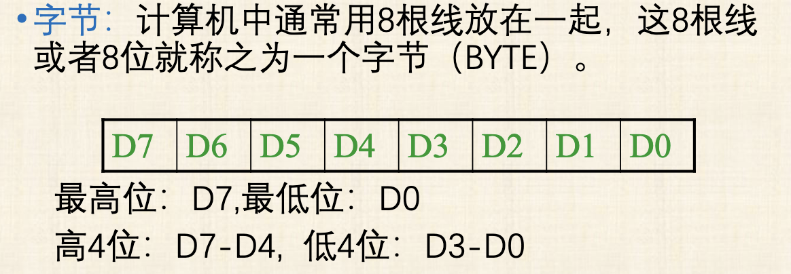

**数制**

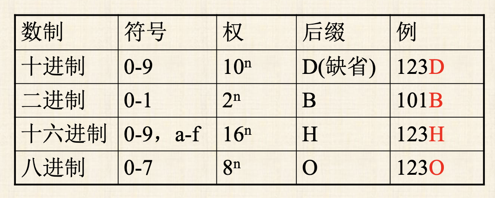

数制转换  
整数：  
- 除 2 取余法
- 分解权之和法
小数：  
	乘 2 取整，限定精度
	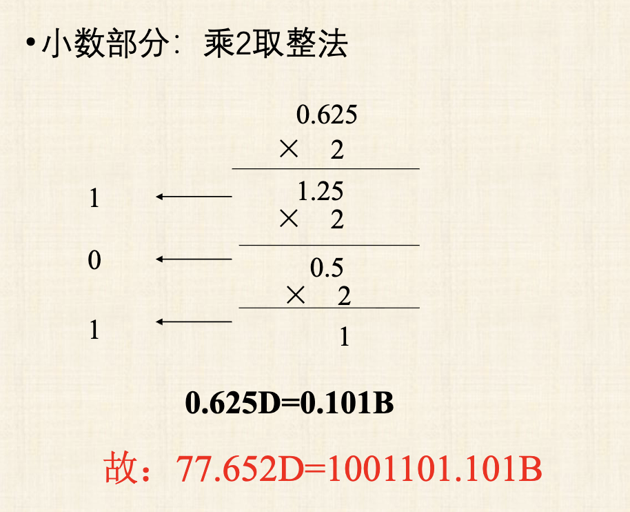

二进制转十六进制。不足四位的补 0
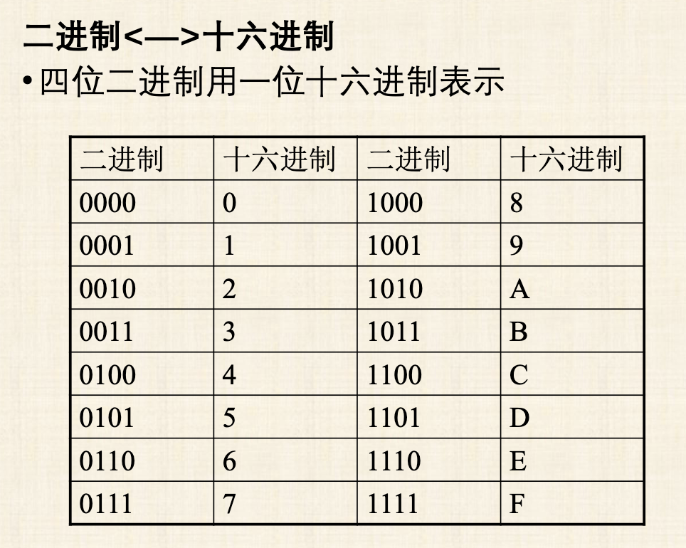

**数的表示方式**

1. 原码
	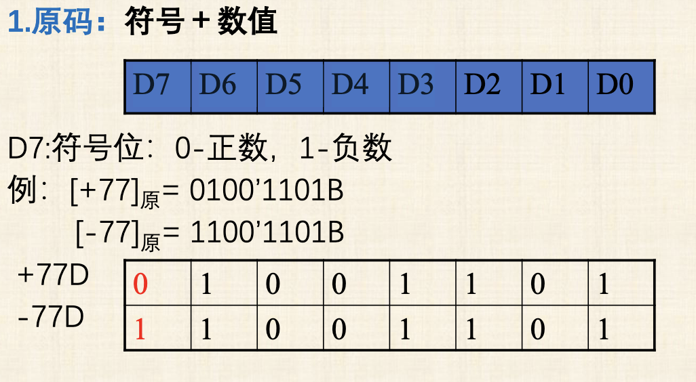
2. 反码
	主要是负数有例外
	$$
	[正数]_反​=[正数]_原​ 
	$$$$
	[负数]_反​=[对应正数]_原​取反​
	$$
	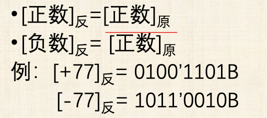
3. 补码：计算机中用补码表示
	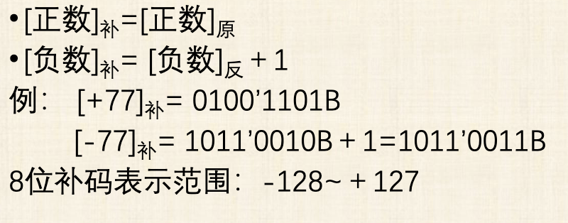

字符表示：

-9➡️11110111 B➡️F7 H

!!! note "作业"
	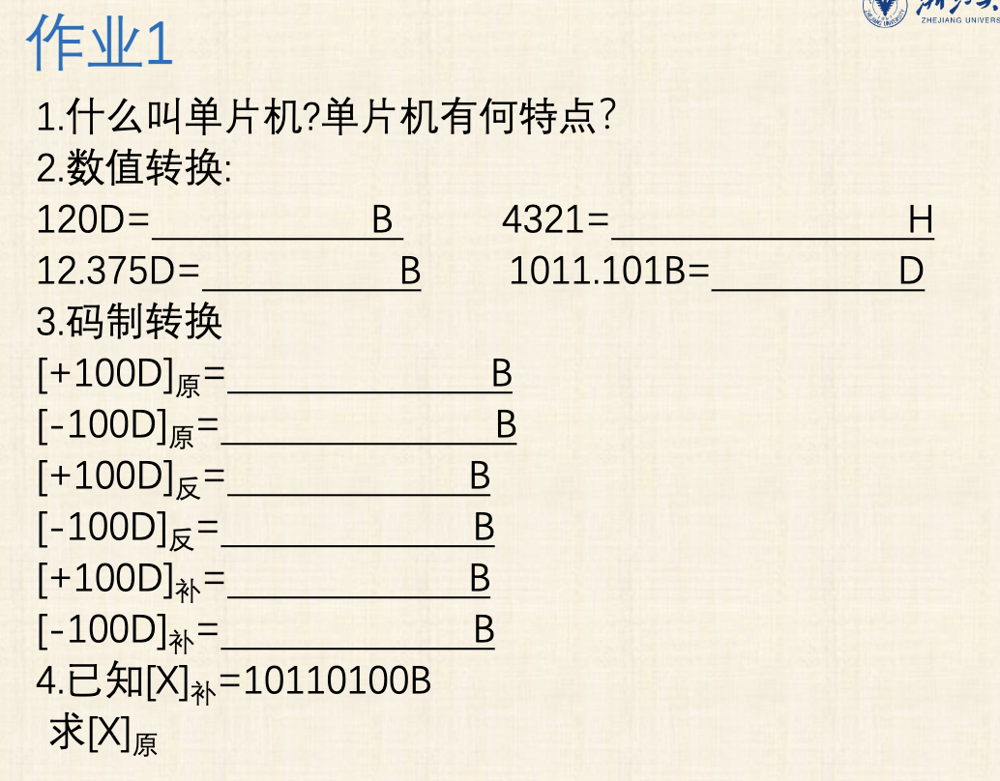

## MCS-51单片机结构

### 内部结构与外部引脚
**内部结构**  

1. 中央处理器 CPU：8 位，运算器+控制器  
2. 内部数据存储器 RAM：128 字节，存放可读写的数据  
3. 内部程序存储器 ROM：4 K，存放程序和常数  
4. 定时/计数器：2 个 16 位  
5. 并行 I/O 口：4 个 8 位 I/O 口，P0-P3，数据的并行输入输出  
6. 串行口：一个全双工的串行口,实现单片机和其他数据设备之间的串行数据传送  
7. 中断控制系统：5个中断源:2个外部中断,2个定时/计数中断,1个串行中断  
8. 时钟电路  
9. 总线  

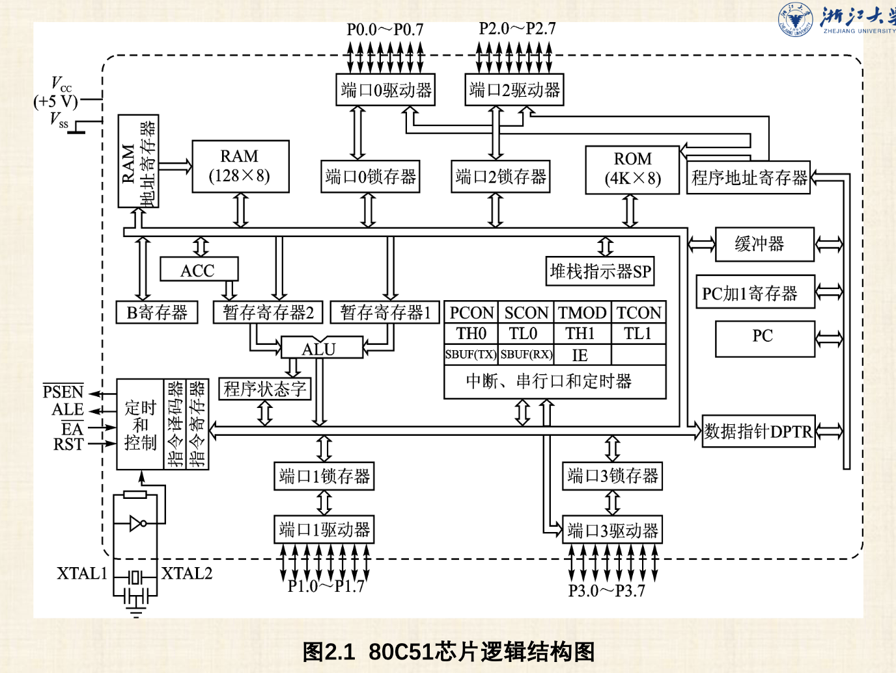

**外部引脚**
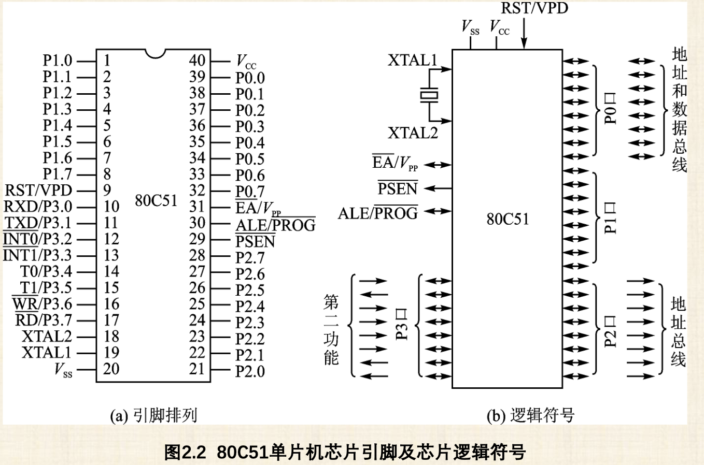

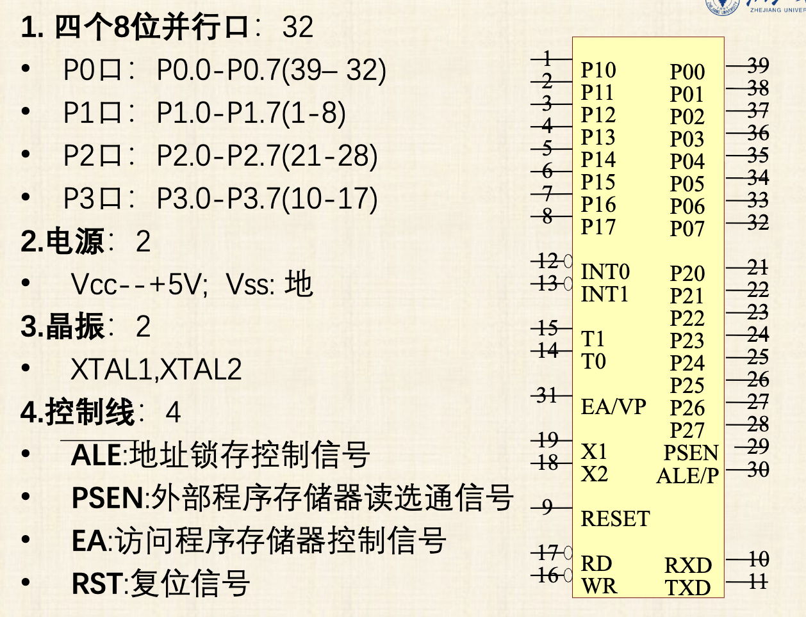

P3 口是分散的

控制线：
ALE：区分地址信号
PSEN：控制ROM

### 8051内部存储器

**内部数据存储器**

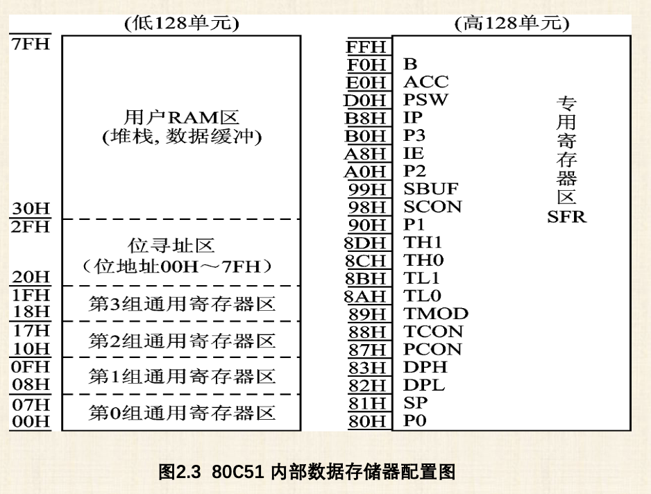

1. 寄存器区：
	
2. 位寻址区  
3. 用户 RAM 区  
	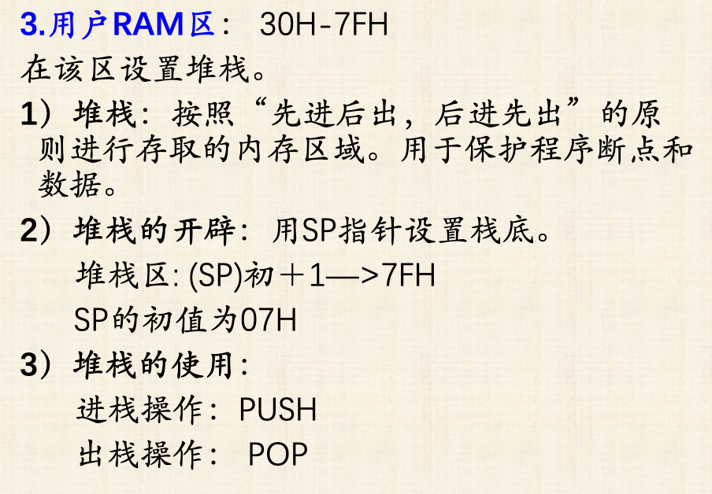
4. 特殊功能寄存区  
