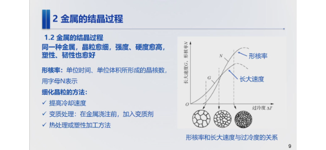
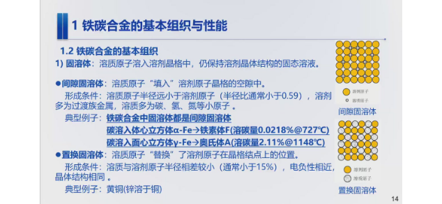
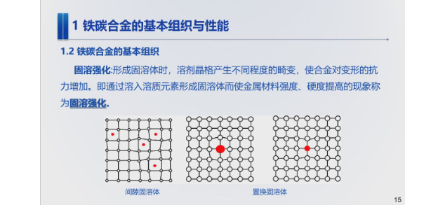
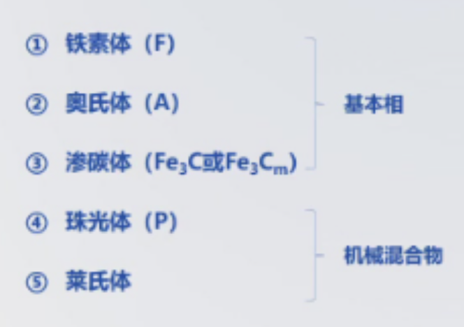
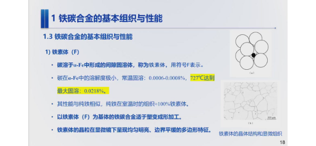
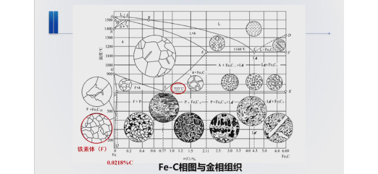
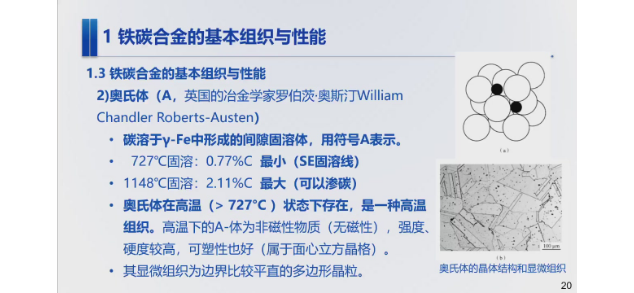
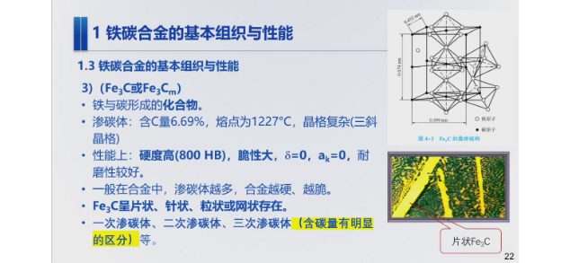
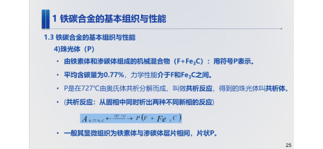
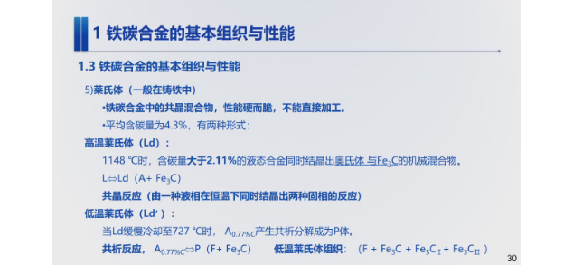

# 机械制造基础

记录上课笔记

!!! info "成绩构成"
	期末闭卷考试

## 1. 金属材料的力学性能

## 3. 铁碳合金

### 金属的晶体结构

晶格

过冷度

金属结晶过程

### 铁碳合金基本组织与性能

合金：合金是一种金属元素与其他金属元素或非金属元素通过熔炼或其他方法结合而成的具有金属特性的的材料。  
组元：组成合金最简单的、最基本的、能够独立存在的元物质，简称元。（决定性能潜力）  
**相**：合金中成分、结构及性能相同的组成部分。

**铁碳合金基本组织与性能**

1. 固溶体

固溶强化

2. 金属化合物：渗碳体 $Fe_3C$
3. 机械混合物：珠光体（铁素体+渗碳体）、莱氏体

基本相和机械混合物：

基本组织与性能

1. **铁素体**：

2. **奥氏体**
	

3. 渗碳体：硬度高、脆性大
	
4. 珠光体（P）
	
5. 莱氏体
	
	共晶反应

$$
\boxed{\text{珠光体}=\text{铁素体}+\text{渗碳体}}
$$