# 材料力学

记录课程学习笔记
!!! info "**成绩构成**"
	- 平时成绩 40%
		- 作业30%
		- 其他10%  小测：选择+计算
	- 期末考试 60%

[复习](复习.md)
[公式整理](公式整理)

## 1. 绪论

连续性假设

轴力   剪力  应力  

- **变形与应变**    
	- 位移
	- 变形
		- 线变形：长度变化
		- 角变形：角度变化
	- 应变
		- 正应变（线应变）
			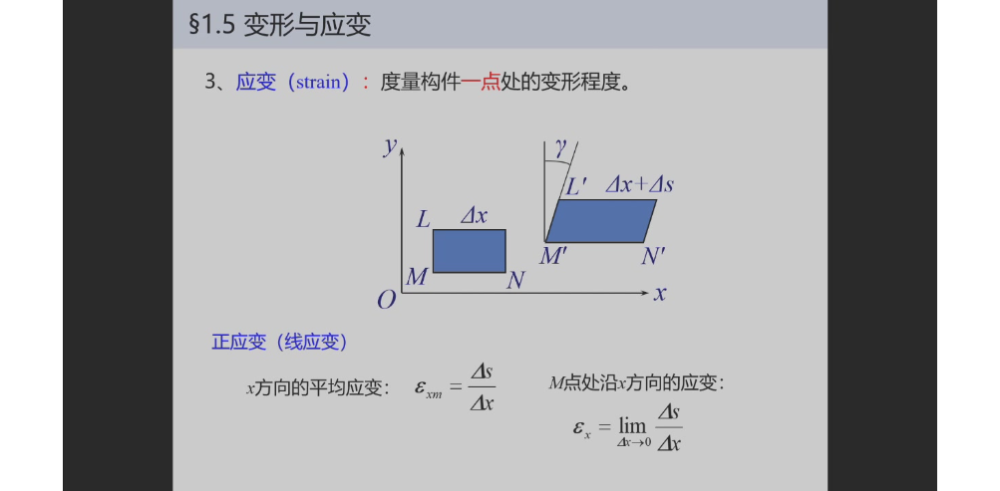
		- 切应变（角应变）
			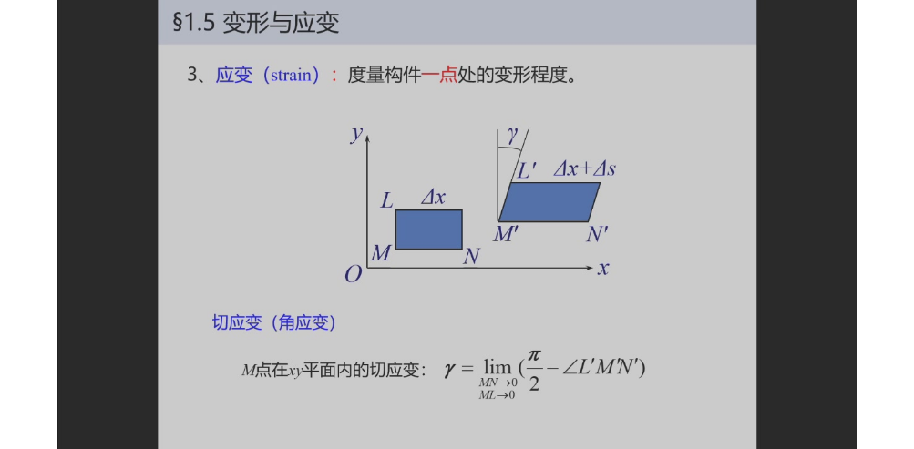

- **杆件变形基本形式（5种）**    
	- 拉伸/压缩
		- 轴线受到一对大小相等，方向相反的力，力的方向沿轴线方向
		- 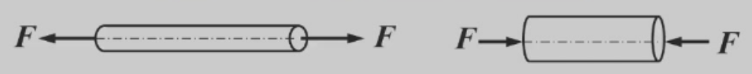
	- 剪切：
		- 大小相等，方向相反的横向力，力的作用线很近
		- 
	- 扭转：
		- 
	- 弯曲：
		- 轴线由直线变曲线，杆件受到一对大小相等方向相反力偶，力偶作用线为包含轴线的纵向面
		- 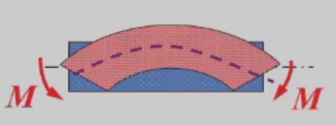

材料力学分析流程

## 2.拉伸与压缩/剪切与挤压

**截面法**
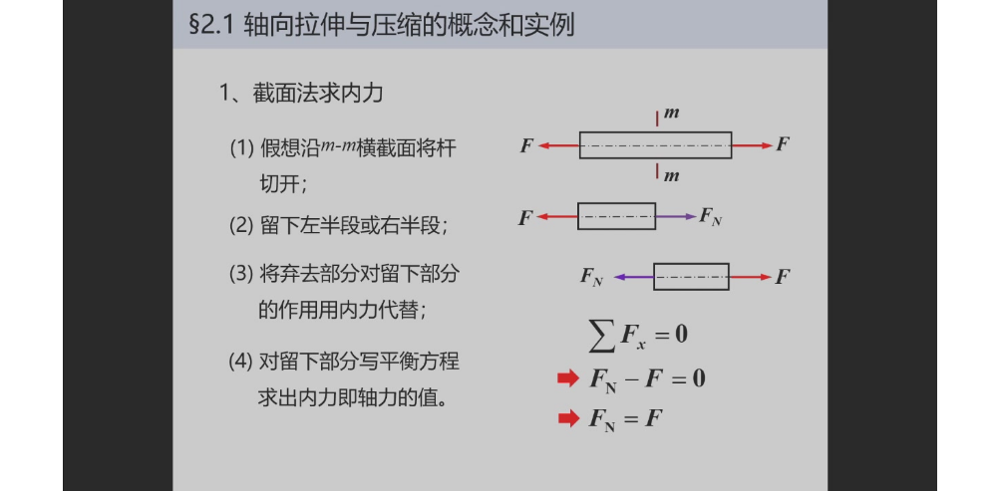
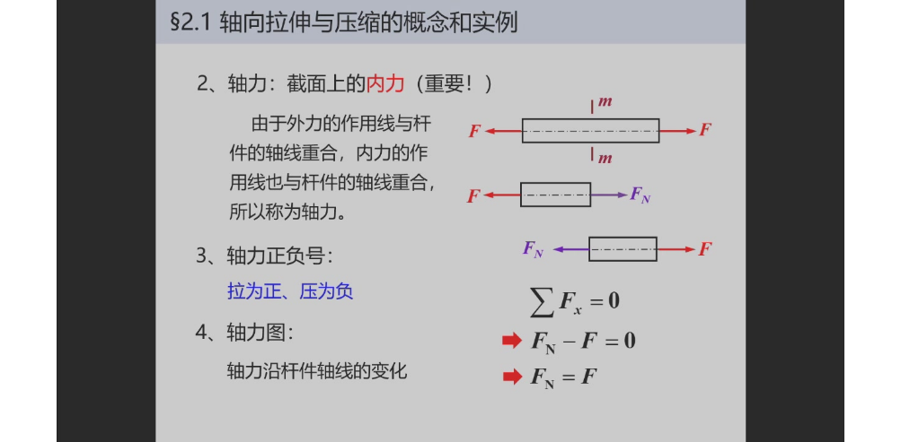

!!! info "e.g."
	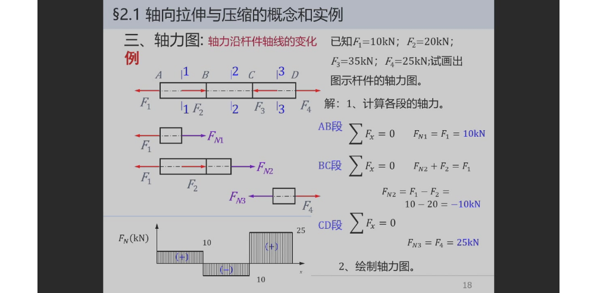

- **平面假设**：变形前原为平面的横截面，变形后仍保持为平面且仍垂直于轴线。
	- 1.所有纵向纤维的伸长相等
	- 2.因材料均匀，故各纤维受力相等
	- 3.内力均匀分布，各点正应力相等，为常量。
	- 得到**横截面应力计算公式**：$\sigma=\frac{F_N}{A}（应力=内力/横截面积）$
	- 拉应力为正，压应力为负

**圣维南原理**

!!! info "e.g."
	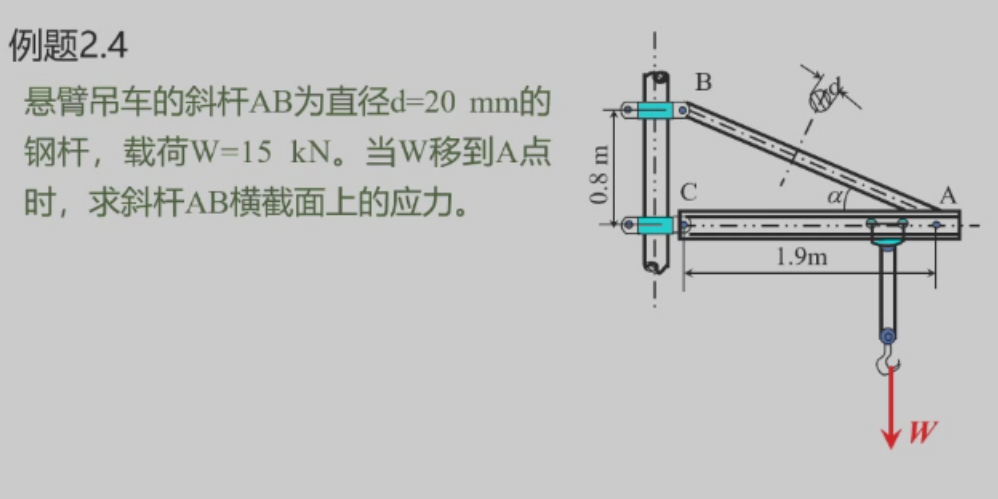

**斜截面的应力**  
- 正应力 $\sigma_{\alpha}=\sigma_0(\cos\alpha)^2$
- 切应力 $\tau_{\alpha}=\frac{\sigma_0}{2}\sin2\alpha$
	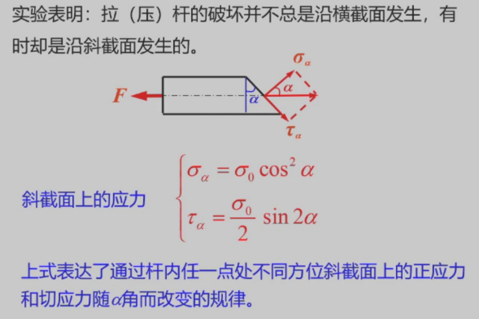

**材料拉伸时的力学性能**

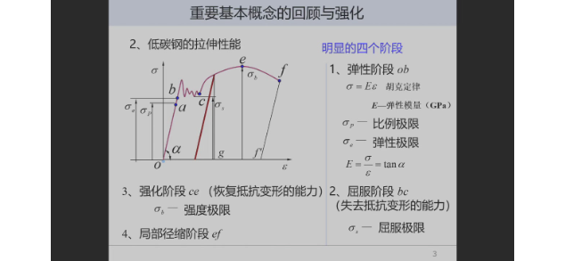

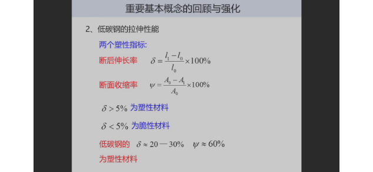

**失效**

屈服或强度

**轴向拉伸或压缩时的形变**

**胡克定律**

应力不超过比例极限时  
应力=应变×弹性模量
$$
\sigma=E\epsilon
$$

**弹性模量**

杆件的纵向变形计算公式：
$$
\Delta l = \frac{F_N l}{EA}
$$

**说明：**

- $EA$ 乘积项被称为杆的**抗拉（抗压）刚度**。
    
- 在该公式中：
    
    - $F_N$ 为轴力；
        
    - $l$ 为杆件原长；
        
    - $E$ 为材料的弹性模量；
        
    - $A$ 为横截面积。

**泊松比**

1、纵向变形与应变

- **纵向变形量**：$\Delta l = l_1 - l$
    
- **纵向线应变**：$\varepsilon = \frac{\Delta l}{l}$
    
 2、横向变形与应变

- **横向变形量**：$\Delta b = b_1 - b$
    
- **横向线应变**：$\varepsilon' = \frac{\Delta b}{b}$
    
 3、泊松比定义

泊松比 $\mu$ 定义为横向应变与纵向应变绝对值的比值：

$$
\mu = \left| \frac{\varepsilon'}{\varepsilon} \right|
$$

**由此可得横向应变公式：**

$$
\varepsilon' = -\mu \varepsilon
$$
纵向拉伸横向缩短，纵向压缩横向伸长

!!! tip "e.g."
	“以切代弧“的方法
	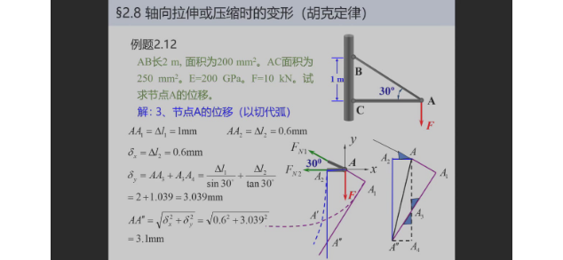

**应变能**  
线性条件下  

根据功能原理，外力所做的功 $W$ 等于杆件储存的应变能 $V_\varepsilon$：

$$
W = V_\varepsilon = \frac{F^2 l}{2EA}
$$

结合基本变形公式 $\Delta l = \frac{Fl}{EA}$，应变能也可以通过变形量 $\Delta l$ 来表达：

$$
V_\varepsilon = \frac{EA}{2l} \Delta l^2
$$

**应变能密度**

1. 应变能密度定义

**应变能密度 ($v$)**：单位体积内储存的应变能。

$$
v = \frac{V_\varepsilon}{V} = \frac{\frac{1}{2}F \Delta l}{A l} = \frac{1}{2} \sigma \varepsilon
$$

2. 基于胡克定律的表达形式变换

结合胡克定律 $\sigma = E \varepsilon$，应变能密度可以进一步表示为：

- **仅含应力形式**：
    $$
    v = \frac{1}{2E} \sigma^2
    $$
- **仅含应变形式**：
    $$
    v = \frac{1}{2} E \varepsilon^2
    $$

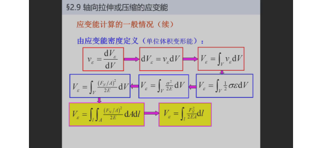

### 超静定问题
 1、静定与超静定问题

- **超静定度数**：
    约束反力多于独立平衡方程的数。
    $$
    n = \text{未知力的个数} - \text{独立平衡方程的数目}
    $$
    
 2、求解超静定问题的步骤

1. **确定超静定度数**：分析题目中的未知力与平衡方程数量，列出**静力平衡方程**；
    
2. **几何分析**：根据变形协调条件，列出**变形几何方程**；
    
3. **物理分析**：将变形与力之间的关系（如**胡克定律**）代入变形几何方程，从而获得**补充方程**。

### 温度应力
#### 线涨系数
$\alpha$
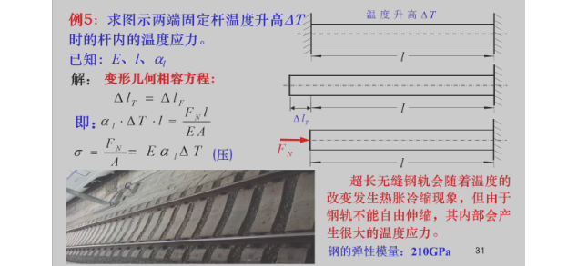

### 装配应力

!!! note "求解步骤"
	 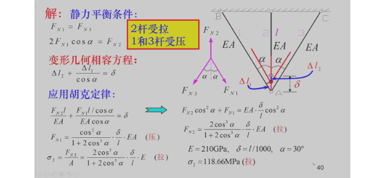
	 一般步骤：   
	 - 找静力平衡方程  
	 - 补充超静定次数方程  
		 - 找变形几何相容方程：变形后的位置，向变形前的位置，各个杆件作垂线得伸长量  
		- 代入力与位移或变形的**物理关系**，得**补充方程**  
	- 联立求解  

### 应力集中

应力集中因子
$$
K=\frac{\sigma_{max}}{\sigma_{nom}}
$$
影响因素：

### 剪切与挤压实用算法

#### 剪切

切应力：
$$
\tau=\frac{F_s}{A}
$$
切应力强度条件：
$$
\tau=\frac{F_s}{A}<=[\tau]
$$

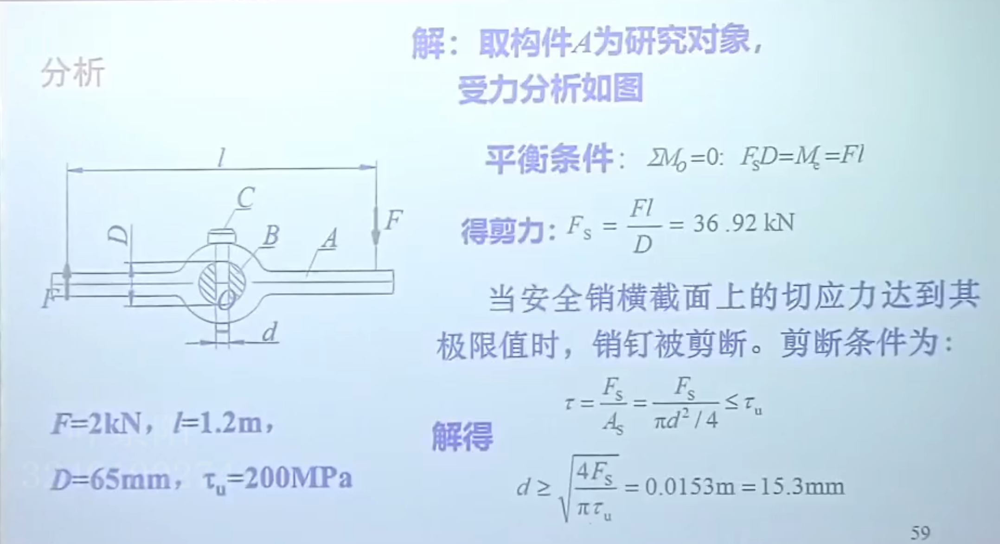

#### 挤压

$$
  
$$

挤压面积为孔壁投影面积

## 3.扭转

#### 3.1外力偶矩的计算

根据功率守恒得出：
$$
M_c=\frac{9549P}{n}
$$

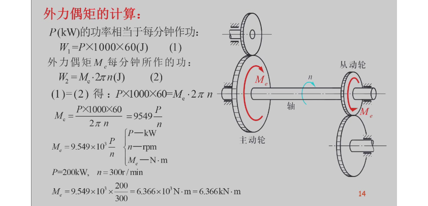
#### 3.2 扭矩和扭矩图

正负号规定：
右手螺旋法则变为力偶矢，指向离开截面扭矩为正，反之为负

绘制扭矩图

标注单位、正负、大小

#### 3.3 纯剪切
##### 薄壁圆筒
薄壁圆筒扭转时的切应力
  $$
  \tau = \frac{T}{2\pi r_0^2 \delta} = \frac{T}{2A_0 \delta}
  $$
**横截面上切应力分析**  
针对薄壁圆筒受扭转的情况，切应力 $\tau$ 的推导如下：

- **平衡方程**：$\int_{\text{环}} r_0 \cdot \tau dA = T$
    
- **简化公式**：
    
    $$
    r_0 \cdot \tau \cdot 2\pi r_0 \delta = T
    $$
    
    $$
    \tau = \frac{T}{2\pi r_0^2 \delta} = \frac{T}{2A_0 \delta}
    $$
    
    _(其中 $A_0 = \pi r_0^2$ 为圆筒中线所包围的面积)_
    
- **适用条件**：当壁厚 $\delta \le r_0/10$ 时，误差不超过 **4.52%**，足够精确。

1. 圆筒横截面上没有正应力，只有切引力
2. 沿圆周各点的切应力大小相等，方向垂直于半径
3. 切应力合成扭矩 T

##### 切应力互等定理
在相互垂直的两个平面上，切应力一定成对出现，其数值相等，方向同时指向或背离两平面的交线。

##### 切应变剪切胡克定律
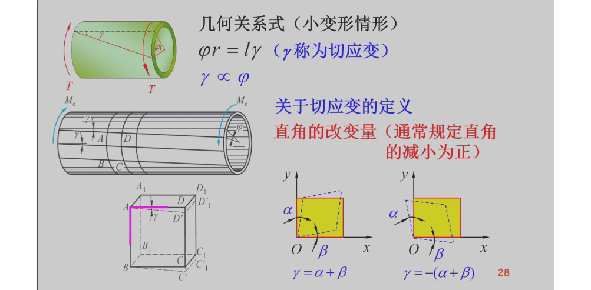

截面相对扭转角

$$
\tau=G\gamma
$$
**剪切模量、弹性模量、泊松比关系**
$$
G=\frac{E}{2(1+\nu)}
$$
##### 应变能

扭转时应变能密度
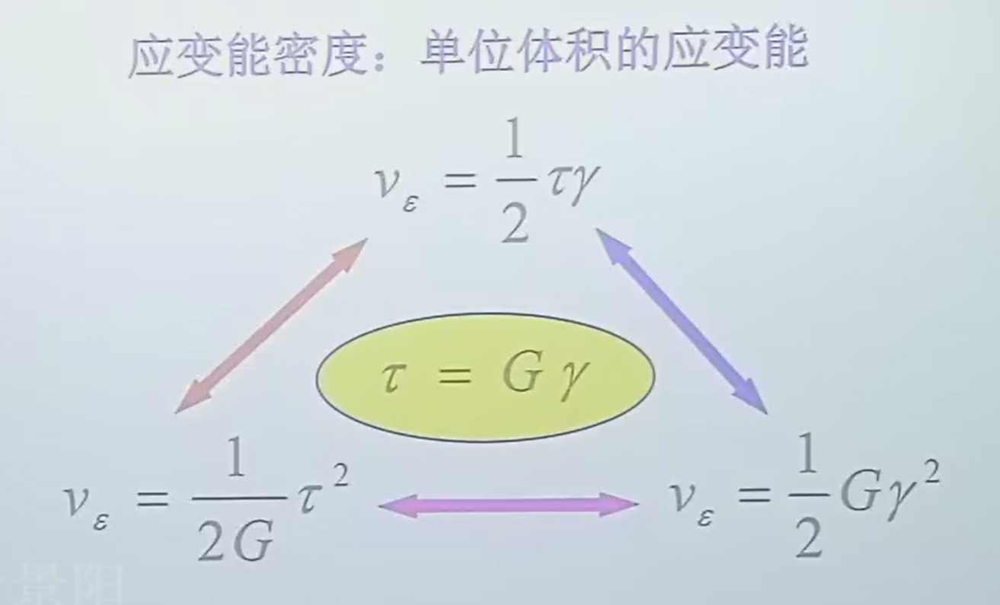

##### 圆轴

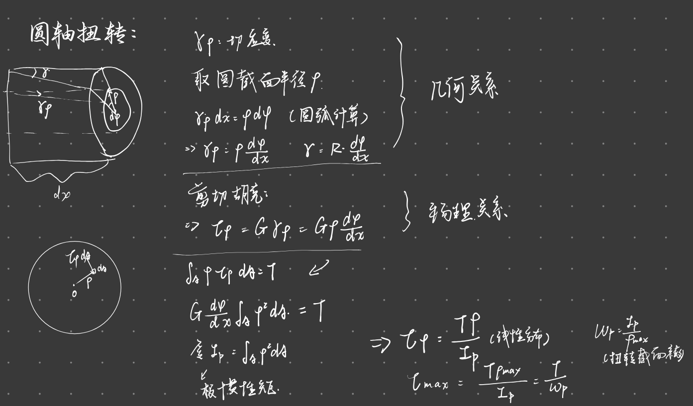
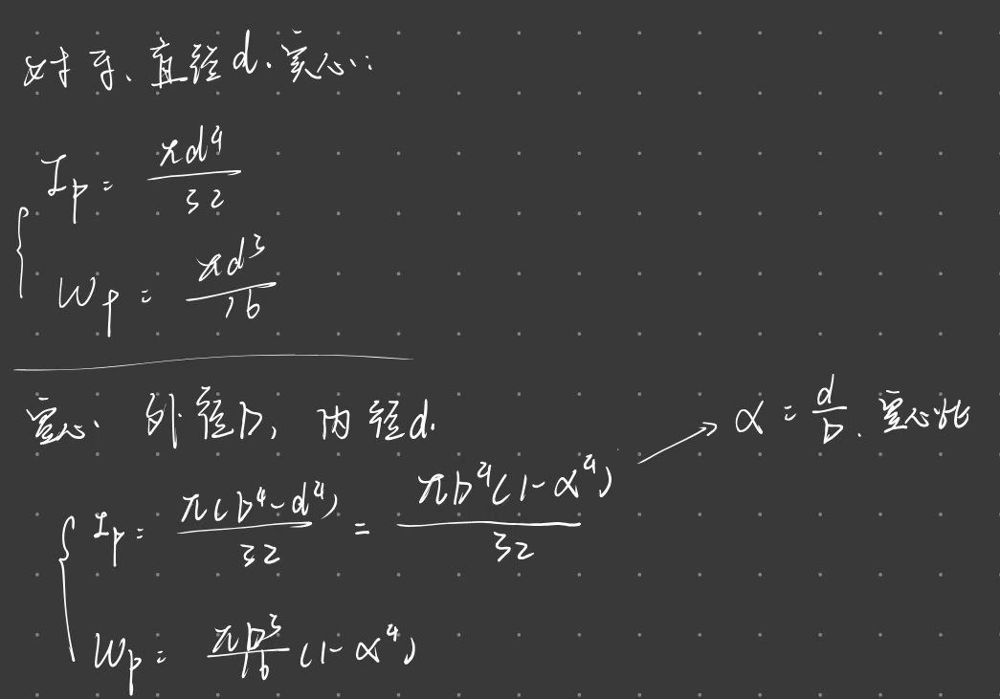

温度

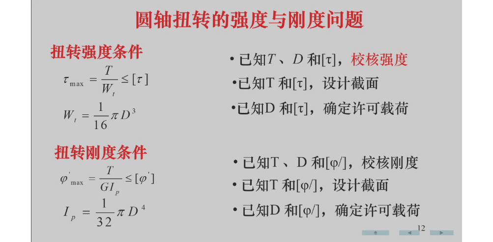

!!! note "本章公式总结"
	材料力学研究的三个步骤
		- 几何关系
		- 物理关系
		- 静力平衡关系
	杆件的纵向变形计算公式：
	$$
	\Delta l = \frac{F_N l}{EA}
	$$

## 4
剪力

弯矩

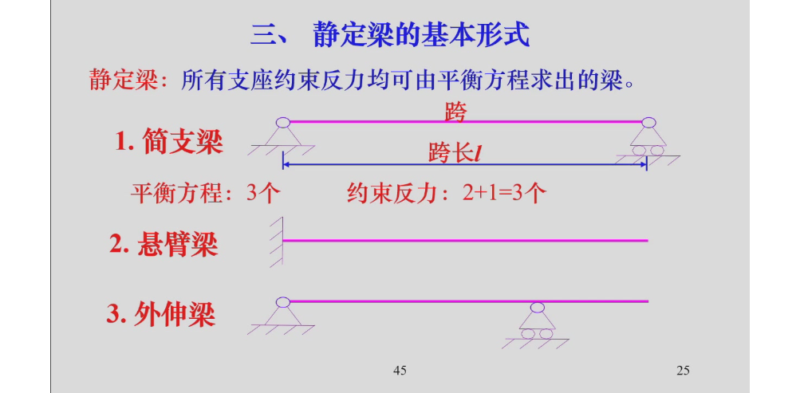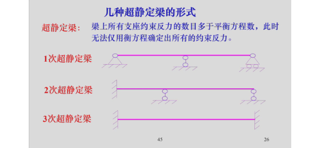
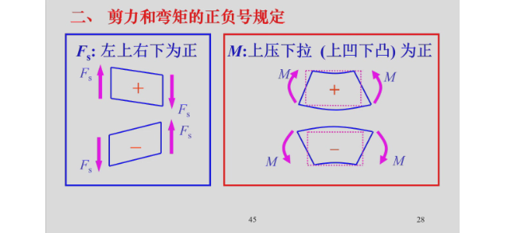

### 荷载

集中分布

线性分布

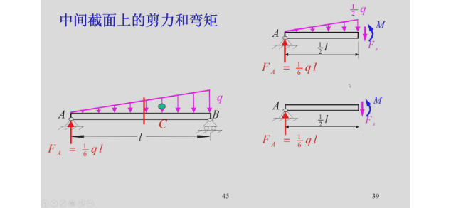

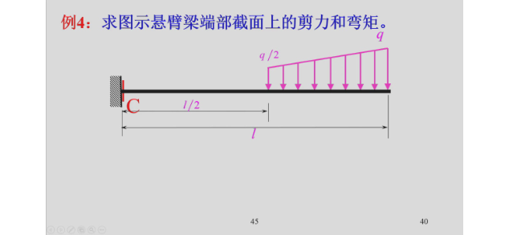

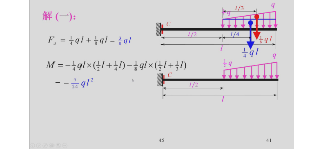

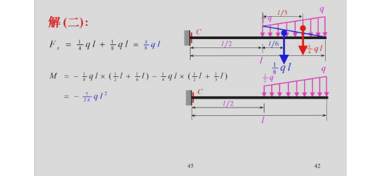

集中力：
剪力突变、弯矩突变

集中力偶：剪力不突变，弯矩突变

#### 载荷集度、剪力和弯矩关系

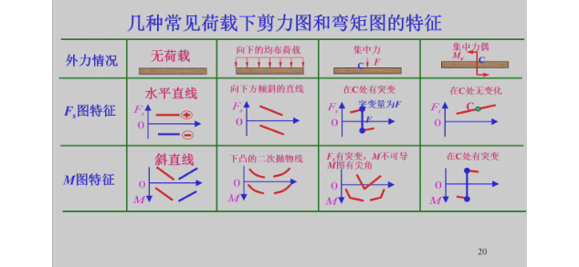

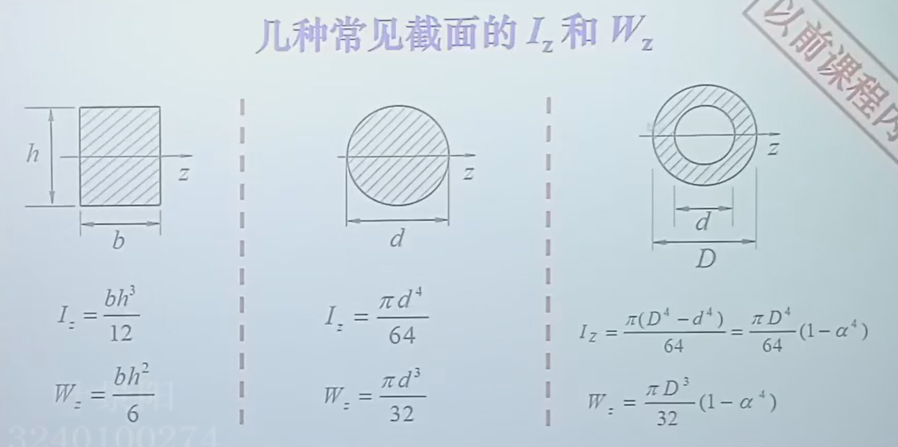

## 6.弯曲变形
#### 基本概念
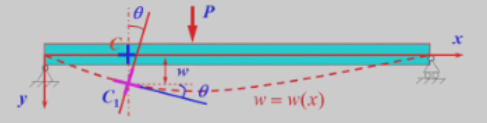
挠度 w：梁上一点竖直位移，与 y 坐标同向为正
截面转角θ：横截面绕中心轴转动角度，**顺时针为正**
挠曲线 w=w(x)
转角与绕曲线关系
$$
\theta=w'
$$

### 挠曲线近似方程

$$
\frac{M}{EI_z}=\pm w''
$$
$$
物理解：  EIw''=-M(x)
$$

积分法求弯曲变形
积分两次代入边界条件
连续条件
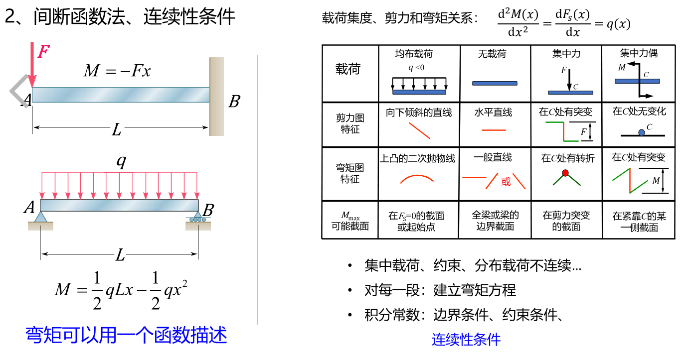

### 叠加法求弯曲变形

#### 经典场景
- 悬臂梁
- 简支梁

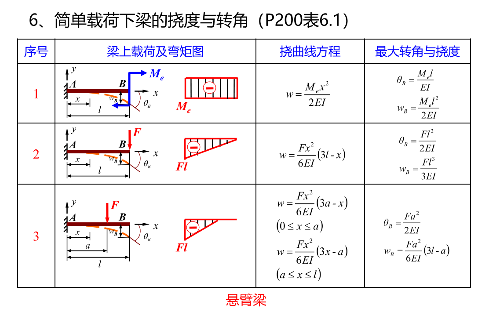
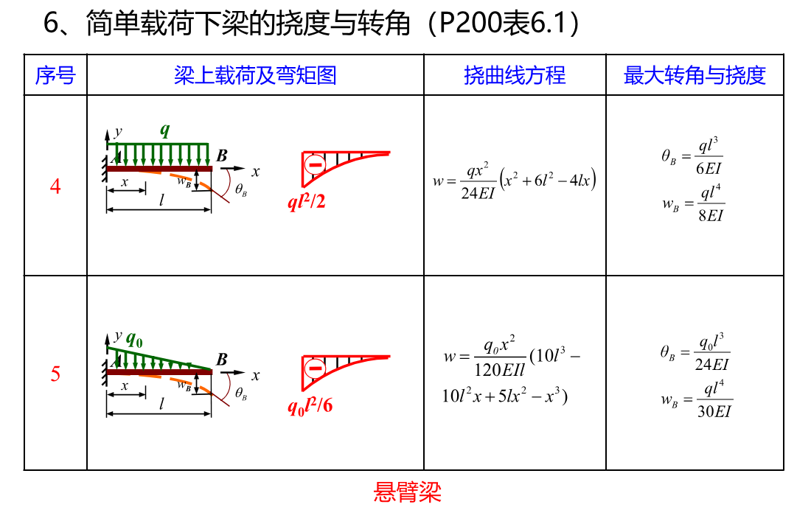
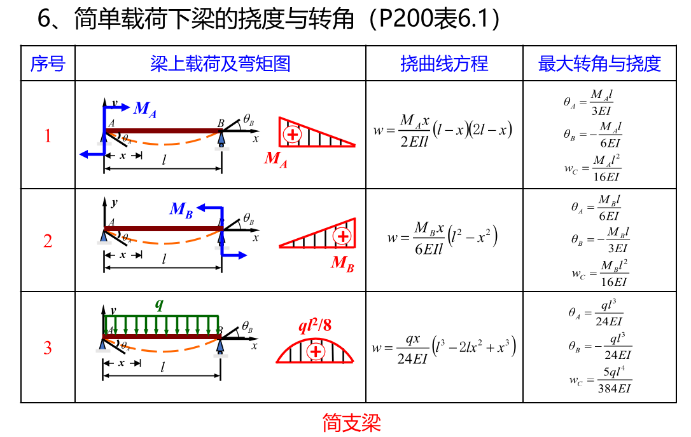
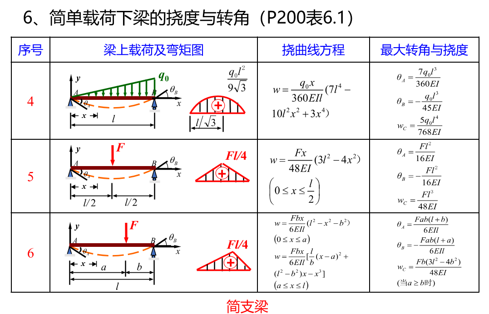

### 梁的弯曲应变能

$$
V_\epsilon = W = \frac{{M_e}^2 l}{2EI}
$$ 

## 7.应力状态

平面应力状态： 
不等于 0 的应力分量军处于同一坐标平面

### 应力分析方法
切应力正负号：**使微元顺时针转动为正**  
α角正负号规定：x 轴逆时针转动为正  
#### 解析法

切应力互等定理是什么  

正应力和切应力：
$$
\sigma_\alpha=\frac{\sigma_x+\sigma_y}{2}+\frac{\sigma_x-\sigma_y}{2}\cos{2\alpha}-\tau_{xy}\sin{2\alpha}
$$
$$
\tau_\alpha=\frac{\sigma_x-\sigma_y}{2}\sin{2\alpha}+\tau_{xy}\cos{2\alpha}
$$

正应力极值与方位角：  
方位角
$$
\tan{2\alpha_0}=-\frac{2\tau_{xy}}{\sigma_x-\sigma_y}
$$

**求导法：**  
极小值和极大值
将方位角的两个在 $(-\pi/2,\pi/2)$ 的根代入应力公式的得到

**三角函数变换求解方法：**
**极大值和极小值公式如下**
$$
\sigma_{\alpha,max}=\frac{\sigma_x+\sigma_y}{2}+\sqrt{(\frac{\sigma_x-\sigma_x}{2})^2+\tau_{xy}^2}
$$
$$
\sigma_{\alpha,min}=\frac{\sigma_x+\sigma_y}{2}-\sqrt{(\frac{\sigma_x-\sigma_x}{2})^2+\tau_{xy}^2}
$$

**主应力和主平面**

正应力取极值时切应力恒为 0   

- 一点处切应力=0 的截面为**主平面**    
- 主平面上的正应力为**主应力**（极值正应力）  

**第一主应力和第二主应力方位角判定方法**  
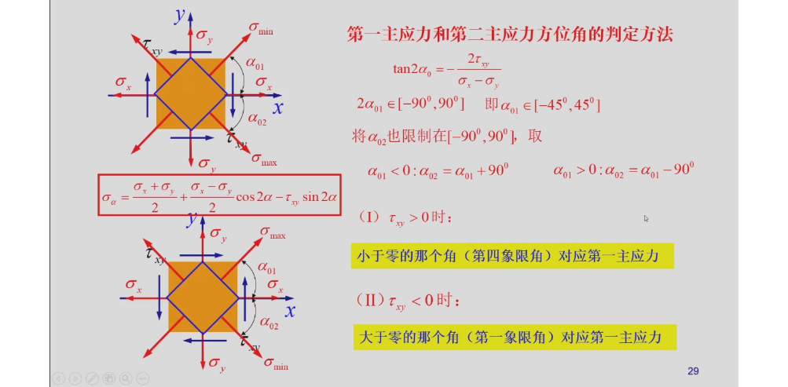

**切应力的极值**  
最大切应力
$$
\tau_{max}=\pm\sqrt{(\frac{\sigma_x-\sigma_y}{2})^2+\tau_{xy}^2}
$$
方位角，和正应力主平面成 45°角
$$
\alpha_1=\alpha_0+\frac{\pi}{4}
$$

小结：
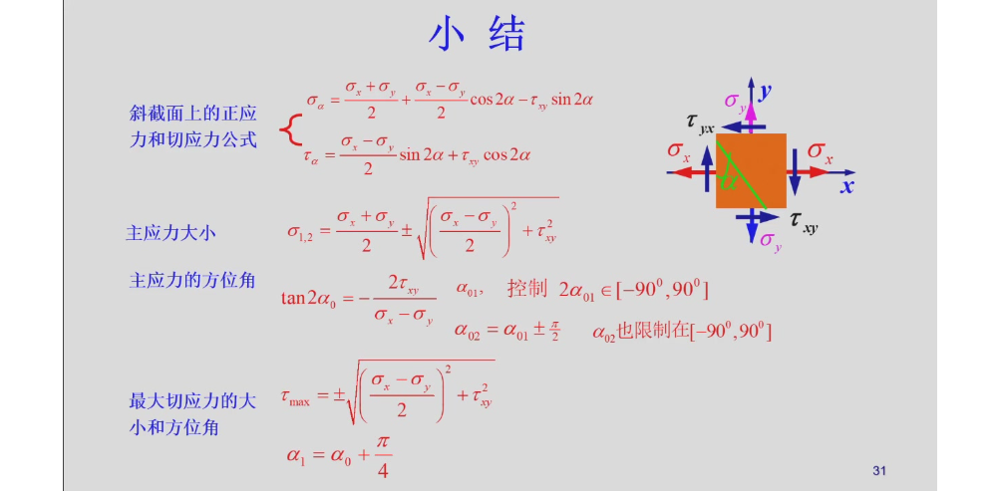

#### 应力圆法

##### 1.斜截面应力
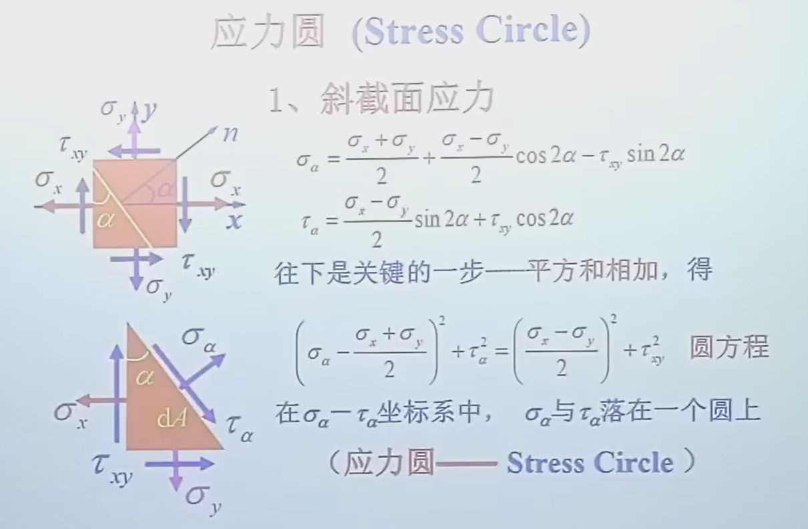
斜截面圆应力：  
- 正应力：  
$$
\sigma_{\alpha} = \frac{\sigma_x + \sigma_y}{2} + \frac{\sigma_x - \sigma_y}{2} \cos 2\alpha - \tau_{xy} \sin 2\alpha
$$
- 切应力：  
$$
\tau_{\alpha} = \frac{\sigma_x - \sigma_y}{2} \sin 2\alpha + \tau_{xy} \cos 2\alpha
$$

圆方程：
$$
\left( \sigma_{\alpha} - \frac{\sigma_x + \sigma_y}{2} \right)^2 + \tau_{\alpha}^2 = \left( \frac{\sigma_x - \sigma_y}{2} \right)^2 + \tau_{xy}^2
$$

圆心：
$$
(\frac{\sigma_x+\sigma_y}{2},0)
$$
半径：
$$
r=\sqrt{\left( \frac{\sigma_x - \sigma_y}{2} \right)^2 + \tau_{xy}^2}
$$

##### 应力圆画法 ：

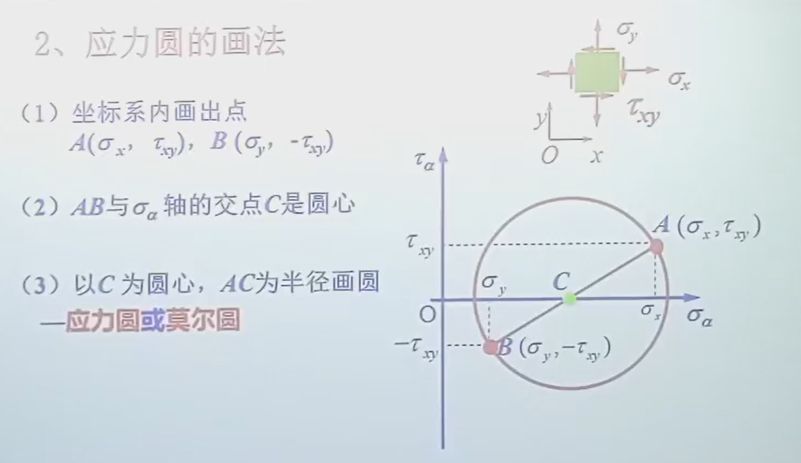

##### 单元体与应力圆对应关系
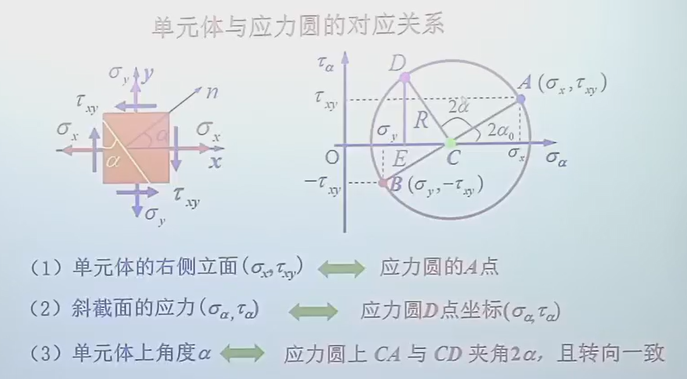

##### 主应力与主平面
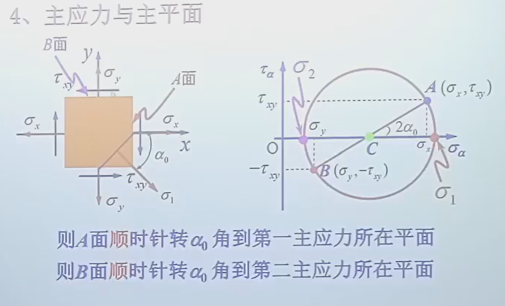

##### 应力极值
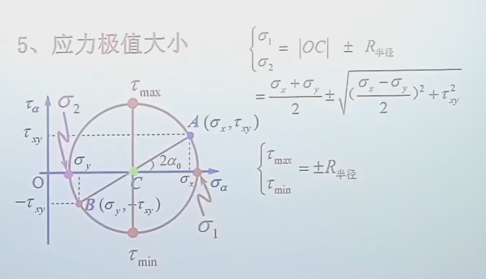

#### 空间应力

### 广义胡克定律
空间应力状态下应力与应变间的关系

单轴拉伸状态：
本构关系：应力&应变关系
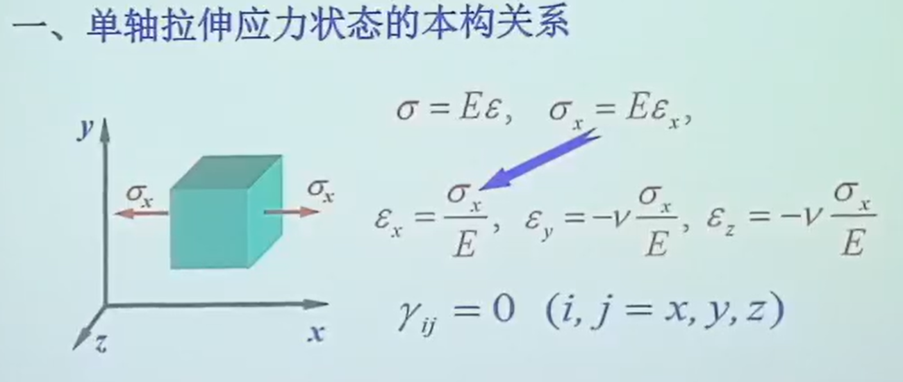

纯剪应力状态：
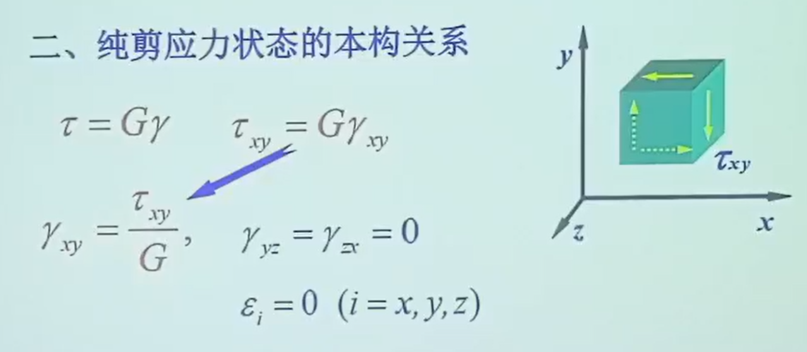

**空间应力状态：**
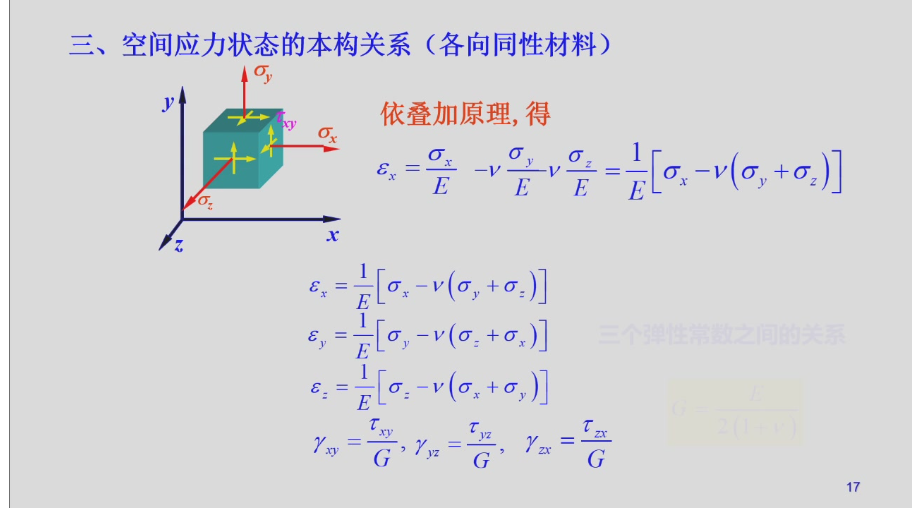

即广义胡克定律
x 方向：
$$
\varepsilon_x = \frac{\sigma_x}{E} - \nu \frac{\sigma_y}{E} - \nu \frac{\sigma_z}{E} = \frac{1}{E} \Big[ \sigma_x - \nu(\sigma_y + \sigma_z) \Big]
$$
$$
\begin{cases}
\varepsilon_x = \dfrac{1}{E} \Big[ \sigma_x - \nu(\sigma_y + \sigma_z) \Big] \\
\varepsilon_y = \dfrac{1}{E} \Big[ \sigma_y - \nu(\sigma_z + \sigma_x) \Big] \\
\varepsilon_z = \dfrac{1}{E} \Big[ \sigma_z - \nu(\sigma_x + \sigma_y) \Big]
\end{cases}
$$ 
主应变：

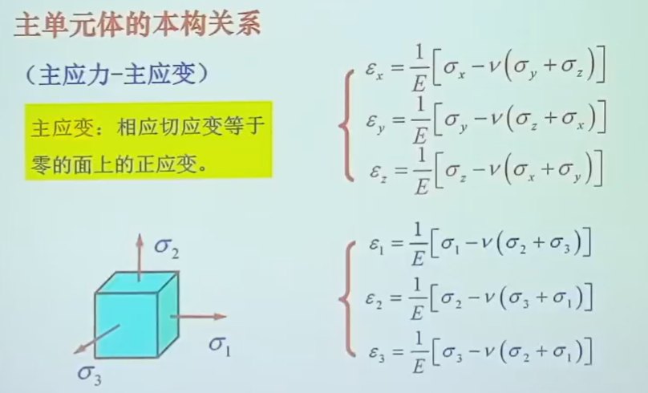

例题：
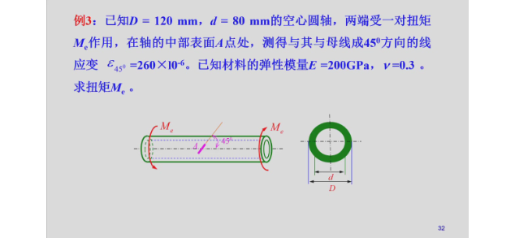

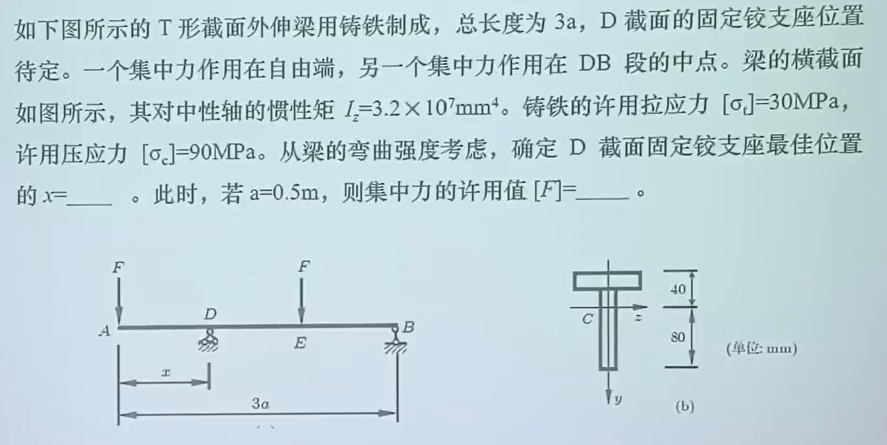

### 应变能密度

1. 单轴拉伸情况：

$$
\nu_{\epsilon}=\frac{1}{2}\sigma\epsilon=\frac{1}{2E}\sigma^2=\frac{1}{2}E\epsilon^2
$$


2. 纯剪应力


3. 主单元体

主单元体：3 个面都是主平面（只有正应力没有切应力）
主应变：只有正应变没有切应变

4. 一般单元体


### 体积改变能密度&形状改变能密度
体应变：
$$
\theta=\frac{V_1-V}{V}=\epsilon_1+\epsilon_2+\epsilon_3
$$
体应变与应力分量关系：
$$
\theta=\frac{1-2\nu}{E}(\epsilon_1+\epsilon_2+\epsilon_3)
$$

应变能密度：
$$
\nu_{\epsilon}=\nu_{\nu}+\nu_{d}
$$

$$
v_\varepsilon = \frac{1}{2E} \Big[ \sigma_1^2 + \sigma_2^2 + \sigma_3^2 - 2\nu(\sigma_1\sigma_2 + \sigma_3\sigma_2 + \sigma_1\sigma_3) \Big]
$$

体积改变能密度：

$$
v_v = \frac{1 - 2\nu}{6E} (\sigma_1 + \sigma_2 + \sigma_3)^2
$$

形状改变能密度：

$$
v_d = \frac{1 + \nu}{6E} \Big[ (\sigma_1 - \sigma_2)^2 + (\sigma_2 - \sigma_3)^2 + (\sigma_3 - \sigma_1)^2 \Big]
$$

### 强度理论

失效形态；  
- 脆性断裂  
- 塑性屈服  

!!! abstract "abstrect"
	四种强度理论  
	- 最大应力理论

#### 第一强度理论（最大强度理论）

最大拉应力与拉伸极限关系  

脆性断裂判据：
$$
\sigma_1=\sigma_u
$$
强度条件：
$$
\sigma_1 \le [\sigma]
$$

#### 第二强度理论（最大伸长线应变理论）

无论材料处于什么应力状态，只要构件内有一点处的最大线应变达到了单向拉伸的应变极限，就发生断裂破坏。

脆性断裂判据：
$$
\varepsilon_1 = \frac{\sigma_u}{E}
$$
强度条件：
将最大主应变 $\varepsilon_1$ 用主应力表示
$$
\text{即 } \frac{\sigma_1 - \nu(\sigma_2 + \sigma_3)}{E} = \frac{\sigma_u}{E}
$$
$$
\sigma_1 - \nu(\sigma_2 + \sigma_3) \le [\sigma]
$$

#### 第三强度理论（最大切应力理论）

屈服判据：
$$
\tau_{max}=\tau_u=\frac{\sigma_s}{2}
$$
$$
即 \sigma_1 -\sigma_3=\sigma_s
$$
强度条件：
$$
\sigma_1 -\sigma_3 \le [\sigma]
$$

#### 第四强度理论（形状改变能密度理论）

形状改变能密度：

$$
v_d = \frac{1 + \nu}{6E} \Big[ (\sigma_1 - \sigma_2)^2 + (\sigma_2 - \sigma_3)^2 + (\sigma_3 - \sigma_1)^2 \Big]
$$

单向拉伸：
$$
\sigma_1=\sigma_s  ;\sigma_2=\sigma_3=0
$$
$$
\nu_{du}=\frac{1+\nu}{6E}\cdot2\sigma_s^2
$$

屈服判据：
$$
\nu_d = \nu_{du}
$$
$$米塞斯应力\sigma_{eq} = \sqrt{\frac{1}{2} \Big[ (\sigma_1 - \sigma_2)^2 + (\sigma_2 - \sigma_3)^2 + (\sigma_3 - \sigma_1)^2 \Big]}=\sigma_s$$ 
强度条件：
$$
\sigma_{eq} \le [\sigma]
$$

#### 相当应力
相当应力：  
$$
\sigma_r \le [\sigma]
$$
$$
[\sigma] = \frac{1}{n}\{\sigma_b, \sigma_{0.2}, \sigma_s\}
$$

需要记忆，分别对应四种强度理论  

$$
\sigma_{r1}=\sigma_1
$$

$$
\sigma_{r2}=\sigma_1-\nu(\sigma_2+\sigma_3)
$$

$$
\sigma_{r3}=\sigma_1-\sigma_3
$$

$$
\sigma_{r4}=\sqrt{\frac{1}{2}[(\sigma_1-\sigma_2)^2+(\sigma_2-\sigma_3)^2+(\sigma_3-\sigma_1)^2]}
$$


## 8.组合变形

[组合变形知识与公式整理](组合变形知识与公式整理.md)
-00### 组合变形和叠加原理


叠加原理：线弹性、小变形

### 拉伸或压缩与弯曲组合

#### 拉弯组合变形

#### 偏心压缩和截面核心


截面上任意一点应力
$$
\sigma_x=\frac{P}{A}+\frac{Py_p\times y}{I_z}+\frac{Pz_p\times z}{I_y}
$$

中性轴：找正应力=0


得中性轴方程：
$$
1+\frac{y_py_0}{i_z^2}+\frac{z_pz_0}{i_y^2}=0
$$


#### 截面核心（每年必考）

压力作用于该区域内时，横截面上无拉应力


1. **圆形截面**

截面核心：
$$
直径d'=d/4 的圆
$$


2. 矩形截面  
 


3. T 形截面


!!! note "历年"
	

### 扭转与弯曲的组合


### 组合变形普遍情况

## 9. 压杆稳定

!!! warning '"warning"
	必考一道大题

研究中心受压直杆

直线平衡构型

临界力 $F_{cr}$：稳定平衡转化为不稳定平衡时轴向力

欧拉经典梁理论（忘记是啥）

### 欧拉公式

$$
F_{cr}=(\frac{n\pi}{l})^2EI
$$
通用形式：
$$
F_{cr}=(\frac{\pi}{\mu l})^2EI
$$

两端球形铰支截面细长中心受压直杆临界力，n=1：
$$
F_{cr}=\frac{\pi^2EI_{min}}{l^2}
$$

 不同杆端约束下细长杆的临界力欧拉公式：

 一端固定一端自由
最小解
$$
F_{cr}=(\frac{\pi}{2l})^2EI
$$

一端固定一端铰支

$$
F_{cr}=(\frac{\pi}{0.7l})^2EI
$$

总结：


### 欧拉公式适用范围

线弹性范围内适用
$$
\sigma_{cr}=\frac{F_{cr}}{A} \le \sigma_p
$$
临界应力 $\sigma_{cr}$

比例极限 $\sigma_p$

#### 柔度

定义柔度 $\lambda$
$$
\lambda=\frac{\mu l}{i}
$$
其中：长度系数 $mu$ ；回转半径 $i=\sqrt{\frac{I}{A}}$

**临界力欧拉公式适用条件**：
$$
\sigma_{cr}=\frac{F_{cr}}{A}=\frac{\pi^2 E}{\lambda^2} \le \sigma_p
$$
即：
$$
\lambda \ge \pi \sqrt \frac{E}{\sigma_p} =\lambda_p
$$

大柔度杆：$\lambda \ge \lambda_p$
小柔度杆：$\lambda < \lambda_p$

Q 235 钢 $\lambda_p=100$

### 经验公式-直线公式
直线公式：

$$
\sigma_{cr}=a-b\lambda
$$


!!! note "校验总结"
	首先计算柔度，判断大柔度杆 or 小柔度杆  
	大柔度杆→欧拉公式 $F_{cr}=\frac{\pi^2 EI}{(\mu l)^2}=\frac{\pi^2 E}{\lambda^2}$ 判稳
	中柔度杆→直线公式公式 判稳

### 压杆稳定校核

受压杆件必须做压杆稳定性分析

## 13. 能量方法

期末考题：


### 应变能与余能计算

#### 应变能计算

外力缓慢做功，功能互等
$$
V_\epsilon=W
$$

线弹性问题：

1. 轴向拉压

$$
W=\frac{1}{2}F\Delta l
$$
$$
\Delta l=\frac{Fl}{EA}
$$
2. 剪切变形

积分式
比较小，不考虑

3. 扭转变形
$$
W=\frac{1}{2}T\phi
$$
$$
\phi = \frac{Tl}{GI_p}
$$

4. 弯曲变形杆件
弯曲变形的力用弯矩描述
$$
W=\frac{1}{2}M\theta
$$
$$
\theta=\frac{l}{\rho}
$$
$$\frac{1}{\rho}=\frac{M}{EI}$$

M：弯矩  
E：材料弹性模量  
I：截面对中性轴的惯性矩  
ρ：弯曲后的曲率半径  
EI：抗弯刚度


应变能普遍表达式：

$$V_{\varepsilon}
=
\int_L \frac{F_N^2(x)}{2EA}\,dx
+
\int_L \frac{T^2(x)}{2GI_p}\,dx
+
\int_L \frac{M^2(x)}{2EI}\,dx$$

用应变能密度积分计算：


#### 功的互等定理

$$
P_1 \Delta_{12}=P_2 \Delta_{21}
$$
一个求解问题的巧妙方法


#### 位移互等定理

$$
P_1 \Delta_{12}=P_2 \Delta_{21}
$$
$$
P_1=P_2
$$
$$
\Delta_{12}=\Delta_{21}
$$ 

#### 非线性弹性问题

1. 材料线性，几何非线性

2. 材料非线性 


#### 余能
几何线性问题

几何非线性

物理非线性

	余能密度


拉压+扭转+弯曲

### 卡氏定理

#### 卡氏第一定理
结构线性，材料线性 or 非线性


弹性杆件应变能对位移的偏导=相应的荷载
$$
F_i=\frac{\partial V_\epsilon (\Delta_1,...)}{\partial \Delta_i}
$$

#### 卡氏第二定理

余能角度
$V_c=W_c=\sum_{i=1}^n$
$$
V_c=V_c(F_1,F_2,...)
$$

余能定理：

弹性杆件的余能对载荷的偏导=相应的位于
$$
\Delta_i=\frac{\partial V_c (F_1,F_2,...)}{\partial F_i}
$$

卡氏第二定理
只用于线性弹性情况，是余能定理的子集
$$
\Delta_i=\frac{\partial V_\epsilon (F_1,F_2,...)}{\partial F_i}
$$

 

例题：


转角 + - 代表与虚设力矩方法相同 or 相反

### 虚位移原理


### 单位载荷法 莫尔积分


线弹性杆件

 


### 莫尔积分图乘法

$$
\int_l M(x)\bar{M(x)} dx=\omega\bar{M_C}
$$


折杆例题：


## 14 超静定问题

能量法求解超静定问题


注意：写利用能量法建立补充方程
卡氏第二定理


对于非线性问题：

余能定理

对称问题：

